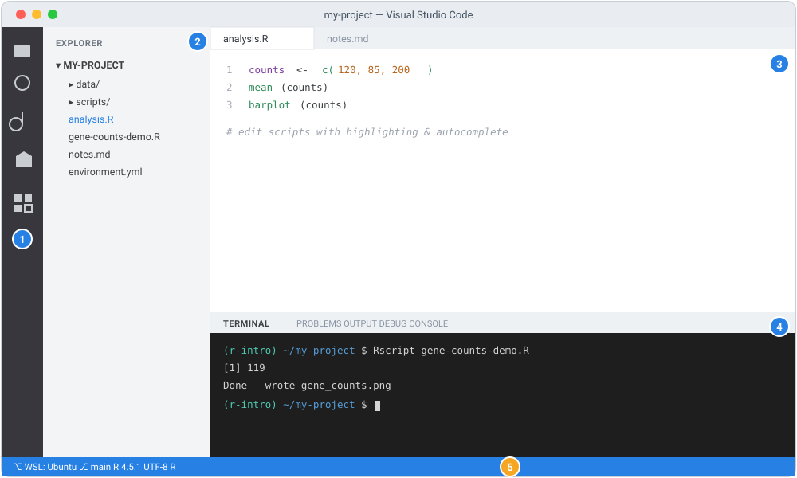

## 🧩 The mystery

Pendo, a first-year PhD student, corners you by the coffee machine. He looks worried.

> "Everyone keeps telling me to 'just use R'. But what even is R? And why R and not, I
> don't know, a spreadsheet?"

Amina (that is you) smiles. You remember asking the exact same question.

Here is the secret nobody tells you up front. R is not really a piece of software you
"use". R is a **language**. And like any language, it exists so you can ask questions and
get answers.

::: {.think}
You have data. A column of gene counts, say. You want to know things about it.

"What is the average?" "What is the biggest value?" "Draw me a picture of this."

Now: would you rather click through menus hunting for the right button every single time,
or just **ask**, in a language your data understands? Hold that thought. We will answer it
together.
:::

::: {.callout-note appearance="simple"}
## A gentle welcome before we begin

If the letter "R" has been floating around your lab as something everyone seems to use but
nobody quite explains, this module is for you. We start from *what R even is* and build up
slowly. No prior programming assumed.

R has a reputation for being a little quirky. It counts starting from 1, and it has strong
opinions about arrows. But it is also one of the friendliest on-ramps into computational
biology, because so much of the statistics and visualisation biologists need is already
built for them. You do not need to become a software engineer. You need just enough R to
explore your data with confidence.

As always: this is a doorway, not the whole house. You get comfortable by **typing the
examples yourself, experimenting, and looking things up**, not by reading alone. Ready?
Let us meet R.
:::

## 💬 What R actually is

::: {.story}
Think of R as a very literal, very patient colleague who only speaks one language, but
speaks it fluently: the language of data and statistics.

You say "mean of these numbers", and it hands you the average. You say "draw me a bar
chart", and it draws one. It never gets bored, never mishears, and does exactly the same
thing every time you ask. That last part turns out to matter enormously.
:::

**R is a programming language and environment built for statistics, data analysis, and
visualisation.** It was created by statisticians, and it shows. Things that are awkward in
general-purpose languages, like fitting a model, summarising a table, or drawing a
publication-quality plot, are often one short line in R.

For biologists specifically, R is popular because:

- **Statistics are first-class.** Means, t-tests, linear models, and far more are built in
  or a package away.
- **Visualisation is excellent.** Base R plots are quick. The
  [`ggplot2`](https://ggplot2.tidyverse.org/) package produces beautiful, customisable
  figures.
- **[Bioconductor](https://bioconductor.org/).** This is the big one. A huge, curated
  ecosystem of R packages purpose-built for molecular biology (working with sequencing
  counts, genomic intervals, expression data, and much more). You will meet it in later
  modules.
- **Reproducibility.** Your analysis is written as a script, so it can be re-run, shared,
  and checked. Exactly the habit good science needs.

So back to Pendo's question. Why R and not a spreadsheet? Because a spreadsheet remembers
the *answer*, but R remembers the *question*. Ask it again next year, and it gives the
same answer, the same way. That is the difference between a result and a reproducible
result.

::: {.callout-tip}
## R or Python? (a calm answer)
You may hear people debate R vs Python. Honestly: **both are excellent, and many biologists
use both.** R has historically had the edge for statistics and for the Bioconductor
ecosystem. Python shines in general-purpose scripting and some machine-learning work. You
are not marrying one forever. Learning R does not close any doors. We start with R here
because of its statistical roots and Bioconductor.
:::

::: {.callout-note}
Concrete examples of what R can do for a biologist (we build toward these in later modules,
so no need to install them now): summarise and clean experimental data, run statistical
tests, make figures with `ggplot2`, and analyse RNA-seq counts with Bioconductor packages.
Names of specific tools are mentioned only as examples. **Verify a package exists and its
current usage before relying on it.**
:::

::: {.didyouknow}
R was born in the 1990s at the University of Auckland, named partly after its two creators,
Ross and Robert, and partly as a playful nod to an older language called S. Today it quietly
powers a huge share of the statistics behind published biology. Every time you read "we
analysed the data in R" in a paper, someone was doing exactly what you are about to learn.
:::

::: {.callout-tip}
## Explore these (it helps to see them)
Clicking through the official homes of these tools makes them feel much less abstract. Have
a quick look:

- [The R Project](https://www.r-project.org/): R's official home.
- [CRAN](https://cran.r-project.org/): the Comprehensive R Archive Network, where R and most
  general packages live.
- [Bioconductor](https://bioconductor.org/): the ecosystem of R packages for genomics and
  molecular biology.
- [RStudio (by Posit)](https://posit.co/products/open-source/rstudio/): a popular graphical
  editor for R (optional; we use the terminal in this module).
:::

## What you'll learn

By the end of this module you will be able to:

1. Explain **what R is** and why it is so widely used in biology.
2. **Install R** cleanly using the Conda setup from Module 01.
3. Run R **two ways**, interactively in the **console** and from the **command line** as
   scripts, and get oriented in the **RStudio** and **VS Code** editors.
4. **Install packages** from the two repositories biologists rely on: **CRAN** and
   **Bioconductor**.
5. Run a small, hands-on demo on some toy biological data.

### Before you start

- You have completed **[Module 01](../01-setup-environment/index.qmd)** and have a working
  **Conda** setup in a Unix shell (Ubuntu/WSL on Windows, or Terminal on macOS). We build
  directly on that.
- You are comfortable activating a Conda environment (`conda activate ...`).

::: {.callout-warning}
## ⚠️ Verify: versions change
R, Bioconductor, and every package have their own release cycles, and specific version
numbers below are **examples**. Bioconductor in particular is tied to your R version, so
mismatches are a common source of confusion. When a step matters, check the official docs
(R Project / CRAN, Bioconductor, and each package's page).
:::

## 🛠 Let's do it: install R with Conda

Before you can speak a language, you need it on your machine. Because you set up Conda in
Module 01, the cleanest, most reproducible way to get R is to create a **dedicated Conda
environment** for it. This works identically on Windows (inside Ubuntu/WSL) and macOS, and
needs no administrator rights.

The core R package on the [conda-forge](https://conda-forge.org/) channel is called
**`r-base`**:

```bash
conda create -n r-intro r-base
```

Type `y` when prompted. Then activate it:

```bash
conda activate r-intro
```

Your prompt should now show `(r-intro)`.

::: {.callout-note collapse="true"}
## ✅ Check: is R installed?
```bash
R --version
```
This should print R's version and license information. If you get "command not found", make
sure the `r-intro` environment is **activated**.
:::

::: {.callout-tip}
## Want a batch of common packages at once?
The `r-essentials` bundle installs R plus many popular packages (including the
[tidyverse](https://www.tidyverse.org/) and others) in one go:

```bash
conda create -n r-intro r-base r-essentials
```

It is convenient but larger to download. For a first look, plain `r-base` is enough.
:::

::: {.callout-warning}
## ⚠️ Verify: other ways to install R exist
Installing via Conda keeps things consistent with the rest of this series, but it is **not
the only way**. R can also be installed from the
[official CRAN](https://cran.r-project.org/) website, and many people pair it with the
[**RStudio**](https://posit.co/products/open-source/rstudio/) desktop application (a
friendly graphical editor for R). Those are perfectly valid, but their installation steps
differ by operating system and change over time, so if you go that route, follow the current
official instructions from [the R Project](https://www.r-project.org/) and from
[Posit](https://posit.co/) (the makers of RStudio) rather than this page. Note that running
a graphical app like RStudio under Windows WSL involves extra setup. The terminal-based
approach in this module avoids that.
:::

## Two ways to ask: console and script

Here is where Pendo starts to get confused, and honestly, most beginners do. There are
**two fundamental ways** to speak R, and they behave differently. It is worth understanding
both from the start.

::: {.story}
Think of it like talking to that patient colleague two different ways.

The **console** is a live conversation. You say one thing, they answer right away, you say
the next thing. Great for thinking out loud.

A **script** is a letter. You write down all your questions in order, seal the envelope, and
hand it over. They read the whole thing and do everything at once. Great when you want the
exact same conversation to happen again next month.
:::

Once you have those two, we tour two popular **graphical environments**, RStudio and VS
Code, which simply wrap those same two ways in a friendlier window.

### The interactive console (the "REPL")

The **console** is R's interactive prompt. You type a line, press Enter, and R responds
immediately. It is perfect for exploring and experimenting.

Start it by simply typing:

```bash
R
```

**Here is exactly what you will see when R starts up** (this is a real capture from an R
session; yours will look the same, give or take the version and platform lines):

```text
R version 4.5.1 (2025-06-13) -- "Great Square Root"
Copyright (C) 2025 The R Foundation for Statistical Computing
Platform: aarch64-apple-darwin24.4.0

R is free software and comes with ABSOLUTELY NO WARRANTY.
You are welcome to redistribute it under certain conditions.
Type 'license()' or 'licence()' for distribution details.

  Natural language support but running in an English locale

R is a collaborative project with many contributors.
Type 'contributors()' for more information and
'citation()' on how to cite R or R packages in publications.

Type 'demo()' for some demos, 'help()' for on-line help, or
'help.start()' for an HTML browser interface to help.
Type 'q()' to quit R.

>
```

That wall of text scares people off. It should not. Let us read it top to bottom, because
it is friendly once you know what each part is:

- **Line 1, the version.** `R version 4.5.1 ... "Great Square Root"`. Every R release gets a
  playful nickname. **Yours may differ**, that is fine.
- **`Platform:` line.** Just tells you the operating system and architecture R built for
  (here, an Apple-Silicon Mac). Yours will reflect your own machine.
- **The warranty / license paragraph.** Standard free-software notice. Nothing you need to
  act on.
- **The `Type '...'` hints.** Genuinely useful signposts: `q()` quits, `help()` opens help,
  `citation()` tells you how to cite R in a paper.
- **The `>` on the last line, this is the prompt.** It means "R is ready and waiting for
  your command." This blinking-cursor line is where you type. When you see `>`, R is
  listening.

Now ask R a few things. Type each line at the `>` prompt and press Enter. Here is a **real
transcript** of exactly that (your typed input is echoed after each `>`, and R's answers
appear underneath):

```text
> 1 + 1
[1] 2
> x <- c(2, 4, 6, 8)
> mean(x)
[1] 5
> counts <- c(GeneA = 120, GeneB = 85, GeneC = 200, GeneD = 40, GeneE = 150)
> counts
GeneA GeneB GeneC GeneD GeneE
  120    85   200    40   150
> mean(counts)
[1] 119
> summary(counts)
   Min. 1st Qu.  Median    Mean 3rd Qu.    Max.
     40      85     120     119     150     200
```

Reading that conversation section by section:

- `> 1 + 1` then `[1] 2`. You asked `1 + 1`, R answered `2`. The **`[1]`** is R labelling the
  *position* of the first value on that output line (handy when output spans many numbers).
  You will stop noticing it quickly.
- `x <- c(2, 4, 6, 8)` produced **no output**. Assignment is silent. `<-` is R's
  **assignment** operator ("put the value on the right into the name on the left"), and
  `c(...)` **c**ombines values into a vector. So this line means "let `x` be those four
  numbers."
- `mean(x)` gave `[1] 5`. R computed the average. Notice results **print automatically** in
  the console (you did not have to ask). Remember this. It is the opposite of how scripts
  behave, which we get to next.
- `counts` printed as a **named vector**: the gene names sit above their values. Naming
  entries (`GeneA = 120`) makes output readable.
- `summary(counts)` gave a **five-number-style overview**: minimum, quartiles, median, mean,
  and maximum. A one-line feel for your data's spread.

See what happened there? You asked your data questions, in a language, and it answered.
That is the whole idea.

When you are done, leave the console with:

```r
q()
```

It may ask whether to "save the workspace image". For now, answering **no** (`n`) is a fine,
tidy default.

::: {.callout-note collapse="true"}
## ✅ Check
If `mean(x)` printed `[1] 5`, your console is working. (The `[1]` is just R labelling the
position of the first value in the output. You will get used to it.)
:::

### From the command line (running scripts)

The **console** is great for exploring, but real analyses live in **scripts**: plain text
files of R code you can save, re-run, and share. You run these from the command line
**without** entering the interactive console. This is the reproducible way to work. This is
the sealed letter from our analogy.

The tool for this is **`Rscript`**.

**One-liners.** Run a snippet directly with `-e`:

```bash
Rscript -e 'print(mean(c(2, 4, 6, 8)))'
```

**Script files.** Create a file called `hello.R` with these contents:

```{.r filename="hello.R"}
# hello.R: my first R script
x <- c(2, 4, 6, 8)
print(mean(x))
cat("R is working!\n")
```

Then run it:

```bash
Rscript hello.R
```

## 🚧 The gotcha that catches everyone: scripts stay quiet

Pendo runs his first script. Nothing prints. He is convinced R is broken. It is not. He just
hit the single most common R surprise there is.

::: {.mistake}
In the **console**, typing `mean(x)` prints the result automatically. In a **script** run
with `Rscript`, it does **not**. You must ask for output explicitly with `print(...)` (or
`cat(...)`).

Why the difference? Remember the analogy. The console is a live chat, so R chatters back at
every line. A script is a sealed letter, so R does the work silently and only tells you what
you *explicitly* asked it to say. If your script "runs but shows nothing", a missing
`print()` is almost always the reason.
:::

::: {.callout-note}
## Console vs CLI: when to use which
- **Console (`R`):** exploring, trying ideas, quick checks. Interactive, immediate.
- **CLI (`Rscript`):** running a finished, repeatable analysis, automating, running on a
  server. Non-interactive and reproducible.

You will use both constantly. Explore in the console, then save what works into a script you
run with `Rscript`.
:::

### A friendlier option: the RStudio window at a glance

Everything so far works in a plain terminal, which is why we teach it that way, since it
behaves identically on every system. But many biologists prefer
[**RStudio**](https://posit.co/products/open-source/rstudio/): a free graphical application
that wraps R in one friendly window. You do not need it for this series, but it is so common
that it is worth knowing what you are looking at, so the first time you open it does not feel
like a cockpit.

When RStudio opens, it is a single window split into **panes**. Here is the anatomy:

{width=760 fig-alt="Labelled schematic of the RStudio window with its toolbar and four panes numbered one to six."}

Taking it pane by pane (the numbers match the diagram):

1. **Toolbar (top).** Buttons to create, open and save files, the "Go to file/function"
   search box, the **Addins** menu, and, in recent versions, a **Posit Assistant** button.
2. **Source editor (top-left).** Where you write and save R **scripts** (`.R` files). Run
   the current line or selection straight into the console with **Ctrl+Enter** (Windows) or
   **Cmd+Enter** (Mac). *In a brand-new session with no file open, this pane is hidden and
   the Console fills the whole left side*, exactly what you see when RStudio first launches.
3. **Console (bottom-left).** The very **same interactive R prompt** you met earlier: same
   startup banner, same `>` prompt, results auto-printing. Its neighbouring tabs,
   **Terminal** and **Background Jobs**, give you a system shell and a place for long-running
   tasks.
4. **Environment / History (top-right).** **Environment** lists the objects (variables, data)
   you have created this session. It starts empty and fills as you work. **History** keeps
   your past commands. **Connections** and **Tutorial** are extra tabs.
5. **Files / Plots / Packages / Help / Viewer (bottom-right).** A file browser, the pane
   where your **plots** appear, a **Packages** manager, searchable **Help**, and viewers for
   web content. This is where the demo's bar chart would show up if you ran it here.
6. **Project (top-right corner).** The current **RStudio Project**: a tidy way to keep one
   analysis's files, working directory, and settings bundled together. Getting into the habit
   of working inside a Project early will save you confusion later.

::: {.callout-tip}
The console *inside* RStudio and the console you get by typing `R` in a terminal are the
**same R**. RStudio just wraps helpful panes around it. Everything you learned in the console
and script sections works identically either way.
:::

::: {.callout-warning}
## ⚠️ Verify
RStudio's exact layout, button labels, and features (assistant tools included) change between
releases, so your real window may differ a little from this schematic. The current
[RStudio documentation from Posit](https://posit.co/products/open-source/rstudio/) is the
authoritative reference.
:::

### Another friendly option: VS Code

RStudio is purpose-built for R. **Visual Studio Code** (usually just "VS Code") is a
different flavour: a free, hugely popular, general-purpose **code editor** from Microsoft. It
is not only for R. It is equally at home with Python, Bash, and the very `.qmd` / `.R` /
`.sh` files you will write across this whole series. Baraka, the lab's resident programmer,
practically lives in it, because it puts three things you constantly need into one tidy
window:

- a **file explorer** to see and open your project's files and folders,
- an **integrated terminal** to run commands (the same shell from Module 01) without ever
  leaving the editor, and
- a smart **editor** with syntax highlighting and autocomplete.

Here is the anatomy of the VS Code window:

{width=820 fig-alt="Labelled schematic of the VS Code window with five numbered regions."}

Pane by pane (the numbers match the diagram):

1. **Activity Bar (far left).** Icons that switch what the side panel shows: the file
   **Explorer**, **Search**, source control (Git), **Run**, and **Extensions**.
2. **Explorer (side panel).** A tree of your project's **files and folders**. Click to open,
   and see everything at a glance. This is the "easily visualise and access your files" part
   you will appreciate most.
3. **Editor (main area).** Where you read and write files, with tabs across the top so
   several can stay open at once. Highlighting and autocomplete make scripts easier to write
   and read.
4. **Integrated terminal (bottom panel).** A full shell built right in. Run `Rscript`,
   `conda`, `git`, or any command from Module 01 here, right beside your files. Open it from
   the menu with **View → Terminal** (or press the `Ctrl` key together with the backtick
   key).
5. **Status bar (bottom).** Small but handy readouts: your Git branch, the file's language,
   and (for Windows users) whether you are connected to WSL.

#### Installing VS Code

Download it from the official site,
[code.visualstudio.com](https://code.visualstudio.com/):

- **macOS:** download the app from the site, or install it with Homebrew:

  ```bash
  brew install --cask visual-studio-code
  ```

- **Windows:** download and run the installer from the site. Then, importantly, install the
  **WSL extension**, which lets VS Code work *inside* your Ubuntu/WSL environment (the one
  you set up in Module 01). With it in place, you can type `code .` in any project folder from
  your Ubuntu terminal to open that folder in VS Code, connected straight to Linux.

#### Opening it

Launch it like any other application, **or** from a terminal run:

```bash
code .
```

This opens your current folder in VS Code. (The first time, VS Code quietly installs the
small `code` helper command for you.)

#### Running R inside VS Code (optional)

You *can* run R in VS Code as well, using an add-on called the **R extension** (search for
"R" in the Extensions panel). It takes a little more setup than RStudio's out-of-the-box
experience, so if you only want R, RStudio is the gentler choice. VS Code really shines when a
project mixes R with Bash, Python, and other file types. You get a single home for all of it,
terminal included.

::: {.callout-warning}
## ⚠️ Verify
VS Code, its installers, and its extensions change frequently, and the Windows plus WSL setup
in particular has several moving parts. Follow the current official guides rather than trusting
exact steps here: [code.visualstudio.com](https://code.visualstudio.com/), the
[WSL in VS Code](https://code.visualstudio.com/docs/remote/wsl) guide, and, if you want R
inside it, the [R in VS Code](https://code.visualstudio.com/docs/languages/r) guide.
:::

::: {.callout-tip}
## RStudio or VS Code, which should I use?
Either is fine, and you can switch any time. A rough rule of thumb: choose **RStudio** if your
work is mostly R and statistics. Choose **VS Code** if you juggle several languages and file
types and want one editor (with a built-in terminal) for everything, including the
terminal-heavy work in later modules. The plain-terminal approach in this series works
perfectly alongside both.
:::

## 🛠 Let's do it: teach R new words with packages

Now that you can *speak* R, let us give it a bigger vocabulary. Out of the box, R knows the
basics. Its real power comes from **packages**: bundles of extra functions others have
written. Think of each package as a phrasebook that teaches R a whole new set of things you
can ask for. Biologists draw from two main repositories.

### CRAN packages: `install.packages()`

[**CRAN**](https://cran.r-project.org/) is R's central, general-purpose package repository.
You install from it **inside R** with the built-in `install.packages()` function. From the R
console:

```r
install.packages("ggplot2")
```

The first time, R may ask you to choose a "mirror" (a download location). Pick any one that
is geographically near you. After it finishes, load the package to use it:

```r
library(ggplot2)
```

::: {.callout-tip}
## Installing from a script or one-liner
Because a non-interactive run cannot prompt you to pick a mirror, specify one:

```bash
Rscript -e 'install.packages("ggplot2", repos="https://cloud.r-project.org")'
```

`https://cloud.r-project.org` is CRAN's official, globally load-balanced mirror.
:::

::: {.callout-tip}
## A cleaner option with Conda: install R packages as Conda packages
Because you are in a Conda environment, many R packages are **also** available as Conda
packages, named with an `r-` prefix, for example:

```bash
conda install r-ggplot2
```

Installing R packages through Conda (rather than `install.packages()`) keeps your whole
environment described in one place and avoids occasional compilation issues. For a Conda-based
setup, this is often the smoother path. You can mix approaches, but picking one primary method
per environment will save you headaches.
:::

### Bioconductor packages: `BiocManager`

[**Bioconductor**](https://bioconductor.org/) is the repository of R packages for molecular
biology and genomics. You do not install Bioconductor packages with `install.packages()`
directly. Instead you use a small helper package called
[**`BiocManager`**](https://cran.r-project.org/package=BiocManager). First install the helper
(once), then use it to install Bioconductor packages:

```r
install.packages("BiocManager")
BiocManager::install("DESeq2")
```

Here [`DESeq2`](https://bioconductor.org/packages/DESeq2/) is just an **example** of a
well-known RNA-seq analysis package. We are not using it yet, it is only to show the pattern.
The `::` means "the `install` function from the `BiocManager` package."

::: {.callout-warning}
## ⚠️ Verify: Bioconductor is tied to your R version
Bioconductor releases are matched to specific R versions, so a package that "will not install"
is very often an R/Bioconductor version mismatch rather than anything you did wrong. Check the
current Bioconductor installation instructions and the package's own page for the versions
they expect. On a Conda setup, Bioconductor packages are also available with a
`bioconductor-` prefix (e.g. `conda install bioconductor-deseq2`), which keeps versions
consistent with your environment.
:::

### Keeping it reproducible

However you install packages, remember the lesson from Module 01: **an analysis is only
trustworthy if it can be recreated.** Two common approaches:

- **Conda:** if you installed R and packages via Conda, `conda env export` captures the whole
  environment (see Module 01).
- [**`renv`**](https://rstudio.github.io/renv/): a popular R package that records the exact
  package versions a project uses in a lockfile, so collaborators can restore them. It is
  worth learning once you are comfortable. Look up the current `renv` documentation when you
  get there.

::: {.callout-warning}
## ⚠️ Verify
`renv` is a real, widely used package, but its commands and workflow evolve. Confirm current
usage in its official documentation before relying on it. I am mentioning it as a signpost,
not giving you exact commands here.
:::

## 🛠 Let's do it: ask your data a real question

Time to put it all together. Prof. Zola, the impossibly demanding PI, wanders past and asks:
"Which of these genes is highest? And can I have a figure by lunch?" Let us answer both, using
only **base R** (no extra packages needed). We do it first in the console, then as a script.

### In the console

Start R (`R`), then enter:

```r
# Toy counts for five imaginary genes
counts <- c(GeneA = 120, GeneB = 85, GeneC = 200, GeneD = 40, GeneE = 150)

counts            # look at the data
mean(counts)      # average count
summary(counts)   # min, quartiles, median, mean, max
```

Here is the **real output** those lines produce:

```text
> counts
GeneA GeneB GeneC GeneD GeneE
  120    85   200    40   150
> mean(counts)
[1] 119
> summary(counts)
   Min. 1st Qu.  Median    Mean 3rd Qu.    Max.
     40      85     120     119     150     200
```

The average prints as `[1] 119` (the five numbers add to 595, divided by 5), and `summary()`
gives a quick overview of the spread: minimum 40, median 120, maximum 200. You just answered
half of Prof. Zola's question in three short lines.

Now the figure. Make a simple bar chart and save it to a file:

```r
png("gene_counts.png", width = 600, height = 400)
barplot(counts, main = "Toy gene counts", ylab = "Count")
dev.off()
```

- `png(...)` opens an image file as the drawing target.
- `barplot(...)` draws the chart.
- `dev.off()` closes the file. **Do not forget this**, or the image will not be finished
  writing.

You will now have a `gene_counts.png` in your working directory. (Not sure where that is? Run
`getwd()` to print your current working directory.)

::: {.callout-note collapse="true"}
## ✅ Check
`mean(counts)` prints `[1] 119`, and a `gene_counts.png` file appears in the folder `getwd()`
reports. Open it to see your first R figure.
:::

### As a script (the reproducible version)

Prof. Zola will absolutely ask for the same figure again next week. So instead of retyping,
save the whole conversation as a sealed letter. Create a file named `gene-counts-demo.R`:

```{.r filename="gene-counts-demo.R"}
# gene-counts-demo.R
# A tiny base-R demo on toy gene counts.

counts <- c(GeneA = 120, GeneB = 85, GeneC = 200, GeneD = 40, GeneE = 150)

# In a script, ask for output explicitly:
print(mean(counts))
print(summary(counts))

# Save a bar chart to a file
png("gene_counts.png", width = 600, height = 400)
barplot(counts, main = "Toy gene counts", ylab = "Count")
dev.off()

cat("Done: wrote gene_counts.png\n")
```

Run it from the command line:

```bash
Rscript gene-counts-demo.R
```

Here is the **real output** of that run:

```text
[1] 119
   Min. 1st Qu.  Median    Mean 3rd Qu.    Max.
     40      85     120     119     150     200
Done: wrote gene_counts.png
```

And here is the **actual figure** it wrote, your first R plot:

{width=560}

Notice the `print(...)` calls. Remember, scripts do not auto-print. This is the exact same
analysis as the console version, but now it is **saved, repeatable, and shareable**, the
reproducible way to work. Next week, one command, same figure. Prof. Zola will never know how
easy that was.

::: {.callout-note}
A ready-to-run copy of this script is included alongside this module at
`scripts/gene-counts-demo.R`.
:::

::: {.callout-warning}
## 🧰 Troubleshooting
- **`Rscript: command not found`** means your `r-intro` environment is not activated
  (`conda activate r-intro`), or R did not install correctly (revisit the install section).
- **Script "runs" but prints nothing** means you are missing `print()` around the values you
  want to see (the classic scripting gotcha).
- **`could not find function "..."`** means the function comes from a package you have not
  loaded. `library(thePackage)` first (and install it if needed).
- **A plot file is empty or will not open** means you likely forgot `dev.off()` after
  drawing.
:::

## 🎉 What just happened?

::: {.insight}
Step back and notice what you actually did. You did not "use software". You held a
conversation with your data.

You asked "what is the average?" and it answered. You asked "draw me a picture" and it drew
one. Then you wrote the whole conversation down as a script so it can happen again, exactly,
forever. That last move is the quiet superpower. A spreadsheet gives you an answer once. R
gives you a question you can re-ask any time, and trust the answer.

That is R. Everything from here on, RNA-seq, statistics, genomics, is just bigger questions
in the same language.
:::

## 😂 Bioinformatics reality

::: {.reality}
Prof. Zola: "Can you rerun last year's analysis with the new samples?"<br>
Pendo (no script): "...define rerun."<br>
Amina (has a script): *types one command*<br>
Prof. Zola: "How are you done already?"
:::

## 🧩 Mini challenge

::: {.challenge}
You write a script with a single line: `mean(counts)`. You run it with `Rscript`. Nothing
appears on screen. Your gene counts are definitely loaded. Is R broken? What is the one word
you need to add?

Think before you read on.

**Answer:** R is not broken. Scripts do not auto-print. Wrap it: `print(mean(counts))`. That
one word is the difference between a silent script and a helpful one, and it catches nearly
everyone at least once.
:::

## Three quick questions

Not graded. Just checking yourself.

1. In the **console**, do results print automatically, or must you ask with `print()`?
2. Which function installs a **CRAN** package, and which helper installs a **Bioconductor**
   package?
3. What does `dev.off()` do, and why does forgetting it ruin your plot file?

::: {.callout-note collapse="true"}
## Answers
1. The console prints automatically. A script run with `Rscript` does not, so you use
   `print()` (or `cat()`).
2. `install.packages("...")` for CRAN. `BiocManager::install("...")` for Bioconductor (after
   installing `BiocManager` once).
3. `dev.off()` closes the image file so it finishes writing. Forget it, and the file is left
   open and incomplete, so it is empty or will not open.
:::

## 🎯 Key takeaway

::: {.takeaway}
R is a language you speak to your data to ask it questions. Explore out loud in the console,
then save what works into a script so the same answer comes back every time. Reproducibility
is not extra work. It is the whole point.
:::

::: {.callout-tip appearance="simple"}
## Keep going, a word of encouragement

Nobody becomes fluent in a language by reading a phrasebook once, and R is no different. The
single best thing you can do now is **play**: change the numbers, break things on purpose,
look up any error message you do not understand. Every hour you spend experimenting in the
console is worth several spent reading.

And remember this module is a starting point, not the last word. The official R and
Bioconductor documentation will take you far deeper than any single tutorial can. You are
doing the hard part just by showing up and typing. Keep at it.
:::

## Exercises

1. In the console, make a vector of your own (say, five numbers), then try `min()`, `max()`,
   `median()`, and `sd()` on it. What does each return?
2. Turn Exercise 1 into a script and run it with `Rscript`. Add `print()` around each result.
   Notice how the script stays silent without it.
3. Install a CRAN package of your choice (for example `stringr`) and load it with `library()`.
   Then find its help with `?`, e.g. `?str_detect`, in the console.
4. Change the demo's `barplot(...)` to a `boxplot(counts)` and re-run the script. How does the
   figure change?

::: {.callout-important}
## One more time on accuracy
If a command here behaved differently, it is most likely an R/package version difference. The
authoritative sources are the **R Project / CRAN**, **Bioconductor**, and each package's own
documentation. They supersede this tutorial whenever they disagree with it.
:::

```{=html}
<div class="cba-signoff">
```
Nicely done. Go make coffee. ☕

Next time, Amina opens up the different kinds of molecular data you will actually be asking
questions about: DNA, RNA, proteins, and the file formats that carry them.
```{=html}
</div>
```
