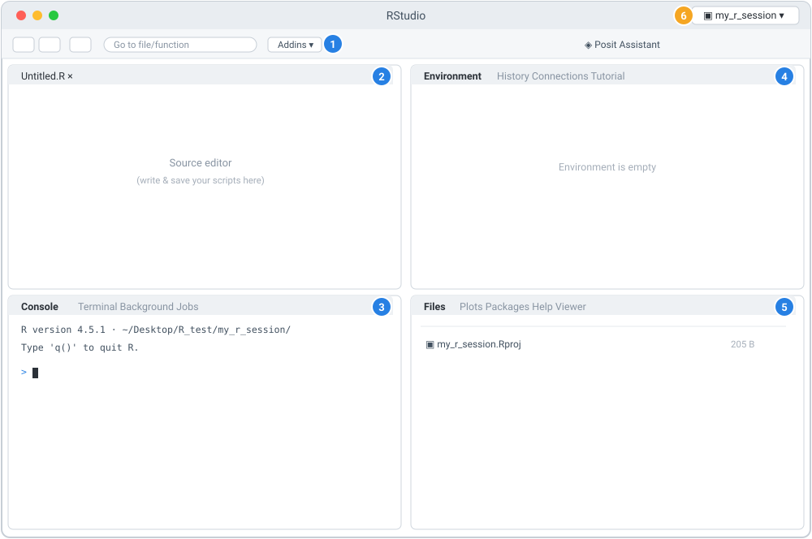

::: {.callout-note appearance="simple"}
## A gentle welcome before we begin

If the letter "R" has been floating around your lab as something everyone seems to
use but nobody quite explains — this module is for you. We'll start from *what R
even is* and build up slowly, no prior programming assumed.

R has a reputation for being a little quirky (it counts starting from 1, and it has
strong opinions about arrows). But it's also one of the friendliest on-ramps into
computational biology, because so much of the statistics and visualisation biologists
need is already built for them. You don't need to become a software engineer — you
need just enough R to explore your data with confidence.

As always: this is a doorway, not the whole house. You'll get comfortable by
**typing the examples yourself, experimenting, and looking things up** — not by
reading alone. Ready? Let's meet R.
:::

## What you'll learn

By the end of this module you'll be able to:

1. Explain **what R is** and why it's so widely used in biology.
2. **Install R** cleanly using the Conda setup from Module 01.
3. Run R **two ways** — interactively in the **console**, and from the **command
   line** as scripts.
4. **Install packages** from the two repositories biologists rely on: **CRAN** and
   **Bioconductor**.
5. Run a small, hands-on demo on some toy biological data.

### Before you start

- You've completed **[Module 01](../01-setup-environment/index.qmd)** and have a
  working **Conda** setup in a Unix shell (Ubuntu/WSL on Windows, or Terminal on
  macOS). We'll build directly on that.
- You're comfortable activating a Conda environment (`conda activate ...`).

::: {.callout-warning}
## ⚠️ Verify — versions change
R, Bioconductor, and every package have their own release cycles, and specific
version numbers below are **examples**. Bioconductor in particular is tied to your R
version, so mismatches are a common source of confusion. When a step matters, check
the official docs (R Project / CRAN, Bioconductor, and each package's page).
:::

---

## Part A — What is R, and why do biologists use it?

**R is a programming language and environment built for statistics, data analysis,
and visualisation.** It was created by statisticians, and it shows: things that are
awkward in general-purpose languages — fitting a model, summarising a table,
drawing a publication-quality plot — are often one short line in R.

For biologists specifically, R is popular because:

- **Statistics are first-class.** Means, t-tests, linear models, and far more are
  built in or a package away.
- **Visualisation is excellent.** Base R plots are quick; the
  [`ggplot2`](https://ggplot2.tidyverse.org/) package produces beautiful,
  customisable figures.
- **[Bioconductor](https://bioconductor.org/).** This is the big one — a huge,
  curated ecosystem of R packages purpose-built for molecular biology (working with
  sequencing counts, genomic intervals, expression data, and much more). You'll meet
  it in later modules.
- **Reproducibility.** Your analysis is written as a script, so it can be re-run,
  shared, and checked — exactly the habit good science needs.

::: {.callout-tip}
## R or Python? (a calm answer)
You may hear people debate R vs Python. Honestly: **both are excellent, and many
biologists use both.** R has historically had the edge for statistics and for the
Bioconductor ecosystem; Python shines in general-purpose scripting and some
machine-learning work. You are not marrying one forever — learning R does not close
any doors. We start with R here because of its statistical roots and Bioconductor.
:::

::: {.callout-note}
Concrete examples of what R can do for a biologist (we'll build toward these in later
modules, so no need to install them now): summarise and clean experimental data,
run statistical tests, make figures with `ggplot2`, and analyse RNA-seq counts with
Bioconductor packages. Names of specific tools are mentioned only as examples —
**verify a package exists and its current usage before relying on it.**
:::

::: {.callout-tip}
## Explore these (it helps to see them)
Clicking through the official homes of these tools makes them feel much less
abstract. Have a quick look:

- [The R Project](https://www.r-project.org/) — R's official home.
- [CRAN](https://cran.r-project.org/) — the Comprehensive R Archive Network, where R
  and most general packages live.
- [Bioconductor](https://bioconductor.org/) — the ecosystem of R packages for
  genomics and molecular biology.
- [RStudio (by Posit)](https://posit.co/products/open-source/rstudio/) — a popular
  graphical editor for R (optional; we use the terminal in this module).
:::

---

## Part B — Install R (using Conda)

Because you set up Conda in Module 01, the cleanest, most reproducible way to get R
is to create a **dedicated Conda environment** for it. This works identically on
Windows (inside Ubuntu/WSL) and macOS, and needs no administrator rights.

### B.1 Create an R environment

The core R package on the [conda-forge](https://conda-forge.org/) channel is called
**`r-base`**:

```bash
conda create -n r-intro r-base
```

Type `y` when prompted. Then activate it:

```bash
conda activate r-intro
```

Your prompt should now show `(r-intro)`.

::: {.callout-note collapse="true"}
## ✅ Check — is R installed?
```bash
R --version
```
This should print R's version and license information. If you get "command not
found", make sure the `r-intro` environment is **activated**.
:::

::: {.callout-tip}
## Want a batch of common packages at once?
The `r-essentials` bundle installs R plus many popular packages (including the
[tidyverse](https://www.tidyverse.org/) and others) in one go:

```bash
conda create -n r-intro r-base r-essentials
```

It's convenient but larger to download. For a first look, plain `r-base` is enough.
:::

::: {.callout-warning}
## ⚠️ Verify — other ways to install R exist
Installing via Conda keeps things consistent with the rest of this series, but it is
**not the only way**. R can also be installed from the
[official CRAN](https://cran.r-project.org/) website, and many people pair it with the
[**RStudio**](https://posit.co/products/open-source/rstudio/) desktop application (a
friendly graphical editor for R). Those are perfectly valid — but their installation
steps differ by operating system and change over time, so if you go that route, follow
the current official instructions from [the R Project](https://www.r-project.org/) and
from [Posit](https://posit.co/) (the makers of RStudio) rather than this page. Note that running a graphical app like RStudio under Windows
WSL involves extra setup; the terminal-based approach in this module avoids that.
:::

---

## Part C — Running R two ways

There are two everyday ways to run R, and it's worth understanding both from the
start.

### C.1 The interactive console (the "REPL")

The **console** is R's interactive prompt: you type a line, press Enter, and R
responds immediately. It's perfect for exploring and experimenting.

Start it by simply typing:

```bash
R
```

**Here is exactly what you'll see when R starts up** (this is a real capture from an
R session — yours will look the same, give or take the version and platform lines):

```text
R version 4.5.1 (2025-06-13) -- "Great Square Root"
Copyright (C) 2025 The R Foundation for Statistical Computing
Platform: aarch64-apple-darwin24.4.0

R is free software and comes with ABSOLUTELY NO WARRANTY.
You are welcome to redistribute it under certain conditions.
Type 'license()' or 'licence()' for distribution details.

  Natural language support but running in an English locale

R is a collaborative project with many contributors.
Type 'contributors()' for more information and
'citation()' on how to cite R or R packages in publications.

Type 'demo()' for some demos, 'help()' for on-line help, or
'help.start()' for an HTML browser interface to help.
Type 'q()' to quit R.

>
```

Let's read that screen top to bottom, because it's less intimidating once you know
what each part is:

- **Line 1 — the version.** `R version 4.5.1 ... "Great Square Root"`. Every R
  release gets a playful nickname. **Yours may differ** — that's fine.
- **`Platform:` line.** Just tells you the operating system/architecture R built for
  (here, an Apple-Silicon Mac). Yours will reflect your own machine.
- **The warranty / license paragraph.** Standard free-software notice — nothing you
  need to act on.
- **The `Type '...'` hints.** Genuinely useful signposts: `q()` quits, `help()` opens
  help, `citation()` tells you how to cite R in a paper.
- **The `>` on the last line — this is the prompt.** It means "R is ready and waiting
  for your command." This blinking-cursor line is where you type. When you see `>`,
  R is listening.

Now try a few things — type each line at the `>` prompt and press Enter. Here's a
**real transcript** of exactly that (your typed input is echoed after each `>`, and
R's answers appear underneath):

```text
> 1 + 1
[1] 2
> x <- c(2, 4, 6, 8)
> mean(x)
[1] 5
> counts <- c(GeneA = 120, GeneB = 85, GeneC = 200, GeneD = 40, GeneE = 150)
> counts
GeneA GeneB GeneC GeneD GeneE
  120    85   200    40   150
> mean(counts)
[1] 119
> summary(counts)
   Min. 1st Qu.  Median    Mean 3rd Qu.    Max.
     40      85     120     119     150     200
```

Reading that transcript section by section:

- `> 1 + 1` then `[1] 2` — you typed `1 + 1`; R answered `2`. The **`[1]`** is R
  labelling the *position* of the first value on that output line (handy when output
  spans many numbers). You'll stop noticing it quickly.
- `x <- c(2, 4, 6, 8)` produced **no output** — assignment is silent. `<-` is R's
  **assignment** operator ("put the value on the right into the name on the left"),
  and `c(...)` **c**ombines values into a vector. So this line means "let `x` be those
  four numbers."
- `mean(x)` → `[1] 5` — R computed the average. Notice results **print
  automatically** in the console (you didn't have to ask). Remember this — it's the
  opposite of how scripts behave (Part C.2).
- `counts` printed as a **named vector**: the gene names sit above their values. Naming
  entries (`GeneA = 120`) makes output readable.
- `summary(counts)` gave a **five-number-style overview** — minimum, quartiles, median,
  mean, and maximum — a one-line feel for your data's spread.

When you're done, leave the console with:

```r
q()
```

It may ask whether to "save the workspace image" — for now, answering **no** (`n`)
is a fine, tidy default.

::: {.callout-note collapse="true"}
## ✅ Check
If `mean(x)` printed `[1] 5`, your console is working. (The `[1]` is just R labelling
the position of the first value in the output — you'll get used to it.)
:::

### C.2 From the command line (running scripts)

The **console** is great for exploring, but real analyses live in **scripts** —
plain text files of R code you can save, re-run, and share. You run these from the
command line **without** entering the interactive console. This is the reproducible
way to work.

The tool for this is **`Rscript`**.

**One-liners.** Run a snippet directly with `-e`:

```bash
Rscript -e 'print(mean(c(2, 4, 6, 8)))'
```

**Script files.** Create a file called `hello.R` with these contents:

```{.r filename="hello.R"}
# hello.R — my first R script
x <- c(2, 4, 6, 8)
print(mean(x))
cat("R is working!\n")
```

Then run it:

```bash
Rscript hello.R
```

::: {.callout-important}
## The one gotcha that surprises everyone: printing
In the **console**, typing `mean(x)` prints the result automatically. In a **script**
run with `Rscript`, it does **not** — you must ask for output explicitly with
`print(...)` (or `cat(...)`). This catches nearly every beginner. If your script
"runs but shows nothing," a missing `print()` is the usual reason.
:::

::: {.callout-note}
## Console vs. CLI — when to use which
- **Console (`R`):** exploring, trying ideas, quick checks. Interactive, immediate.
- **CLI (`Rscript`):** running a finished, repeatable analysis; automating; running
  on a server. Non-interactive and reproducible.

You'll use both constantly — explore in the console, then save what works into a
script you run with `Rscript`.
:::

### C.3 A friendlier option: the RStudio window at a glance

Everything so far works in a plain terminal — which is why we teach it that way, since
it behaves identically on every system. But many biologists prefer
[**RStudio**](https://posit.co/products/open-source/rstudio/): a free graphical
application that wraps R in one friendly window. You don't need it for this series, but
it's so common that it's worth knowing what you're looking at, so the first time you
open it doesn't feel like a cockpit.

When RStudio opens, it's a single window split into **panes**. Here's the anatomy:

{width=760 fig-alt="Labelled schematic of the RStudio window with its toolbar and four panes numbered one to six."}

Taking it pane by pane (the numbers match the diagram):

1. **Toolbar (top).** Buttons to create, open and save files, the "Go to file/function"
   search box, the **Addins** menu, and — in recent versions — a **Posit Assistant**
   button.
2. **Source editor (top-left).** Where you write and save R **scripts** (`.R` files).
   Run the current line or selection straight into the console with **Ctrl+Enter**
   (Windows) or **Cmd+Enter** (Mac). *In a brand-new session with no file open, this
   pane is hidden and the Console fills the whole left side* — exactly what you see when
   RStudio first launches.
3. **Console (bottom-left).** The very **same interactive R prompt from Part C.1** —
   same startup banner, same `>` prompt, results auto-printing. Its neighbouring tabs,
   **Terminal** and **Background Jobs**, give you a system shell and a place for
   long-running tasks.
4. **Environment / History (top-right).** **Environment** lists the objects
   (variables, data) you've created this session — it starts empty and fills as you
   work. **History** keeps your past commands; **Connections** and **Tutorial** are
   extra tabs.
5. **Files / Plots / Packages / Help / Viewer (bottom-right).** A file browser, the
   pane where your **plots** appear, a **Packages** manager, searchable **Help**, and
   viewers for web content. This is where the demo's bar chart would show up if you ran
   it here.
6. **Project (top-right corner).** The current **RStudio Project** — a tidy way to keep
   one analysis's files, working directory, and settings bundled together. Getting into
   the habit of working inside a Project early will save you confusion later.

::: {.callout-tip}
The console *inside* RStudio and the console you get by typing `R` in a terminal are the
**same R** — RStudio just wraps helpful panes around it. Everything you learned in
Parts C–E works identically either way.
:::

::: {.callout-warning}
## ⚠️ Verify
RStudio's exact layout, button labels, and features (assistant tools included) change
between releases, so your real window may differ a little from this schematic. The
current [RStudio documentation from Posit](https://posit.co/products/open-source/rstudio/)
is the authoritative reference.
:::

---

## Part D — Installing packages

R's real power comes from **packages** — bundles of extra functions others have
written. Biologists draw from two main repositories.

### D.1 CRAN packages — `install.packages()`

[**CRAN**](https://cran.r-project.org/) is R's central, general-purpose package
repository. You install from it **inside R** with the built-in `install.packages()`
function. From the R console:

```r
install.packages("ggplot2")
```

The first time, R may ask you to choose a "mirror" (a download location) — pick any
one that's geographically near you. After it finishes, load the package to use it:

```r
library(ggplot2)
```

::: {.callout-tip}
## Installing from a script or one-liner
Because a non-interactive run can't prompt you to pick a mirror, specify one:

```bash
Rscript -e 'install.packages("ggplot2", repos="https://cloud.r-project.org")'
```

`https://cloud.r-project.org` is CRAN's official, globally load-balanced mirror.
:::

::: {.callout-tip}
## A cleaner option with Conda: install R packages as Conda packages
Because you're in a Conda environment, many R packages are **also** available as
Conda packages, named with an `r-` prefix — for example:

```bash
conda install r-ggplot2
```

Installing R packages through Conda (rather than `install.packages()`) keeps your
whole environment described in one place and avoids occasional compilation issues.
For a Conda-based setup, this is often the smoother path. You can mix approaches, but
picking one primary method per environment will save you headaches.
:::

### D.2 Bioconductor packages — `BiocManager`

[**Bioconductor**](https://bioconductor.org/) is the repository of R packages for
molecular biology and genomics. You don't install Bioconductor packages with
`install.packages()` directly; instead you use a small helper package called
[**`BiocManager`**](https://cran.r-project.org/package=BiocManager). First install the
helper (once), then use it to install Bioconductor packages:

```r
install.packages("BiocManager")
BiocManager::install("DESeq2")
```

Here [`DESeq2`](https://bioconductor.org/packages/DESeq2/) is just an **example** of a
well-known RNA-seq analysis package — we're not using it yet, it's only to show the
pattern. The `::` means "the `install`
function from the `BiocManager` package."

::: {.callout-warning}
## ⚠️ Verify — Bioconductor is tied to your R version
Bioconductor releases are matched to specific R versions, so a package that "won't
install" is very often an R/Bioconductor version mismatch rather than anything you
did wrong. Check the current Bioconductor installation instructions and the package's
own page for the versions they expect. On a Conda setup, Bioconductor packages are
also available with a `bioconductor-` prefix (e.g. `conda install bioconductor-deseq2`),
which keeps versions consistent with your environment.
:::

### D.3 Keeping it reproducible

However you install packages, remember the lesson from Module 01: **an analysis is
only trustworthy if it can be recreated.** Two common approaches:

- **Conda:** if you installed R and packages via Conda, `conda env export` captures
  the whole environment (see Module 01).
- [**`renv`**](https://rstudio.github.io/renv/): a popular R package that records the
  exact package versions a project uses in a lockfile, so collaborators can restore
  them. It's worth learning once
  you're comfortable — look up the current `renv` documentation when you get there.

::: {.callout-warning}
## ⚠️ Verify
`renv` is a real, widely used package, but its commands and workflow evolve — confirm
current usage in its official documentation before relying on it. I'm mentioning it
as a signpost, not giving you exact commands here.
:::

---

## Part E — A tiny hands-on demo

Let's tie it together on some toy "gene expression" numbers, using only **base R**
(no extra packages needed). We'll do it first in the console, then as a script.

### E.1 In the console

Start R (`R`), then enter:

```r
# Toy counts for five imaginary genes
counts <- c(GeneA = 120, GeneB = 85, GeneC = 200, GeneD = 40, GeneE = 150)

counts            # look at the data
mean(counts)      # average count
summary(counts)   # min, quartiles, median, mean, max
```

Here's the **real output** those lines produce:

```text
> counts
GeneA GeneB GeneC GeneD GeneE
  120    85   200    40   150
> mean(counts)
[1] 119
> summary(counts)
   Min. 1st Qu.  Median    Mean 3rd Qu.    Max.
     40      85     120     119     150     200
```

The average prints as `[1] 119` (the five numbers add to 595, divided by 5), and
`summary()` gives a quick overview of the spread — minimum 40, median 120, maximum
200.

Now make a simple bar chart and save it to a file:

```r
png("gene_counts.png", width = 600, height = 400)
barplot(counts, main = "Toy gene counts", ylab = "Count")
dev.off()
```

- `png(...)` opens an image file as the drawing target.
- `barplot(...)` draws the chart.
- `dev.off()` closes the file — **don't forget this**, or the image won't be finished
  writing.

You'll now have a `gene_counts.png` in your working directory. (Not sure where that
is? Run `getwd()` to print your current working directory.)

::: {.callout-note collapse="true"}
## ✅ Check
`mean(counts)` prints `[1] 119`, and a `gene_counts.png` file appears in the folder
`getwd()` reports. Open it to see your first R figure.
:::

### E.2 As a script (the reproducible version)

Save the same logic as a file named `gene-counts-demo.R`:

```{.r filename="gene-counts-demo.R"}
# gene-counts-demo.R
# A tiny base-R demo on toy gene counts.

counts <- c(GeneA = 120, GeneB = 85, GeneC = 200, GeneD = 40, GeneE = 150)

# In a script, ask for output explicitly:
print(mean(counts))
print(summary(counts))

# Save a bar chart to a file
png("gene_counts.png", width = 600, height = 400)
barplot(counts, main = "Toy gene counts", ylab = "Count")
dev.off()

cat("Done — wrote gene_counts.png\n")
```

Run it from the command line:

```bash
Rscript gene-counts-demo.R
```

Here's the **real output** of that run:

```text
[1] 119
   Min. 1st Qu.  Median    Mean 3rd Qu.    Max.
     40      85     120     119     150     200
Done — wrote gene_counts.png
```

And here's the **actual figure** it wrote — your first R plot:

{width=560}

Notice the `print(...)` calls — remember, scripts don't auto-print (Part C.2). This
is the exact same analysis as the console version, but now it's **saved, repeatable,
and shareable** — the reproducible way to work.

::: {.callout-note}
A ready-to-run copy of this script is included alongside this module at
`scripts/gene-counts-demo.R`.
:::

::: {.callout-warning}
## 🧰 Troubleshooting Part E
- **`Rscript: command not found`** → your `r-intro` environment isn't activated
  (`conda activate r-intro`), or R didn't install correctly (revisit Part B).
- **Script "runs" but prints nothing** → you're missing `print()` around the values
  you want to see (the classic scripting gotcha).
- **`could not find function "..."`** → the function comes from a package you haven't
  loaded; `library(thePackage)` first (and install it if needed).
- **A plot file is empty or won't open** → you likely forgot `dev.off()` after
  drawing.
:::

---

## Recap

You now can:

- ✅ Explain **what R is** and why it's a natural fit for biology.
- ✅ **Install R** in a dedicated Conda environment.
- ✅ Run R in the **console** (interactive) and from the **CLI** with `Rscript`
  (reproducible).
- ✅ Install packages from **CRAN** (`install.packages()`) and **Bioconductor**
  (`BiocManager`), and know the Conda alternatives.
- ✅ Run a small analysis on toy data and save a figure.

That's a real foundation. R will feel strange for a little while and then, fairly
suddenly, it won't.

::: {.callout-tip appearance="simple"}
## Keep going — a word of encouragement

Nobody becomes fluent in a language by reading a phrasebook once, and R is no
different. The single best thing you can do now is **play**: change the numbers,
break things on purpose, look up any error message you don't understand. Every hour
you spend experimenting in the console is worth several spent reading.

And remember this module is a starting point, not the last word — the official R and
Bioconductor documentation will take you far deeper than any single tutorial can.
You're doing the hard part just by showing up and typing. Keep at it.
:::

## Exercises

1. In the console, make a vector of your own (say, five numbers), then try `min()`,
   `max()`, `median()`, and `sd()` on it. What does each return?
2. Turn Exercise 1 into a script and run it with `Rscript`. Add `print()` around each
   result — notice how the script stays silent without it.
3. Install a CRAN package of your choice (for example `stringr`) and load it with
   `library()`. Then find its help with `?` — e.g. `?str_detect` — in the console.
4. Change the demo's `barplot(...)` to a `boxplot(counts)` and re-run the script.
   How does the figure change?

## Where to go next

You've now got R installed and know how to run and extend it — a toolkit you'll use
constantly from here on. Future modules build on this foundation (for example, using
R and Bioconductor to analyse real sequencing data). New modules appear on the
[home page](../../index.qmd) as they're ready.

In the meantime: **practise in the console**, and get into the habit of saving what
works into scripts. That single habit will carry you a long way.

::: {.callout-important}
## One more time on accuracy
If a command here behaved differently, it's most likely an R/package version
difference. The authoritative sources are the **R Project / CRAN**, **Bioconductor**,
and each package's own documentation — they supersede this tutorial whenever they
disagree with it.
:::
