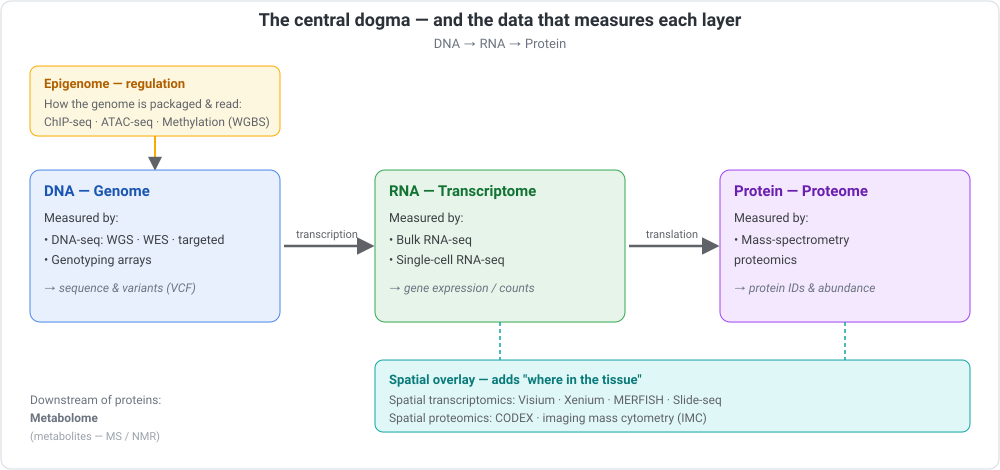
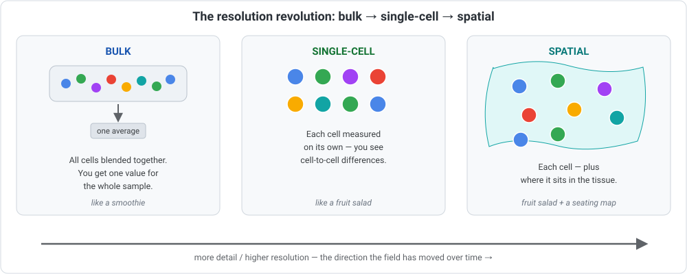

::: {.callout-note appearance="simple"}
## A gentle welcome before we begin

Before you can *analyse* biological data, it helps to know **what kinds of data
exist**, where each one comes from, and what it looks like when it lands on your
computer. That's the whole job of this module — it's a **map of the territory**, not
a deep dive into any one method.

We'll keep the language as plain as possible and spell out every abbreviation the
first time it appears (the field is drowning in acronyms, and nobody is born knowing
them). Think of this as a friendly tour of the "food groups" of molecular data.

You won't run big analyses here. You'll walk away able to look at a dataset and say:
"Ah — that's single-cell RNA data, it came from a sequencer, it's stored in this
format, and I can find more like it *here*." That orientation makes every later
module easier.
:::

## What you'll learn

By the end of this module you'll be able to:

1. Place the main molecular data types onto the **central dogma** (DNA → RNA →
   protein).
2. **Decode the "-omics" vocabulary** — genomics, transcriptomics, proteomics, and even
   ones you've never heard of.
3. Understand the **"resolution revolution"** — how the field moved from **bulk** to
   **single-cell** to **spatial** measurements.
4. For each data type, know **how it's generated**, the **file format** you receive
   (and what it actually looks like), and **where it's stored publicly** (with links).
5. Understand why **metadata** (the information *about* your samples) must be compiled
   *before* analysis.
6. Set up an **organised project folder** on the command line (`pwd`, `cd`, `mkdir`,
   `ls`) and understand **absolute vs relative paths**.
7. Retrieve a **small public dataset** yourself — into that folder — using both **Bash**
   and **R**.

### Before you start

- [Module 01](../01-setup-environment/index.qmd) (the command line and Conda) and
  [Module 02](../02-r-for-biologists/index.qmd) (R) will let you run the hands-on part
  at the end — but the concepts stand on their own.
- No lab experience assumed. Where a term is technical, we explain it.

::: {.callout-warning}
## ⚠️ Verify — this is a fast-moving field
New technologies, file formats, and databases appear constantly, and older ones
change. Everything here is a **snapshot and a starting point**. Spatial methods in
particular are evolving very quickly. Always confirm current formats, tools, and
repository details against the official sources linked below before relying on them.
:::

---

## Part A — The big picture: data across the central dogma

Biology has a famous storyline called the **central dogma**: information flows from
**DNA** (the instructions) to **RNA** (working copies of those instructions) to
**protein** (the molecular machines that do the work). Most molecular data types are
simply **different ways of measuring one of these layers** — or the machinery that
regulates them.

Here's the map we'll follow:

{width=820 fig-alt="Diagram mapping molecular data types onto the central dogma."}

::: {.callout-note}
## Acronym key for the diagram above
- **DNA** — deoxyribonucleic acid (the genome; your instructions).
- **RNA** — ribonucleic acid (working copies of genes that are switched on).
- **WGS** — whole-genome sequencing (read *all* the DNA).
- **WES** — whole-exome sequencing (read only the protein-coding parts).
- **VCF** — variant call format (a file listing differences from a reference genome).
- **ChIP-seq** — chromatin immunoprecipitation sequencing (where a protein sticks to DNA).
- **ATAC-seq** — assay for transposase-accessible chromatin using sequencing (which DNA is "open").
- **WGBS** — whole-genome bisulfite sequencing (DNA methylation — a chemical on/off mark).
- **RNA-seq** — RNA sequencing (which genes are switched on, and how strongly).
- **MS** — mass spectrometry / **NMR** — nuclear magnetic resonance (two ways to measure molecules by their physical properties).
- **MERFISH**, **CODEX**, **IMC** — spatial methods, spelled out in [Part G](#part-g-spatial-data-adding-location).
- **Visium / Xenium / Slide-seq** — brand/platform names for spatial products, not acronyms.
:::

A couple of orienting notes:

- The whole collection of these data types is often called **"omics"** data — a word we
  decode in full just below.
- The **epigenome** (top of the diagram) isn't a separate molecule — it's the layer
  of chemical marks and packaging that decides *which* genes get used. We measure it
  because it explains a lot about how identical DNA produces very different cell types.
- **Metabolites** (small molecules like sugars and lipids) sit *downstream* of
  proteins — the **metabolome**. We mention it briefly; it's measured much like
  proteins.

### The "-omics" family — decoding the buzzword

You'll hear "-omics" *everywhere*, and it can sound like impenetrable jargon. Here's the
little secret that makes it all click:

> **-ome** = the *complete set* of something. &nbsp; **-omics** = the *study* of that
> complete set.

So a **gen·ome** is all of your DNA, and **genomics** is the study of it. A
**prote·ome** is all your proteins, and **proteomics** studies them. Once you see the
pattern, every "-omics" word decodes itself: find the *thing*, then add "the study of
all of it."

Most map straight onto the layers we just met:

| Term | The "-ome" (the actual thing) | In plain English |
|---|---|---|
| **Genomics** | genome — all your DNA | Your full set of genetic instructions. |
| **Epigenomics** | epigenome — chemical marks on DNA | The switches deciding which genes are used. |
| **Transcriptomics** | transcriptome — all the RNA | Which genes are switched on, and how strongly. |
| **Proteomics** | proteome — all the proteins | The molecular machines actually present. |
| **Metabolomics** | metabolome — all the metabolites | The small molecules of life (sugars, lipids…). |

Beyond those core layers, you'll also bump into:

- **Metagenomics** — the genomes of a *whole community* of microbes at once (say, every
  bacterium in a gut sample), sequenced together without growing them in a dish. ("Meta"
  here means *across many organisms*.) It gets its own module later.
- **Microbiomics / the microbiome** — the study of those microbial communities and what
  they do; a close cousin of metagenomics.
- **Exposomics** — the *exposome*: the grand total of environmental exposures a person
  meets over a lifetime (diet, pollutants, chemicals, stress) and how they shape health.
  A newer, ambitious idea — think of it as the environmental counterpart to the genome.
- **Lipidomics** — all the *lipids* (fats); really a focused branch of metabolomics.
- **Glycomics** — all the *glycans* (the sugar chains attached to many molecules).
- **Phenomics** — all the *phenotypes* (an organism's observable traits).
- **Multi-omics** — not a layer itself, but the practice of **combining several omics**
  (say genomics + transcriptomics + proteomics) to see the fuller picture.

::: {.callout-tip}
## The one rule that cracks any "-omics" you'll ever meet
New "-omics" terms are coined all the time — there's a whole zoo of niche ones out
there. The good news: you never need to memorise them. Just apply the rule — **strip off
the "-omics" and read it as "the study of *all* the [that thing]."** Nine times out of
ten, that's the entire meaning.
:::

::: {.callout-warning}
## ⚠️ Verify
"-omics" is a fast-growing, loosely-policed vocabulary: new words appear often, and some
are used more strictly than others. If you meet an unfamiliar one, check how that
specific paper or database defines it rather than assuming.
:::

---

## Part B — The resolution revolution: bulk → single-cell → spatial

This is one of the most important ideas in modern biology, and it's genuinely
simple once you see it. It's about **how finely we can look**.

{width=860 fig-alt="Three panels showing bulk, single-cell, and spatial resolution."}

The easiest way to feel the difference is with food:

- **Bulk** = a **smoothie.** You throw a whole tissue sample (millions of cells) into
  the blender and measure the mixture. You get **one average** for the whole sample.
  Cheap, simple, and still very useful — but you can't tell which cell said what.
- **Single-cell** = a **fruit salad.** Clever chemistry keeps each cell separate, so
  you measure **every cell on its own**. Now you can see that a tumour isn't one thing
  — it's dozens of different cell types mixed together.
- **Spatial** = a **fruit salad with a seating chart.** You measure each cell *and*
  record **where it was** in the tissue. Location matters enormously in biology
  (which cells are neighbours, where a tumour meets healthy tissue), and this is the
  current frontier.

The field has moved steadily in this direction — from bulk, to single-cell, to
spatial — trading cost and simplicity for ever-richer detail.

::: {.callout-tip}
## "Single-cell" is bigger than just RNA
Single-cell started with RNA (single-cell RNA-seq) but has spread across the whole
central dogma. You'll increasingly hear about:

- **snRNA-seq** — single-nucleus RNA sequencing (uses the cell's nucleus; handy for
  frozen or hard-to-dissociate tissue).
- **scATAC-seq** — single-cell ATAC sequencing (open chromatin, one cell at a time).
- **CITE-seq** — cellular indexing of transcriptomes and epitopes by sequencing
  (measures RNA *and* surface proteins in the same cell).
- **Multiome** — measuring more than one layer (e.g. RNA + open chromatin) in the
  same single cell.

Don't worry about the details now — just know the trend: **more layers, one cell at a
time.**
:::

::: {.callout-warning}
## ⚠️ Verify
Approximate history: bulk sequencing came first, single-cell methods became practical
later, and spatial methods are newer still. The exact dates and "firsts" vary by
technology and are debated — if you need specific years, check a primary review rather
than quoting this page.
:::

---

## Part C — One shared language: common file formats

Most of these data types are produced by the same two kinds of machine — a
**DNA/RNA sequencer** or a **mass spectrometer** — so they share a surprisingly small
set of file formats. Here are the ones you'll meet most:

| Format | What it holds (in plain terms) | Typical stage |
|---|---|---|
| **FASTA** (`.fa`, `.fasta`) | Plain sequences — e.g. a reference genome or protein sequences | Reference |
| **FASTQ** (`.fastq`, `.fq`, often `.gz`) | Raw sequencing "reads" plus a quality score for each letter | Raw data |
| **SAM / BAM / CRAM** | Reads after they've been *aligned* to a reference (BAM = binary alignment map; CRAM is a more compressed version) | Processed |
| **VCF / BCF** | Variants — the differences between your sample and the reference (VCF = variant call format) | Result |
| **BED / GTF / GFF** | Locations of features along the genome (genes, regions). GTF = gene transfer format; GFF = general feature format | Annotation |
| **bigWig / bedGraph** | A "coverage track" — how much signal there is along the genome | Processed |
| **narrowPeak / broadPeak** | "Peaks" — regions where a signal piles up (used in ChIP-seq / ATAC-seq) | Result |
| **Count matrix** (`.csv`, `.tsv`, `.mtx`) | A table of genes × samples (or genes × cells) with expression numbers | Result |
| **h5ad / loom / `.rds`** | Single-cell datasets bundled with their metadata (h5ad is an HDF5 file used by the Python tool *AnnData*; `.rds` is an R object) | Result |
| **mzML / `.raw`** | Mass-spectrometry measurements (`.raw` = instrument vendor format; mzML = an open format) | Raw/processed |
| **OME-TIFF** | Microscopy images with their metadata (used in imaging/spatial) | Image |

::: {.callout-note}
## Two habits that will save you
- **`.gz` just means "compressed."** `sample.fastq.gz` is a normal FASTQ file zipped
  to save space. Most tools read `.gz` directly.
- **Data flows through formats.** A typical sequencing project goes
  **FASTQ → BAM → VCF/counts**: raw reads, then aligned reads, then results. Knowing
  which format you have tells you *which stage* you're at.
:::

### What these files actually look like

Tables are abstract — it helps enormously to *see* a few. Here are small examples of
the formats you'll meet most. Real files are far bigger (and often compressed), but the
shape is exactly this.

::: {.callout-note appearance="simple"}
## Don't panic at the funny characters

Fair warning: some of the boxes below contain things like `IIIIIIIHHHHGGGFFF@@@`, which
on first sight look less like scientific data and more like a cat took a nap on the
keyboard. If your reaction is "what on earth am I looking at" — good, you're paying
attention.

When I first started learning Japanese, the Kanji and Katakana looked completely alien:
strange symbols I had no clue how to write, strung together in a sentence order that
felt backwards to my English-speaking brain. It was genuinely hard. But it was also
oddly wonderful — every mysterious squiggle turned out to *mean* something, and slowly
learning to recognise them became its own quiet joy.

These file formats are exactly the same. Right now they're unfamiliar squiggles; give
them a little time and they turn into old friends. **And here's the reassuring part:**
you will almost never read these files by hand. **Dedicated tools do that for us** — you
won't sit and squint at a raw BAM or VCF. So don't invest hours memorising this; the
goal of this section isn't fluency, it's just to *appreciate what's inside* so these
formats stop feeling like scary black boxes. Skim, enjoy the tour, and move on.
:::

#### FASTA — sequences

This is a **real** snippet of the SARS-CoV-2 reference genome (the one you'll download
in Part K):

```text
>NC_045512.2 Severe acute respiratory syndrome coronavirus 2 isolate Wuhan-Hu-1, complete genome
ATTAAAGGTTTATACCTTCCCAGGTAACAAACCAACCAACTTTCGATCTCTTGTAGATCTGTTCTCTAAA
CGAACTTTAAAATCTGTGTGGCTGTCACTCGGCTGCATGCTTAGTGCACTCACGCAGTATAATTAATAAC
```

- The line starting with **`>`** is the **header** — a name and description.
- Everything after it is the **sequence** (the A/C/G/T letters), wrapped across lines.
- A file can hold one sequence (like this genome) or millions (like all human proteins).

#### FASTQ — raw sequencing reads

A sequencer doesn't hand you a tidy genome — it hands you millions of short **reads**,
each stored as **four lines**. Here's one read (a simplified example):

```text
@SEQ_ID_001
AGGTCAGTTCAAGGCTAACG
+
IIIIIIIHHHHGGGFFF@@@
```

- **Line 1** (`@…`) — the read's **name / ID**.
- **Line 2** — the **DNA letters** the machine read.
- **Line 3** (`+`) — just a separator.
- **Line 4** — a **quality score for every base** (one character each, the *same length*
  as line 2). Higher means the machine was more confident. Storing that confidence is
  why FASTQ is bigger than FASTA.

#### BAM (and SAM) — reads aligned to a reference

Once reads are **aligned** (matched to their place on a reference genome), they're
stored as **BAM** — **b**inary **a**lignment **m**ap — a compressed, *binary* file you
can't read by eye. Its human-readable twin is **SAM** (**s**equence **a**lignment
**m**ap); a tool like `samtools` converts between them. One aligned read looks like
this (simplified; the real columns are separated by tabs):

```text
read001   0   1   866500   60   20M   *   0   0   AGGTCAGTTCAAGGCTAACG   IIIIIIIHHHHGGGFFF@@@
```

Reading the important columns left to right:

- **`read001`** — the read's name (the same read from the FASTQ above).
- **`1`** and **`866500`** — the **chromosome** and **position** where it aligned.
- **`60`** — **mapping quality** (how sure we are it's in the right place).
- **`20M`** — the **CIGAR** string, here meaning "20 bases match."
- Then the **sequence** and its **quality scores** again.

#### VCF — variants (differences from the reference)

Where a sample differs from the reference, those differences are recorded in a **VCF**
(**v**ariant **c**all **f**ormat) file (simplified example):

```text
##fileformat=VCFv4.2
#CHROM  POS      ID   REF  ALT  QUAL  FILTER  INFO
1       866511   .    C    T    258   PASS    DP=42
1       900505   .    G    A    132   PASS    DP=28
```

- Lines starting with **`##`** are header / metadata; the **`#CHROM …`** line names the
  columns.
- Each row is one variant. Read the first as: on **chromosome 1**, at **position
  866511**, the reference has a **C** but this sample has a **T** — a single-letter
  change. **`QUAL`** is confidence, **`PASS`** means it cleared quality filters, and
  **`INFO`** carries extras (here **`DP=42`** = 42 reads covered this spot).
- The **`ID`** column often holds a database name (an "rsID" from dbSNP); a **`.`** means
  none was assigned.

#### Count matrix — expression tables

Gene-expression results (from RNA-seq) usually arrive as a **count matrix**: a plain
table of **genes (rows) × samples (columns)**, where each number is how much of that
gene was seen (simplified example):

```text
gene_id   sample1  sample2  sample3  sample4
TP53         540      512      118      130
BRCA1        112       98      340      410
ACTB        2200     2150     2300     2250
GAPDH       1800     1750     1900     1880
```

- Each **row** is a gene, each **column** a sample, each **number** that gene's activity
  in that sample.
- For **single-cell** data the idea is identical, but the columns become **cells** —
  often tens of thousands of them. Because most entries are zero, single-cell matrices
  are stored **sparsely** (the "10x" `matrix.mtx` trio, or bundled into `h5ad`) rather
  than as one giant plain table.

::: {.callout-tip}
Spot the same read, `AGGTCAGTTCAAGGCTAACG`, in the FASTQ example and then aligned in the
BAM/SAM example. That's the whole journey in miniature: **FASTQ (raw) → BAM (aligned) →
VCF / counts (results)** — exactly the flow from the "Two habits" note above.
:::

---

## Part D — The genome layer (DNA)

With the big picture and the file formats in hand, let's now walk the central dogma
**one layer at a time**, in the same order as the diagram in Part A. For each, we'll use
the same simple template: *what it measures · how it's generated · the format you
receive · where it's stored publicly.* We begin at the foundation — **DNA**.

### DNA sequencing (DNA-seq)

- **What it measures:** the DNA sequence itself — your genome's letters, and where
  yours differs from a reference (these differences are called **variants**).
- **How it's generated:** DNA is extracted, chopped into fragments, and read by a
  **sequencer**. *Short-read* machines (most commonly from Illumina) read many short
  fragments; *long-read* machines (Pacific Biosciences, known as **PacBio**, and
  Oxford Nanopore) read much longer stretches, which helps with tricky regions.
  Common flavours: **WGS** (whole-genome sequencing — everything), **WES**
  (whole-exome sequencing — just the ~1–2% that codes for proteins, so it's cheaper),
  and **targeted** panels (only chosen genes).
- **Format you receive:** **FASTQ** (raw reads) → **BAM/CRAM** (aligned) → **VCF**
  (variants).
- **Where it's stored publicly:**
  [Sequence Read Archive (SRA)](https://www.ncbi.nlm.nih.gov/sra) and the
  [European Nucleotide Archive (ENA)](https://www.ebi.ac.uk/ena/browser/home) hold
  raw reads openly. **Human** data that could identify a person is usually
  *controlled-access* (you must apply): the
  [database of Genotypes and Phenotypes (dbGaP)](https://www.ncbi.nlm.nih.gov/gap/)
  and the [European Genome-phenome Archive (EGA)](https://ega-archive.org/).

### The epigenome (how the genome is regulated)

Every cell has the *same* DNA, yet a neuron and a skin cell behave completely
differently. The **epigenome** — chemical marks and how tightly DNA is packed —
explains much of that. Key assays:

- **ChIP-seq** (chromatin immunoprecipitation sequencing): finds **where a specific
  protein sticks to DNA** (for example, marks on histones, or transcription factors
  that switch genes on).
- **ATAC-seq** (assay for transposase-accessible chromatin using sequencing): finds
  which stretches of DNA are **"open"** and available for use.
- **DNA methylation** (e.g. **WGBS**, whole-genome bisulfite sequencing): reads a
  chemical on/off mark added directly to DNA.

- **Format you receive:** **FASTQ → BAM**, then results as **peaks**
  (narrowPeak/broadPeak/BED) and **coverage tracks** (bigWig).
- **Where it's stored publicly:**
  [Gene Expression Omnibus (GEO)](https://www.ncbi.nlm.nih.gov/geo/) and the
  [ENCODE portal](https://www.encodeproject.org/) (Encyclopedia of DNA Elements — a
  huge, well-curated collection), with raw reads mirrored in SRA/ENA.

---

## Part E — The transcriptome layer (RNA)

RNA tells you **which genes are switched on right now, and how strongly** — a much
more dynamic picture than DNA. This is where the resolution revolution is most vivid.

### Bulk RNA sequencing (bulk RNA-seq)

- **What it measures:** the **average** gene activity across all the cells in a
  sample.
- **How it's generated:** RNA is extracted, converted to DNA, and sequenced.
- **Format you receive:** **FASTQ → BAM**, then a **count matrix** (a table of
  genes × samples).
- **Where it's stored publicly:**
  [GEO](https://www.ncbi.nlm.nih.gov/geo/),
  [SRA](https://www.ncbi.nlm.nih.gov/sra)/[ENA](https://www.ebi.ac.uk/ena/browser/home),
  and [ArrayExpress / BioStudies (EBI)](https://www.ebi.ac.uk/biostudies/arrayexpress).

### Single-cell RNA sequencing (scRNA-seq)

- **What it measures:** gene activity in **each individual cell**, revealing the mix
  of cell types inside a tissue.
- **How it's generated:** cells are separated (often one-per-droplet), each tagged
  with a unique barcode, then sequenced together. A close cousin, **snRNA-seq**
  (single-nucleus RNA sequencing), uses nuclei instead — useful for frozen tissue.
- **Format you receive:** a **cell × gene count matrix**, frequently as the
  three-file "10x" bundle (a `matrix.mtx` plus barcode and feature lists) or bundled
  into **h5ad** (for the Python tool *AnnData*), **loom**, or a Seurat **`.rds`** (for
  R).
- **Where it's stored publicly:**
  [GEO](https://www.ncbi.nlm.nih.gov/geo/),
  [CELLxGENE (CZI)](https://cellxgene.cziscience.com/),
  the [Single Cell Portal (Broad)](https://singlecell.broadinstitute.org/), and the
  [Human Cell Atlas (HCA)](https://www.humancellatlas.org/).

---

## Part F — The proteome layer (protein) and beyond

The last stop on the central dogma is the **protein** layer — the molecules that
actually do the work. Measuring it uses a different machine from all the sequencing
above.

### Proteomics (mass spectrometry)

- **What it measures:** the **proteins** actually present in a sample, and roughly
  how much of each — the layer that does the real work in cells.
- **How it's generated:** proteins are cut into pieces and weighed extremely
  precisely by a **mass spectrometer (MS)**; software matches the weights back to
  known proteins.
- **Format you receive:** instrument **`.raw`** files, the open **mzML** format, and
  result tables of identified proteins and their amounts.
- **Where it's stored publicly:**
  [PRIDE (EBI)](https://www.ebi.ac.uk/pride/) — the proteomics identifications
  database — which is part of the
  [ProteomeXchange](https://www.proteomexchange.org/) network, alongside
  [MassIVE (UCSD)](https://massive.ucsd.edu/).

### Beyond the dogma: the metabolome (a light mention)

**Metabolites** are the small molecules of life (sugars, lipids, amino acids). They're
measured much like proteins — by **MS** or by **NMR** (nuclear magnetic resonance) —
and stored in places like
[MetaboLights (EBI)](https://www.ebi.ac.uk/metabolights/) and the
[Metabolomics Workbench](https://www.metabolomicsworkbench.org/). We won't go deeper
here.

---

## Part G — Spatial data (adding location) {#part-g-spatial-data-adding-location}

Remember the third step of the resolution revolution from [Part B](#part-b-the-resolution-revolution-bulk-single-cell-spatial)?
This is it. Spatial methods answer a question the others can't: **"where in the tissue
did this happen?"** They keep the position of each measurement, so you can see how cells
are
arranged and who their neighbours are.

- **Spatial transcriptomics** measures RNA *in place*. Common approaches include
  **Visium**, **Xenium**, and **Slide-seq** (platform names), and **MERFISH**
  (multiplexed error-robust fluorescence in situ hybridisation — a mouthful that just
  means "light up many genes, one by one, under a microscope").
- **Spatial proteomics** measures proteins in place — e.g. **CODEX** (co-detection by
  indexing) and **IMC** (imaging mass cytometry).

- **Format you receive:** usually a **count matrix + an image** (often **OME-TIFF**)
  + the **coordinates** of each spot or cell, frequently bundled into an **h5ad** or
  Seurat object.
- **Where it's stored publicly:** often [GEO](https://www.ncbi.nlm.nih.gov/geo/), plus
  vendor collections such as
  [10x Genomics datasets](https://www.10xgenomics.com/datasets) and various
  specialised portals.

::: {.callout-warning}
## ⚠️ Verify
Spatial technology is changing faster than almost anything else in the field —
platforms, formats, and best-practice tools are all moving targets. Treat the names
above as examples and check current documentation for whatever platform your data
came from.
:::

---

## Part H — Metadata is key

If you remember one thing from this module, make it this: **compile your metadata
before you analyse anything.**

**Metadata** is the information *about* your samples — everything that isn't the
measurement itself. The data tells you *what was measured*; the metadata tells you
*what each sample was*. Without it, your numbers are meaningless.

A classic example: you find that "group A" and "group B" differ. But if every group-A
sample was processed on Monday and every group-B sample on Friday, are you seeing
**biology** or just the **day of processing** (a so-called **batch effect**)? Only the
metadata can tell you — and only if you recorded it.

**Record at least these, one row per sample:**

- A unique **sample ID**
- The **condition / group** (e.g. treated vs. control)
- The **replicate** number and any **batch** (day, machine, kit lot)
- The **tissue / cell type** and organism
- The **platform / protocol** (which machine, which library kit)
- The **reference genome and version** you'll analyse against
- Relevant biology: treatment, dose, time point, sex, age, etc.

A tidy metadata table (a "sample sheet") looks like this — just a plain spreadsheet or
CSV (comma-separated values) file:

| sample_id | condition | replicate | batch | tissue | platform |
|---|---|---|---|---|---|
| S01 | control | 1 | A | liver | Illumina NovaSeq |
| S02 | control | 2 | A | liver | Illumina NovaSeq |
| S03 | treated | 1 | B | liver | Illumina NovaSeq |
| S04 | treated | 2 | B | liver | Illumina NovaSeq |

::: {.callout-tip}
## The rules of good metadata
- **One row per sample, one column per fact.** Keep it tidy.
- **Be consistent.** `control` and `Control` are two different things to a computer.
- **Record it as you go**, not from memory months later.
- Public repositories ask for structured metadata for exactly this reason. You may see
  formal standards mentioned — for example **MIAME** (minimum information about a
  microarray experiment) or similar "minimum information" checklists for sequencing and
  proteomics. The spirit is always the same: *write down enough that someone else could
  understand and redo your experiment.*
:::

---

## Part I — Resources that come *with* the data (a light touch)

Raw measurements are only half the story. To make sense of them, you almost always
need **reference resources** — and you must match their **version** to your data (and
note it in your metadata!). We'll use these hands-on in later modules; for now, just
know they exist:

- **Reference genome + gene annotation** — the "map" you compare your reads against, from
  [Ensembl](https://www.ensembl.org/),
  [GENCODE](https://www.gencodegenes.org/),
  the [UCSC Genome Browser](https://genome.ucsc.edu/) (University of California, Santa
  Cruz), or [NCBI RefSeq](https://www.ncbi.nlm.nih.gov/refseq/) (Reference Sequence).
- **Known variants** — catalogues of common DNA differences, from
  [dbSNP](https://www.ncbi.nlm.nih.gov/snp/) (database of single-nucleotide
  polymorphisms) and [gnomAD](https://gnomad.broadinstitute.org/) (the Genome
  Aggregation Database).
- **Protein reference** — [UniProt](https://www.uniprot.org/) (the universal protein
  resource), for proteomics.

::: {.callout-important}
Using the **wrong reference version** is a common, silent source of errors — your
positions won't line up. Always record which reference (and version) you used.
:::

---

## Part J — Set up a project folder

Before we download anything, let's get **organised**. A tidy project folder from day one
saves you from the classic mess of files called `final_FINAL_v2.csv` scattered
everywhere. It's also the perfect moment to meet a handful of command-line moves you'll
use in *every* module from here on. (You already have a working shell from
[Module 01](../01-setup-environment/index.qmd).)

::: {.callout-note}
## We build your command-line skills gradually
This module introduces just **four** essential commands — `pwd`, `cd`, `mkdir`, and
`ls`. Later modules add a few more each time, so it never feels like drinking from a
firehose. You don't need to master the terminal today — you just need these four.
:::

### J.1 "Where am I?" — `pwd`

The terminal always has a **current location** (the folder you're "standing in"). To see
it, type **`pwd`** — *print working directory*:

```bash
pwd
```

It prints something like `/home/yourname` (Linux/WSL) or `/Users/yourname` (macOS) —
your **home** folder, where you usually start.

### J.2 "Move around" — `cd`

**`cd`** — *change directory* — moves you into a different folder:

```bash
cd projects      # go into a folder named "projects" in your current location
cd ..            # go UP one level (into the parent folder)
cd ~             # jump straight to your home folder
```

- `..` means "the folder above me."
- `~` is a shortcut for your home folder.

### Paths: absolute vs relative

A **path** is simply an *address* for a file or folder. There are two kinds, and the
difference trips up every beginner exactly once:

- An **absolute path** starts from the very top (`/`, the "root") or from home (`~`).
  It's the *full* address and works no matter where you currently are — e.g.
  `/home/yourname/projects/covid-demo`.
- A **relative path** starts from **where you are right now** — e.g. `data` (a folder in
  your current location) or `../scripts` (up one level, then into `scripts`).

::: {.callout-tip}
Think of it like directions. An **absolute path** is a full postal address — it gets
someone there from anywhere in the world. A **relative path** is "two doors down on your
left" — only meaningful from where you happen to be standing. `pwd` is how you check
where you're standing.
:::

### J.3 "Make folders" — `mkdir`, and a clean project layout

**`mkdir`** — *make directory* — creates a new folder. Let's build a properly organised
project in one go:

```bash
mkdir -p ~/projects/covid-demo          # create the project folder (and any parents)
cd ~/projects/covid-demo                # move into it
mkdir data scripts results references   # create four sub-folders at once
ls                                      # list what's now inside
```

- **`-p`** tells `mkdir` to create any missing parent folders (and to stay quiet if the
  folder already exists).
- `mkdir` happily takes **several names at once**, so a single line makes all four
  sub-folders.

Here's the **real output** of that `ls`:

```text
data
references
results
scripts
```

Each folder has a clear job — a convention you'll meet everywhere:

| Folder | What goes in it |
|---|---|
| `data/` | raw input data you downloaded or were given (never hand-edit these) |
| `scripts/` | your code — the Bash and R scripts that do the analysis |
| `results/` | outputs your scripts produce (figures, tables, processed files) |
| `references/` | reference genomes and annotations (the resources from Part I) |

::: {.callout-tip}
Keeping **raw data**, **code**, and **results** in separate folders is one of the
simplest habits that makes an analysis reproducible and easy to share. Your future self
will thank you.
:::

---

## Part K — Download your first dataset (into your project)

Enough setup — let's put a real file where it belongs. We'll grab a genuinely tiny
genome, the **SARS-CoV-2 reference** (about 30 kilobytes, so nothing here downloads
anything large). Because it's a *reference*, it belongs in the `references/` folder we
just made — so we'll `cd` into that folder first, then download it two ways.

### K.1 With Bash (using `curl`, no extra tools to install)

First, move into the folder built for it:

```bash
cd ~/projects/covid-demo/references   # go to the references folder
```

Public archives at the National Center for Biotechnology Information (NCBI) offer a
web address (an **API** — application programming interface) you can download from
directly. This command asks for one genome record in FASTA format and saves it right
here:

```bash
curl -s "https://eutils.ncbi.nlm.nih.gov/entrez/eutils/efetch.fcgi?db=nuccore&id=NC_045512.2&rettype=fasta&retmode=text" -o sars2.fasta
```

Then peek at what you got:

```bash
pwd                      # confirm you're in .../covid-demo/references
head -2 sars2.fasta      # first two lines
grep -c "^>" sars2.fasta # count sequences (lines starting with ">")
```

Here is the **real output** of the `head` and `grep` peeks:

```text
>NC_045512.2 Severe acute respiratory syndrome coronavirus 2 isolate Wuhan-Hu-1, complete genome
ATTAAAGGTTTATACCTTCCCAGGTAACAAACCAACCAACTTTCGATCTCTTGTAGATCTGTTCTCTAAA
1
```

You just downloaded a real reference genome — about 30,000 letters of it — straight into
the folder built to hold it. *That's* a tidy workflow.

::: {.callout-note}
## For *real* sequencing data, use the proper tools
The `curl` trick is perfect for small records. For real sequencing datasets (which
can be gigabytes), the standard tools — installable with Conda from the *bioconda*
channel you set up in Module 01 — are:

- **SRA Toolkit** (`prefetch`, `fasterq-dump`) — download from the Sequence Read
  Archive.
- **Entrez Direct** (`efetch`, `esearch`) — a command-line front-end to NCBI.
- **NCBI `datasets`** — download genomes and their annotations.

⚠️ **Verify:** the exact commands, options, and dataset identifiers for these tools
change over time — check each tool's current official documentation before a real
download. (We'll use them properly in a later module.)
:::

### K.2 With R (using base R, no packages needed)

R can download the same file with the built-in `download.file()` function — no extra
packages required. R downloads into its own **current working directory**, which is R's
version of `pwd`; you check it with `getwd()` (and could change it with `setwd()`):

```r
getwd()   # where is R working right now? (R's version of pwd)

url <- "https://eutils.ncbi.nlm.nih.gov/entrez/eutils/efetch.fcgi?db=nuccore&id=NC_045512.2&rettype=fasta&retmode=text"
download.file(url, "sars2.fasta", quiet = TRUE)

# Confirm it arrived, and read the first line (the FASTA header):
file.info("sars2.fasta")$size   # size in bytes
readLines("sars2.fasta", n = 1) # the header line
```

The **real output**:

```text
[1] 30429
[1] ">NC_045512.2 Severe acute respiratory syndrome coronavirus 2 isolate Wuhan-Hu-1, complete genome"
```

::: {.callout-note}
## Going further in R
For real biological datasets, R has purpose-built helpers (from **Bioconductor**,
introduced in Module 02). Two you'll meet later:

- **`GEOquery`** — download data and metadata straight from GEO.
- Ready-made example datasets that ship as packages — for instance the small
  **`airway`** bulk RNA-seq dataset ([Bioconductor page](https://bioconductor.org/packages/airway/)),
  great for practice.

⚠️ **Verify:** these require installing packages and their usage evolves — follow the
current [Bioconductor](https://bioconductor.org/) documentation when you get there.
:::

::: {.callout-warning}
## Keep big data out of version control
As you start downloading real datasets, remember the rule from Module 01: **never
commit large data files to Git.** Keep tiny examples only, and download the rest with
scripts like the ones above.
:::

---

## Recap

You've now got the lay of the land:

- ✅ The main data types mapped onto the **central dogma** (DNA → RNA → protein), plus
  the **epigenome** and a **spatial** overlay.
- ✅ The **"-omics" vocabulary** decoded — and a rule for cracking any new one.
- ✅ The **bulk → single-cell → spatial** progression — the resolution revolution.
- ✅ For each type: **how it's made**, its **file format** (and what it looks like), and
  **where it lives** publicly.
- ✅ Why **metadata** must come first — and what a good sample sheet looks like.
- ✅ How to set up a tidy **project folder** (`pwd`, `cd`, `mkdir`, `ls`; absolute vs
  relative paths) and fetch a small public dataset into it, in both **Bash** and **R**.

You don't need to memorise every acronym. What matters is the **mental map**: when you
meet a new dataset, you can now place it, recognise its format, and know where to look
for more.

::: {.callout-tip appearance="simple"}
## Keep going — a word of encouragement

This was a lot of vocabulary, and that's genuinely the hardest part of getting
oriented — not because it's difficult, but because it's *unfamiliar*. It becomes
second nature faster than you'd think, simply by bumping into these terms again and
again. Every acronym here is just a nickname for a fairly simple idea.

The best way to cement it: next time you read a paper or a dataset description, try to
place it on the map you just learned. That small habit turns this vocabulary into
fluency. You're building real intuition — keep at it.
:::

## Exercises

1. Pick any data type from this module. In one sentence each, write down: what it
   measures, what format you'd receive, and one public repository where you'd find it.
2. Draft a **metadata sample sheet** (like the table in Part H) for an imaginary
   experiment with 6 samples: 3 healthy and 3 diseased, across 2 processing batches.
3. Build the **project folder** from Part J yourself (`mkdir`, then `ls` to check).
   Use `pwd` before and after a `cd` so you can see your location change.
4. `cd` into your `references/` folder and run the **Bash** download from Part K. Then
   use `grep -c "^>" sars2.fasta` to confirm it contains exactly one sequence — and
   `pwd` to confirm the file landed in the right place.
5. If you've done Module 02, run the **R** version too, and print the file size.
6. **Thinking question:** why might "bulk" RNA-seq *hide* an important cell type that
   single-cell RNA-seq would reveal? (Hint: think about averages.)

## Where to go next

You now know *what* the data is and *where* to get it. Later modules put it to work —
taking specific data types through real analysis. You also picked up your first four
command-line moves (`pwd`, `cd`, `mkdir`, `ls`); each module from here will add a few
more, so your terminal toolkit grows steadily and painlessly. New modules appear on the
[home page](../../index.qmd) as they're ready.

In the meantime, browse one of the repositories linked above (GEO is a friendly place
to start) and read a few dataset descriptions. Practising the "place it on the map"
habit now will pay off in every module that follows.

::: {.callout-important}
## One more time on accuracy
Data types, formats, and repositories evolve, and specialised methods (especially
spatial ones) change quickly. The authoritative sources are the **repositories and
tool documentation linked above** — they supersede this tutorial whenever they
disagree with it.
:::
