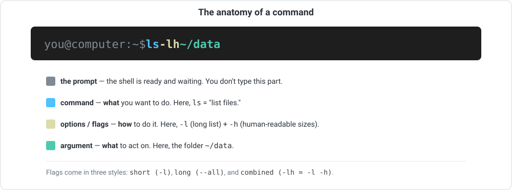

```{=html}
<div class="cba-comic">
```
{fig-alt="Three-panel comic: Prof. Zola says everything real happens in the terminal, Amina sees only a blinking cursor and wonders how to begin, then realises it is just a language she can learn."}
```{=html}
</div>
```

## 🧩 The mystery

Amina (that is you) sits down at the terminal for the first time. A black window. A
blinking cursor. No buttons. No menus. Nothing to click.

Prof. Zola leans over her shoulder and says one thing:

> "Everything real happens here. Learn to talk to it."

Then Prof. Zola walks off. Helpful as ever.

Amina stares at the blinking cursor. The cursor stares back. Where do you even begin?

::: {.think}
The command line looks like a wall. But what if it is not a wall at all? What if it is
just a language you have not learned yet?

Is a blank terminal something to fear, or something to talk to? **Scary? Friendly? Not
sure?** Hold that thought. We will answer it together.
:::

## 💬 A country where nobody speaks your language

::: {.story}
Imagine you move to a country where nobody speaks your language. At first it is
terrifying. You cannot ask for directions. You cannot order food. Every sign is a mystery.

Then you learn a few polite sentences. "Where is the market?" "How much is this?" "Thank
you." Suddenly the country opens up. You do not need the whole dictionary. You need a
handful of sentences that work.

The command line is exactly that country. And a command is just a short, polite sentence.
:::

Here is the reassuring truth. The terminal is not a magic spellbook. It is a
**conversation**. You type an instruction, the computer does it, and it replies. You do
**not** need to memorise hundreds of commands. A small core does 90% of the work. For
everything else, the computer keeps a built-in manual you will learn to summon in a
second.

Nobody is fluent overnight. But spend a little time here, keep the terminal open as you
work, and this foreign country starts to feel like home surprisingly fast.

::: {.callout-note appearance="simple"}
## You have already said your first words

In [Module 03](../03-molecular-data-types/index.qmd) you met your first four commands:
`pwd`, `cd`, `mkdir`, `ls`, while setting up a project folder. So you are not starting
from zero. You already know how to say "where am I?" and "let me look around." This module
teaches you the rest of the everyday phrasebook.
:::

## What you will learn to say

By the end of this story you will be able to:

1. Read the **anatomy of a command**: the command, its options (flags), and its arguments.
2. Use **`man`** (and friends) to look up *any* command's details yourself.
3. Confidently use the **essential commands** for moving around, managing files, and
   peeking inside them.
4. Save time with **Tab completion** and **command history**.
5. Recognise **pipes and redirection**, a first taste of how commands combine into
   pipelines.

Before you start, make sure you have a working terminal from
[Module 01](../01-setup-environment/index.qmd) (Ubuntu/WSL on Windows, or Terminal on
macOS), and that you have met `pwd`, `cd`, `mkdir`, and `ls` in
[Module 03](../03-molecular-data-types/index.qmd). We build straight on those.

::: {.callout-warning}
## ⚠️ Verify: small differences between systems
Linux (including WSL) and macOS share the same core commands, but a few options differ
between them (Linux tools are mostly "GNU"; macOS tools are mostly "BSD"). Where it
matters, we will flag it. When in doubt, **`man` is always the source of truth for *your*
machine**, which is exactly why we teach it early.
:::

## The grammar of a polite request

Almost every command you will ever type follows the same simple pattern. And it is the
same grammar as a spoken sentence: a verb, some adverbs, and an object.

- The **command** is the **verb**: *what* you want to do (`ls` means "list files").
- The **options** (also called **flags**) are the **adverbs**: *how* you want it done.
- The **argument** is the **object**: *what* you want to act on.

"List, in detail, the data folder." Say it out loud and it is almost English. Once you can
see this grammar, commands stop looking like magic spells and start looking like polite
sentences.

{width=820 fig-alt="Diagram labelling the parts of the command 'ls -lh ~/data'."}

Reading it left to right:

- **The prompt** (something like `you@computer:~$`) is printed *by the shell* to say
  "I am ready." You do not type it. You type after it.
- **The command** is *what* you want to do (`ls` lists files).
- **Options** (flags) tweak *how* it is done. They usually start with a dash: `-l`, `-h`.
- **Arguments** are *what* you want to act on, here the folder `~/data`.

### A word on flags

Flags come in three flavours, and you will see all three:

| Style | Looks like | Example |
|---|---|---|
| **Short** | one dash, one letter | `ls -l` |
| **Long** | two dashes, a whole word | `ls --all` |
| **Combined** | several short flags together | `ls -lh` (same as `ls -l -h`) |

::: {.callout-tip}
Order is usually flexible. `ls -l -h ~/data`, `ls -lh ~/data`, and often `ls ~/data -lh`
all work. And a command with **no arguments** just acts on a sensible default (plain `ls`
lists your *current* folder).
:::

## When you forget the words: `man` and friends

Here is a secret that takes the pressure off. You will never memorise every command and
every flag, and you do not have to. Unix ships with its own manual. Knowing how to open it
is one of the most empowering skills a beginner can have.

::: {.story}
Think of it like a phrasebook in your pocket. You do not need to know every word in the
new language. You just need to know how to look one up when you are stuck. Nobody expects
you to have it all memorised. They expect you to know where to look.
:::

### `man`: the manual

**`man`** (short for **manual**) shows the official documentation for a command. Try:

```bash
man ls
```

The top of a manual page is always laid out the same way:

```text
LS(1)                       General Commands Manual                      LS(1)

NAME
     ls - list directory contents

SYNOPSIS
     ls [-@ABCF...abcd...1] [file ...]

DESCRIPTION
     For each operand that names a file of a type other than directory, ls
     displays its name ...
```

How to read it:

- **NAME**: the command and a one-line summary.
- **SYNOPSIS**: the *shape* of the command. Two conventions to know: square brackets
  `[ ]` mean **optional**, and `...` means **"one or more."** So `ls [file ...]` reads as
  "`ls`, optionally followed by one or more files."
- **DESCRIPTION / OPTIONS**: the detail, including what every flag does.

::: {.callout-tip}
## Moving around inside a `man` page
`man` opens a full-screen reader. A few keys are all you need:

- **Spacebar**: down a page. **`b`**: back a page.
- **`/word`** then Enter: search for *word*; **`n`** jumps to the next match.
- **`q`**: quit (back to the prompt).
:::

### Quicker help: `--help`

Many commands also print a short help summary if you add `--help`:

```bash
mkdir --help
```

::: {.callout-warning}
## ⚠️ Verify
`--help` works for most Linux (GNU) tools, but several **macOS** commands do not support
it (you will get an error). On macOS, reach for `man` instead; it always works. This is a
common early "why does this not work?" moment, and now you know why.
:::

### "Where does this command live?": `which`

`which` tells you which program actually runs when you type a name. Handy for checking a
tool is installed and on your `PATH`:

```bash
which ls
which conda
```

## The phrasebook: your essential commands

::: {.think}
Pendo, the perpetually confused PhD student, once tried to memorise a 400-command
reference before touching the keyboard. He is still memorising.

Do not be Pendo. You internalise these by *using* them, not by staring at a table. Skim
the phrasebook now, then learn it by doing.
:::

Here is the core toolkit, grouped by what you are trying to do.

### Looking around

| Command | What it does | Example |
|---|---|---|
| `pwd` | print working directory (where am I?) | `pwd` |
| `ls` | list files & folders | `ls -lh` |
| `cd` | change directory (move) | `cd ~/projects` |

Useful `ls` flags: **`-l`** (long, detailed list), **`-a`** (show hidden files, whose
names start with `.`), **`-h`** (human-readable sizes like `30K` instead of `30429`).

### Working with files and folders

| Command | What it does | Example |
|---|---|---|
| `mkdir` | make a folder | `mkdir data` |
| `touch` | create an empty file (or update its timestamp) | `touch notes.txt` |
| `cp` | copy a file | `cp a.txt b.txt` |
| `mv` | move **or rename** a file | `mv old.txt new.txt` |
| `rm` | remove (delete) a file | `rm junk.txt` |

- To copy or delete a **folder** and its contents, add **`-r`** (recursive):
  `cp -r data backup`, `rm -r oldfolder`.
- `mv` does double duty: move a file to a new folder, *or* rename it in place.

::: {.mistake}
On the command line there is **no Recycle Bin. No Trash. No undo.** `rm` deletes
*immediately and permanently*. The file does not go anywhere. It is simply gone.

Baraka the programmer has a scar from this. One misplaced `rm -rf` and a weekend of work
vanished with no warning and no way back. He now double-checks every path before pressing
Enter. So should you.

Two habits keep you safe:

- Add **`-i`** to be asked for confirmation first: `rm -i file.txt`.
- Treat **`rm -rf`** (force, recursive) with real respect. It deletes a whole folder tree
  with no questions asked. Double-check the path *before* you press Enter.
:::

### Peeking inside files

| Command | What it does | Example |
|---|---|---|
| `cat` | print a whole file to the screen | `cat notes.txt` |
| `less` | view a big file one page at a time (press `q` to quit) | `less big.txt` |
| `head` | show the **first** lines (default 10) | `head -5 data.csv` |
| `tail` | show the **last** lines (default 10) | `tail -5 data.csv` |
| `wc` | count lines, words, characters | `wc -l data.csv` |

::: {.callout-tip}
For anything large, and biological data files are *huge*, use **`less`** or **`head`**,
never `cat`. `cat` dumps the entire file, which can flood your terminal with millions of
lines. (Ask anyone who has accidentally `cat`-ed a genome.)
:::

### Finding things

| Command | What it does | Example |
|---|---|---|
| `grep` | search for text inside files | `grep "TP53" genes.txt` |
| `find` | search for files by name | `find . -name "*.fasta"` |

Handy `grep` flags: **`-i`** (ignore upper/lower case), **`-c`** (count matches instead of
showing them), **`-n`** (show line numbers). `grep` is one of the most useful commands in
all of bioinformatics. You will meet it constantly.

### A few everyday conveniences

| Command | What it does |
|---|---|
| `echo` | print text (e.g. `echo "hello"`) |
| `clear` | clear the screen (or press `Ctrl` + `L`) |
| `history` | show the commands you have run recently |

## 🛠 Two genuine superpowers

These two habits save more time than any single command. Learn them today, and you will
type half as much and make half as many typos.

- **Tab completion.** Start typing a file or folder name and press **`Tab`**. The shell
  finishes it for you. Type `cd ~/proj` then Tab, and it completes to `~/projects/`. This
  prevents typos *and* saves enormous amounts of typing. (Press Tab twice to see all the
  options when there is more than one match.)
- **Command history.** Press the **Up arrow** to bring back your previous command (keep
  pressing to go further back). Perfect for re-running something, or fixing a small typo
  without retyping the whole line.

::: {.callout-tip}
Two more rescue keys: **`Ctrl` + `C`** cancels whatever is currently running (a lifesaver
when something hangs), and **`Ctrl` + `L`** clears the screen.
:::

## A first taste of pipes and redirection

You do not need these yet, but you will see them everywhere in bioinformatics, so here is
a gentle preview of the idea: **small commands can be joined together.** Each says one
short sentence, and the result is passed to the next.

- A **pipe** (`|`) sends the output of one command straight into another:

  ```bash
  cat genes.txt | grep "TP53" | wc -l
  ```

  Read left to right: print the file, then keep only lines with "TP53", then count them.
  Each command does one small job, and the pipe passes the result along, like handing a
  note down a line of people.

- **Redirection** sends output into a *file* instead of the screen. **`>`** writes (and
  overwrites), **`>>`** adds to the end:

  ```bash
  grep "TP53" genes.txt > tp53_hits.txt
  ```

::: {.callout-note}
This is just a taste. We will use pipes properly in later modules. For now, simply
recognise `|`, `>`, and `>>` when you see them. They are how a few simple sentences become
a powerful paragraph.
:::

## 🛠 Let's do it: interrogate a real file

Enough phrasebook. Time to hold a real conversation. Let's use the real reference file
from Module 03. If you still have it, move into that folder. If not, re-download it
(Module 03, Part K). Then let's inspect it with the commands you just met. This is exactly
how you would first "look at" any new data file.

```bash
cd ~/projects/covid-demo/references   # go where the file lives
ls -lh                                # what's here, and how big?
```

**Real output:**

```text
total 64
-rw-r--r--  1 you  staff   30K Aug 16 04:19 sars2.fasta
```

That long line is what `-l` gives you: permissions, owner, group, **size** (`30K`, thanks
to `-h`), the date, and the filename. Now peek inside:

```bash
head -2 sars2.fasta        # the first two lines
wc -l sars2.fasta          # how many lines?
grep -c "^>" sars2.fasta   # how many sequences? (FASTA headers start with ">")
```

**Real output:**

```text
>NC_045512.2 Severe acute respiratory syndrome coronavirus 2 isolate Wuhan-Hu-1, complete genome
ATTAAAGGTTTATACCTTCCCAGGTAACAAACCAACCAACTTTCGATCTCTTGTAGATCTGTTCTCTAAA
     430 sars2.fasta
1
```

## 🎉 What just happened?

::: {.insight}
Look at what those four short sentences just told you. In a handful of keystrokes you
learned where the file is, how big it is (`30K`), what its first lines look like, that it
has exactly **430 lines**, and that it contains exactly **one sequence**.

You did not open a single window. You did not click anything. You just *asked the computer
politely*, and it answered. That is the everyday rhythm of working with data on the command
line, and you just did it for real.
:::

::: {.callout-note collapse="true"}
## ✅ Check
If `grep -c "^>" sars2.fasta` printed `1`, and `wc -l` printed `430`, everything is
working. (Do not worry if the file's date or size differ slightly. Yours will reflect when
*you* downloaded it.)
:::

## 🚧 A common mistake

::: {.mistake}
The moment beginners feel unsure, they reach for the mouse and go looking for a menu. There
is no menu. There is no "are you sure?" dialog box for most things.

Two traps catch nearly everyone early:

- Typing `cat` on a giant file and watching millions of lines scroll by for a full minute.
  Use `less` or `head` instead.
- Forgetting that `rm` is final. There is no undo. Read the path, then press Enter.

Neither trap is dangerous once you know it is there. Now you know.
:::

## 😂 Bioinformatics reality

::: {.reality}
Pendo: "How do I know what this flag does?"<br>
Amina: "`man` the command."<br>
Pendo: "I did. It opened a full-screen thing and now I am trapped."<br>
Amina: "Press `q`."<br>
Pendo: "...you have saved my life."
:::

## 🧩 Mini challenge

::: {.challenge}
You want to know how many `.fasta` files live anywhere inside your `~/projects` folder,
without opening a single one by hand.

Which two commands from your new phrasebook would you combine, and roughly how? Think
before you read on.

**Answer:** reach for **`find`** to locate them, and pipe the result into **`wc -l`** to
count them:

```bash
find ~/projects -name "*.fasta" | wc -l
```

`find` lists every matching file, one per line, and `wc -l` counts the lines. Two small
sentences, one useful answer.
:::

## Three quick questions

Not graded. Just checking yourself.

1. In the command `ls -lh ~/data`, which part is the **command**, which is the **flag**,
   and which is the **argument**?
2. You forget what the `-w` flag on `wc` does. What is the single word that always helps?
3. True or false: `rm` moves a file to the Trash, so you can get it back later.

::: {.callout-note collapse="true"}
## Answers
`ls` is the command, `-lh` are the flags, `~/data` is the argument. The word is **`man`**
(the built-in manual). False: `rm` deletes immediately and permanently, with no Trash and
no undo.
:::

## 🎯 Key takeaway

::: {.takeaway}
The command line is not a wall. It is a language, and a small phrasebook carries you far.
Read every command as **command + options (flags) + arguments**, look up anything with
**`man`**, lean on Tab completion and history, and respect `rm`. Everything else in
bioinformatics is variations on this handful of ideas.
:::

::: {.didyouknow}
The core Unix commands you just learned (`ls`, `cp`, `grep`, and friends) are roughly 50
years old. The people who wrote them are long retired, but their commands still run,
unchanged, under nearly every genome analysis published today. When you type `grep`, you
are speaking a language that has quietly powered science for half a century.
:::

## Exercises

1. Run `man wc`. Use it to find out what the **`-w`** flag does, then quit the manual with
   `q`.
2. In your `~/projects/covid-demo` folder, make a `notes.txt` with `touch`, write a line
   into it (`echo "my first note" > notes.txt`), then read it back with `cat`.
3. Copy `notes.txt` to `notes_backup.txt` with `cp`, then rename the copy to `archive.txt`
   with `mv`. Confirm with `ls`.
4. Use `head`, `tail`, and `wc -l` on your `references/sars2.fasta` file. How many lines
   does it have?
5. Practise **Tab completion**: type `cd ~/proj` and press Tab. Then press the **Up
   arrow** a few times to see your recent commands.
6. **Careful one:** delete `archive.txt` with `rm -i archive.txt` and notice how `-i` asks
   you to confirm first.

```{=html}
<div class="cba-signoff">
```
You can talk to computers now. Go make coffee. ☕

Next time, Amina faces 300 GB of raw sequencing data and one question from Prof. Zola: is any of it actually good?
```{=html}
</div>
```
