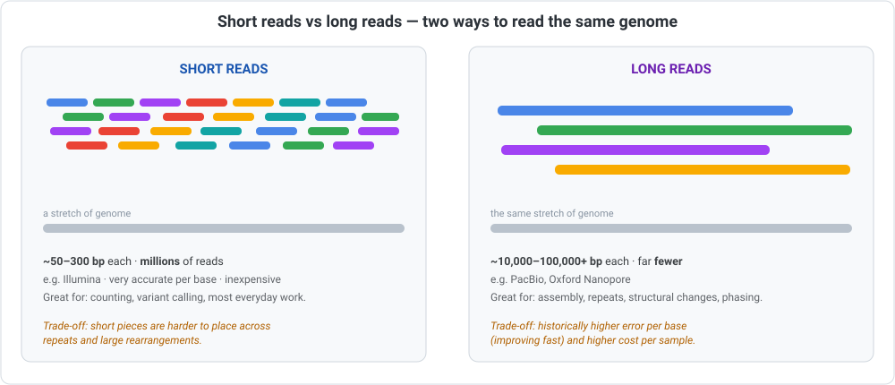
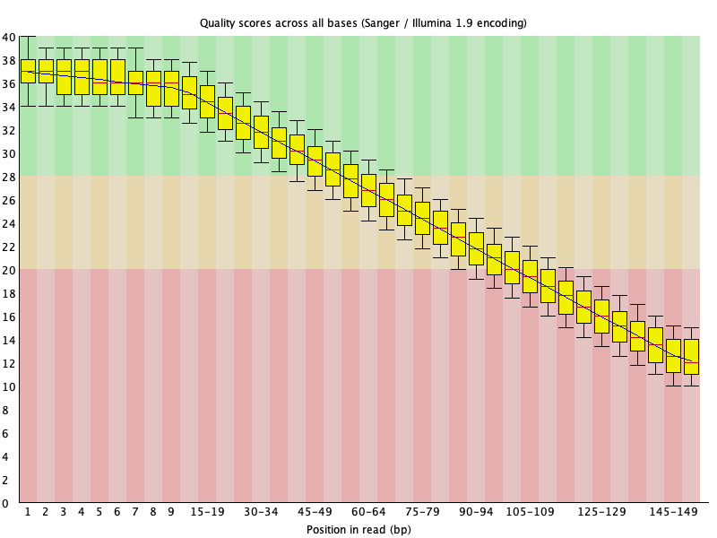
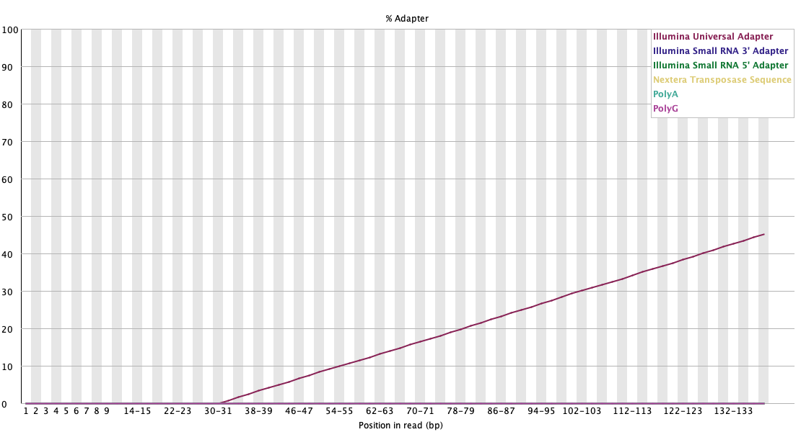
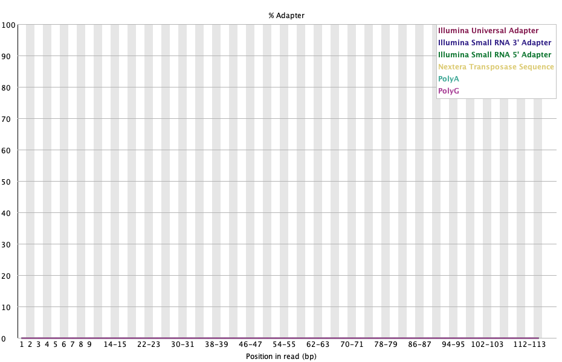
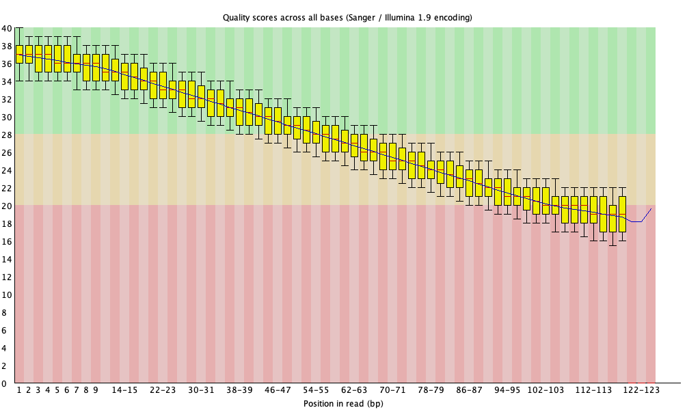

::: {.callout-note appearance="simple"}
## A gentle welcome before we begin

This is a milestone module: it's the first time you'll **run real bioinformatics tools
on real sequencing data, from start to finish.** Everything so far has been
preparation — a working environment (01), R (02), the map of data types (03), and the
command line (04). Now you put it to work.

The task is **quality control** (QC): before you analyse sequencing data, you check that
it's actually *good*, and clean up the obvious problems. It's the unglamorous first step
of essentially *every* sequencing project — and skipping it is one of the most common
ways good experiments turn into wrong conclusions.

We'll go slowly, explain *why* at every step, and — importantly — teach you the
**thinking** behind the decisions, not just the commands. By the end you'll have run
`FastQC`, read its report, trimmed your reads with `fastp`, and confirmed the fix.
:::

## What you'll learn

By the end of this module you'll be able to:

1. Explain what a **sequencing read** is, and read its **quality scores**.
2. Tell apart the main **read types** — single-end vs paired-end, and short vs long.
3. Say **why QC matters** (and what goes wrong without it).
4. Run **FastQC** and interpret its report — knowing that PASS/WARN/FAIL are *heuristics*,
   not verdicts.
5. Reason about **which parameters to use** for trimming, based on your downstream goal.
6. **Trim low-quality bases and remove adapters** with `fastp`, then re-check your work.

### Before you start

- A working shell + Conda ([Module 01](../01-setup-environment/index.qmd)).
- Comfort with the command line and file formats ([Module 03](../03-molecular-data-types/index.qmd),
  [Module 04](../04-command-line-essentials/index.qmd)) — especially **FASTQ**.

::: {.callout-warning}
## ⚠️ Verify — tools and options evolve
FastQC and fastp are updated over time, and some options change. Version numbers and
exact flags here are examples; confirm against each tool's current documentation. And as
always, `man` (or `--help`) is the source of truth on *your* machine.
:::

---

## Part A — What is a read?

Recall from [Module 03](../03-molecular-data-types/index.qmd) that a sequencer doesn't
hand you a tidy genome — it chops the DNA (or RNA) into many small fragments and reads
each one. **A "read" is the sequence of one of those fragments, together with a quality
score for every base.** That's exactly what a **FASTQ** record stores:

```text
@read_1
GATCTTAATGACTTTGTCTCTGATGCAGATTCAACTTTGATTGGTGATTGTGCAACTGTA
+
BIFDEHHFG?CDA@EF?@FAB@@D?E@BBA>@DAA@B@>?=?>;=><?@?<?>=;:@>=;=>
```

Line 2 is the read; line 4 is its **per-base quality**. Each quality character encodes
how confident the machine was about that base, using the **Phred score (Q)**:

| Phred score | Chance that base is *wrong* | Meaning |
|---|---|---|
| **Q20** | 1 in 100 (1%) | okay |
| **Q30** | 1 in 1,000 (0.1%) | good |
| **Q40** | 1 in 10,000 (0.01%) | excellent |

::: {.callout-tip}
So "Q30" means the machine is 99.9% sure of that base. When people say reads are
"high quality," they usually mean most bases are **Q30 or above.** Quality typically
starts high and **drops toward the end of a read** — you'll see this vividly in a moment.
:::

---

## Part B — Types of reads

Not all reads are the same. Two distinctions matter most.

### Single-end vs paired-end

- **Single-end (SE):** the machine reads each fragment from **one end** only — one read
  per fragment.
- **Paired-end (PE):** it reads the fragment from **both ends**, giving **two** reads
  that point toward each other (usually named `R1` and `R2`). Knowing two ends of the
  same fragment makes reads much easier to place on the genome — especially across
  tricky, repetitive regions. Most modern short-read projects are paired-end.

### Short reads vs long reads

This is the big one, and it's a genuine trade-off, not a "which is better":

{width=860 fig-alt="Diagram comparing short reads and long reads over the same stretch of genome."}

| | **Short reads** | **Long reads** |
|---|---|---|
| Length | ~50–300 bp | ~10,000–100,000+ bp |
| Made by | Illumina | PacBio, Oxford Nanopore |
| Per-base accuracy | very high | historically lower (improving fast) |
| Cost | low | higher |
| Best at | counting, variant calling, everyday work | assembly, repeats, structural changes, phasing |

::: {.callout-note}
**Acronym key:** **bp** = base pairs · **SE / PE** = single-end / paired-end ·
**Q** = Phred quality score · **GC** = the guanine + cytosine content of the sequence.

A note on QC and read length: the FastQC tool we use below was designed for **short
reads**. **Long reads** have a very different quality profile and are checked with
different tools (for example **NanoPlot** or **pycoQC**) — mentioned again at the end.
:::

---

## Part C — Why QC matters

It's tempting to skip straight to analysis. Don't. Here's the blunt reason:

> **Garbage in, garbage out.** Every result downstream is only as trustworthy as the
> reads it was built from.

Real, specific things that go wrong when you skip QC:

- **Adapter contamination.** Adapters are short synthetic sequences attached during
  library prep. If a fragment is shorter than the read length, the machine reads past the
  real sequence and **into the adapter**. Left in, adapters cause reads to mis-map and
  can create **false variants**.
- **Low-quality tails.** Base quality usually decays toward the 3′ end. Those unreliable
  bases add noise and false differences.
- **Contamination / unexpected content.** Sometimes your sample contains something it
  shouldn't (another organism, over-represented sequences).

QC catches these **early, when they're cheap to fix**, instead of after days of
downstream computation built on bad data. That's the whole point.

---

## Part D — Running FastQC

**FastQC** is the standard first look at read quality. It reads a FASTQ file and produces
a tidy report of about a dozen checks.

First, an environment with the tools (using the Bioconda channel from
[Module 01](../01-setup-environment/index.qmd)):

```bash
conda create -n qc -c conda-forge -c bioconda fastqc fastp multiqc
conda activate qc
```

Then run it on a FASTQ file (here, a small example set of reads):

```bash
fastqc reads.fastq
```

**Real output:**

```text
Started analysis of reads.fastq
Approx 25% complete for reads.fastq
Approx 50% complete for reads.fastq
Approx 75% complete for reads.fastq
Approx 100% complete for reads.fastq
Analysis complete for reads.fastq
```

That produces two files: **`reads_fastqc.html`** (open it in a browser) and a matching
`.zip`. FastQC also prints a quick pass/warn/fail summary for each check. For our example
reads it reported:

```text
PASS  Basic Statistics
FAIL  Per base sequence quality
WARN  Per sequence quality scores
PASS  Per base N content
PASS  Sequence Length Distribution
FAIL  Adapter Content
```

Two red flags — **per-base quality** and **adapter content**. Let's see what those
actually look like.

::: {.callout-note}
## About the example data (full transparency)
The reads used throughout this module are **simulated from the SARS-CoV-2 genome** (the
tiny one from Module 03), deliberately given a realistic quality drop-off and some
adapter contamination so there's something to see and fix. They're a *teaching* dataset,
not a real experiment — the generator script is included at
`scripts/make_demo_reads.py`. For what real reports look like (good and bad), see
FastQC's own examples, linked in Part E.
:::

---

## Part E — Reading a FastQC report

FastQC runs about a dozen checks ("modules"). You don't need all of them today; two carry
most of the weight for beginners.

### Per-base sequence quality (the most important plot)

This shows a box-and-whisker of quality **at each position along the read**. The
background is colour-coded: **green = good, orange = okay, red = poor.** You want the
boxes sitting up in the green.

Here is the **real plot** from our example reads:

{width=680 fig-alt="FastQC per-base quality boxplot showing quality declining along the read."}

Read it like this: quality starts excellent (~Q37) and **slides into the red** by the end
of the read. That downward slope is normal for Illumina — but here it's steep enough that
FastQC flags it. The fix (trimming) is coming in Part G.

### Adapter content

This shows what fraction of reads contain adapter at each position. You want it flat along
the bottom. Ours is **not**:

{width=680 fig-alt="FastQC adapter content plot showing adapter rising toward the 3' end."}

The Illumina adapter climbs steadily toward the 3′ end — exactly the "fragment shorter
than the read" situation from Part C. This must be removed.

::: {.callout-tip}
## See real good-vs-bad reports
FastQC's authors publish example reports that are worth a look:
[a **good** example](https://www.bioinformatics.babraham.ac.uk/projects/fastqc/good_sequence_short_fastqc.html)
and [a **bad** example](https://www.bioinformatics.babraham.ac.uk/projects/fastqc/bad_sequence_fastqc.html).
The other modules (per-sequence quality, GC content, duplication, overrepresented
sequences) are explained on the
[FastQC site](https://www.bioinformatics.babraham.ac.uk/projects/fastqc/).
:::

---

## Part F — The thinking: which parameters, and why

This is the part most tutorials skip, and it's the most important. **QC is not about
chasing a wall of green ticks.** FastQC's PASS/WARN/FAIL are *heuristics* tuned for a
"typical" whole-genome sample — they don't know what *your* experiment is.

A few principles that separate button-pushing from real understanding:

- **A FAIL is not automatically a problem — and context decides.** Some "failures" are
  *expected* for particular experiments:
  - High **duplication** is normal in **RNA-seq** (highly expressed genes) and in
    amplicon/16S data — not a red flag there.
  - A **per-base sequence content** bias in the first ~10–15 bases is *expected* in
    RNA-seq (random-hexamer priming). Leaving it alone is usually correct.
  - A **GC** warning can simply reflect your organism or library type.
- **Let the downstream goal set your strictness.** The same reads might be "fine" for one
  analysis and "not good enough" for another:
  - **Variant calling** → be stricter; a wrong base can become a false variant.
  - **RNA-seq quantification** → more forgiving; you're counting, and a few noisy bases
    rarely change a gene's count.
  - **De novo assembly** → very sensitive to errors *and* adapters.
- **Trim to fix real problems — don't over-trim.** Every base you cut is data you lose.
  Aggressive trimming can *bias* your results and shorten reads until they no longer map.
  The goal is "remove what's clearly bad," not "make every plot perfect."

So for our example, the honest read is: **two genuine problems** — adapter contamination
and a steep low-quality tail — both worth fixing. That points to two concrete decisions:

1. **Remove adapters.** (Always, when present.)
2. **Trim low-quality tail bases**, using a sensible quality threshold — a common choice
   is around **Q20** — while keeping reads long enough to still be useful (say, at least
   **30 bp**).

Those two decisions are exactly what we hand to `fastp` next.

---

## Part G — Trimming & adapter removal with `fastp`

**`fastp`** is a fast, modern all-in-one tool: it removes adapters (auto-detecting them),
trims low-quality bases, filters out reads that end up too short, and writes its own
report. Here's the command that encodes the two decisions from Part F:

```bash
fastp -i reads.fastq -o reads.trimmed.fastq \
      --cut_tail --cut_tail_window_size 4 --cut_tail_mean_quality 20 \
      --length_required 30 \
      -h fastp.html -j fastp.json
```

What each part *means* (this is the whole point — you're choosing, not copying):

- **`-i` / `-o`** — input reads / cleaned output.
- **Adapter removal is on by default** — fastp auto-detects the adapter, so there's no
  flag needed. (You'll see it announce which adapter it found.)
- **`--cut_tail`** — slide a small window from the 3′ end and cut once quality drops.
- **`--cut_tail_window_size 4`** — use a 4-base window.
- **`--cut_tail_mean_quality 20`** — cut where that window's mean quality falls below
  **Q20** (our threshold decision).
- **`--length_required 30`** — after trimming, discard any read now shorter than 30 bp.
- **`-h` / `-j`** — write an HTML and a JSON report.

**Real output** from running it on our reads:

```text
Detecting adapter sequence for read1...
>Illumina TruSeq Adapter Read 1
AGATCGGAAGAGCACACGTCTGAACTCCAGTCA

Read1 before filtering:
total reads: 20000
Q20 bases: 2109545 (70.32%)
Q30 bases: 910209 (30.34%)

Read1 after filtering:
total reads: 20000
Q20 bases: 1804541 (96.33%)
Q30 bases: 894074 (47.73%)

reads with adapter trimmed: 5995
bases trimmed due to adapters: 239749
```

Look at what happened, in real numbers: fastp **found the adapter on its own**, trimmed
it from **5,995 reads**, and lifted the fraction of Q20+ bases from **70% to 96%**. That's
a real, measurable clean-up.

::: {.callout-note}
## Other trimmers you'll hear about
`fastp` is a great default, but you'll also meet
[**Trimmomatic**](http://www.usadellab.org/cms/?page=trimmomatic) (a long-standing
classic), [**cutadapt**](https://cutadapt.readthedocs.io/) (adapter-focused), and
[**Trim Galore**](https://www.bioinformatics.babraham.ac.uk/projects/trim_galore/) (a
wrapper around cutadapt + FastQC). They do the same core job; the *thinking* in Part F
applies to all of them.
:::

---

## Part H — Re-QC: did it actually work?

Never trust a fix you haven't checked. Run FastQC again on the **trimmed** reads and
compare. Here are the **real before-and-after** plots.

**Adapter content** — the clear win:

::: {layout-ncol=2}
{fig-alt="Adapter content before trimming."}

{fig-alt="Adapter content after trimming, essentially zero."}
:::

**Per-base quality** — improved, and the reads are now shorter because the worst 3′ bases
were cut off:

::: {layout-ncol=2}
{fig-alt="Per-base quality before trimming."}

{fig-alt="Per-base quality after trimming, with shorter reads."}
:::

The FastQC verdicts changed like this:

| Module | Raw | Trimmed |
|---|---|---|
| Adapter Content | **FAIL** | **PASS** ✅ |
| Per sequence quality scores | WARN | **PASS** ✅ |
| Per sequence GC content | WARN | **PASS** ✅ |
| Sequence Length Distribution | PASS | **WARN** |

::: {.callout-important}
## The judgment moment — read this twice
Notice trimming did **not** turn everything green, and that's completely fine — it's the
lesson from Part F in action:

- **Sequence Length Distribution now WARNs.** Of course it does — trimming makes reads
  *different lengths*, and FastQC expects uniform length. This warning is **expected and
  harmless** here.
- **Per-base quality is much improved but may still flag**, because FastQC's threshold is
  deliberately strict. The *overall* quality (Q20 70% → 96%) is what actually matters for
  your downstream analysis.

**You interpret; you don't chase a perfect score.** A thoughtful "this is good enough for
what I'm doing next" beats blindly trimming until every plot is green (and throwing away
good data in the process).
:::

---

## Part I — Scaling up

Two things you'll want soon, mentioned lightly:

- **Many samples at once → [MultiQC](https://multiqc.info/).** Real projects have dozens
  of FASTQ files. MultiQC scans a folder of FastQC/fastp reports and combines them into a
  single interactive summary, so you can spot the odd-one-out sample at a glance.
- **Long reads → different tools.** FastQC is built for short reads. For PacBio/Nanopore
  long reads, use tools like [NanoPlot](https://github.com/wdecoster/NanoPlot) or pycoQC,
  which understand their very different quality and length profiles.

---

## Recap

You've now done a complete, real QC workflow:

- ✅ Understood what a **read** is and how to read its **quality scores** (Q20/Q30).
- ✅ Distinguished **single-end vs paired-end** and **short vs long** reads.
- ✅ Understood **why QC matters** — garbage in, garbage out.
- ✅ Run **FastQC** and interpreted its plots, treating PASS/WARN/FAIL as *heuristics*.
- ✅ **Reasoned about parameters** based on your downstream goal, not a rulebook.
- ✅ **Trimmed and de-adaptered** with `fastp`, then **re-checked** and interpreted the
  result with judgment.

That last skill — *judgment* — is what turns a button-pusher into a bioinformatician.

::: {.callout-tip appearance="simple"}
## Keep going — a word of encouragement

You just ran genuine bioinformatics tools and made real analytical decisions. That's a
big step, and if the FastQC plots felt overwhelming at first, that's normal — everyone
stares at their first per-base-quality plot and thinks "…now what?" It clicks with
repetition. Run FastQC on a few different datasets and you'll start reading these plots at
a glance.

And remember the mindset that matters most: QC isn't about perfect scores, it's about
**understanding your data well enough to trust what comes next.** That habit will serve
you in every analysis you ever do.
:::

## Exercises

1. In a FASTQ file, find a base with quality character `#` and one with `I`. Using the
   idea of Phred scores, which base is more trustworthy? (Higher character = higher
   quality.)
2. Run `fastqc` on any FASTQ file you have (or re-create the example with
   `scripts/make_demo_reads.py`). Open the HTML report and find the **per-base sequence
   quality** plot.
3. Run the `fastp` command from Part G, then `fastqc` on the trimmed output. Confirm the
   **Adapter Content** module went from FAIL to PASS.
4. **Thinking question:** your reads have high duplication levels. Why might that be
   *totally fine* for an RNA-seq experiment but *worrying* for whole-genome sequencing?
5. **Thinking question:** you're about to call variants. Would you trim more or less
   aggressively than if you were just counting genes for RNA-seq? Why?

## Where to go next

You can now take raw reads and get them **clean and trustworthy** — the real starting
line for every sequencing analysis. From here, the natural next step is to *do something*
with those reads: align them to a reference, or quantify them. Later modules build exactly
that, adding a few new commands each time. New modules appear on the
[home page](../../index.qmd) as they're ready.

::: {.callout-important}
## One more time on accuracy
FastQC's and fastp's options and defaults change between versions, and best-practice
thresholds are debated and depend on your application. The authoritative references are
each tool's official documentation (and `man`/`--help` on your machine) — they supersede
this tutorial whenever they disagree.
:::
