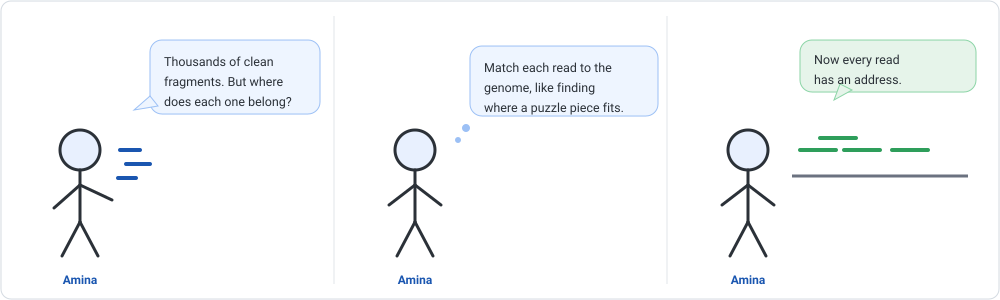
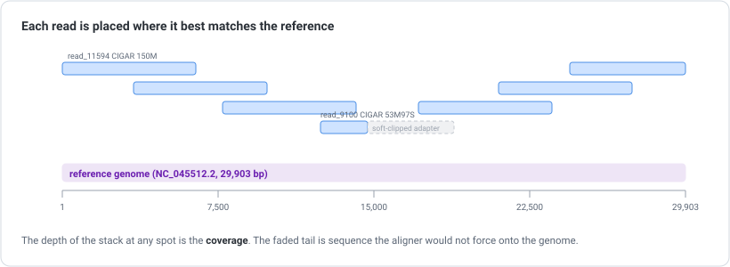
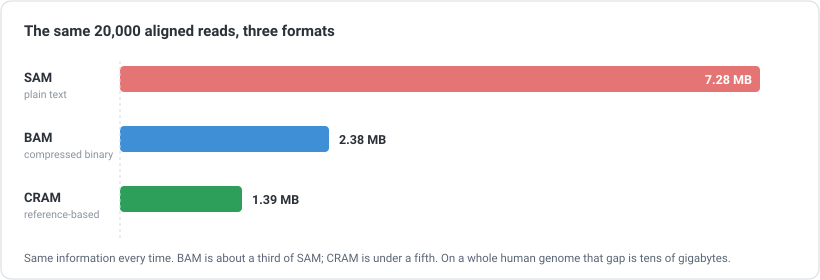

```{=html}
<div class="cba-comic">
```
{fig-alt="Three-panel comic: Amina holds thousands of clean read fragments and wonders where each belongs, decides to match each one against the reference genome, and ends with every read placed on the genome."}
```{=html}
</div>
```

## 🧩 The mystery

Last time you took Prof. Zola's messy data and made it trustworthy. The reads are clean.
But they are still just millions of tiny fragments in a pile, each one 150 letters long,
with no idea where it came from.

Prof. Zola leans over again:

> "Good. Now tell me *where* on the genome they came from."

Amina (that is you) looks at one read:

```text
GATCTTAATGACTTTGTCTCTGATGCAGATTCAACTTTGATTGGTGATTGT...
```

Somewhere in a 29,903-letter genome, this fragment has a home. So do the other 19,999.
How do you find them?

::: {.think}
You have one short fragment and one long genome. The fragment came from *somewhere* in
that genome, but the machine never wrote down where.

If you had to find the spot by hand, how would you do it? Hold that thought. The computer
does exactly what you are about to imagine, just a few million times faster.
:::

## What "alignment" actually means

Finding where a read belongs is called **alignment** (or **mapping**). The idea is simple,
even if the engineering behind it is clever.

::: {.story}
Think of the genome as a very long book and each read as a single torn-out sentence. To
find where the sentence belongs, you slide it along the book until the letters line up.

That is alignment. For every read, the computer finds the position on the reference genome
where the read matches best, and writes down that address.
:::

{width=820 fig-alt="Diagram of short reads stacked above a reference genome bar, each at its matched position, with one read showing a faded soft-clipped tail."}

Two words worth keeping from that picture:

- **Reference genome:** a known, already-assembled genome you map *against*. For us it is
  the SARS-CoV-2 reference, `NC_045512.2`, the same 29,903-letter genome the reads were
  sequenced from.
- **Coverage:** how many reads stack up over a given spot. More coverage means more
  independent looks at that position, which means more confidence later.

::: {.insight}
Aligning does not change your reads. It *annotates* them. Each read keeps its letters and
its quality scores, and gains one new thing: an address on the genome. That is the whole
job of this step.
:::

## 🛠 Let's do it: map the reads

Now the commands. You will use two tools: **bwa** to do the mapping, and **samtools** to
handle the results. Install them once with Conda (the channels come from
[Build Your Dry Lab Bench](../01-setup-environment/index.qmd)):

```bash
conda create -n align -c conda-forge -c bioconda bwa samtools
conda activate align
```

A reference has to be **indexed** before you can search it. This is a one-time step, like
building the index at the back of a book so you are not reading every page to find a word:

```bash
bwa index sars2.fasta
```

Now map the clean reads against it:

```bash
bwa mem sars2.fasta reads.fastq > aln.sam
```

`bwa mem` is the standard choice for short reads. It thinks for less than a second on this
small genome and writes its answer into a file called `aln.sam`.

::: {.didyouknow}
`bwa mem` is built for short reads, the kind from Module 05. Long reads (PacBio, Nanopore)
are a different search problem and use their own mapper, most often **minimap2**. Same
idea, different engine, and the output format below is identical.
:::

## 🎉 Meet the output: the SAM file

Open `aln.sam` and you meet the **SAM** format (Sequence Alignment/Map). It has two parts.

First, a **header**, where every line starts with `@`. It records what you mapped against
and how:

```text
@HD	VN:1.5	SO:coordinate
@SQ	SN:NC_045512.2	LN:29903
@PG	ID:bwa	PN:bwa	VN:0.7.19-r1273	CL:bwa mem sars2.fasta reads.fastq
```

The `@SQ` line names the reference sequence (`SN`) and its length (`LN:29903`). The `@PG`
line is a receipt: which program, which version, exactly which command. Your future self
will thank you for it.

Then come the reads, one per line. Here is a single mapped read (first columns shown):

```text
read_11594	0	NC_045512.2	4	60	150M
```

Read left to right, that line says:

| Column | Value | Meaning |
|---|---|---|
| Name | `read_11594` | which read this is |
| Flag | `0` | a compact status code (0 = mapped, forward strand) |
| Reference | `NC_045512.2` | which sequence it landed on |
| Position | `4` | it starts at base 4 of the genome |
| MAPQ | `60` | how confident the mapper is (higher is better) |
| CIGAR | `150M` | how the read lines up: all 150 bases aligned |

That is the heart of alignment. This read came from position 4, on the forward strand, and
all 150 of its letters line up against the genome.

::: {.insight}
**MAPQ** is the number to respect. It is not "is this letter correct" (that was the quality
score from Module 05). It is "am I sure this read belongs *here* and not somewhere else?"
A read that fits one spot perfectly gets a high MAPQ like 60. A read that could sit in three
different repeat regions gets a low MAPQ, sometimes 0. Later steps lean on this heavily.
:::

## The adapter comes back to haunt us (in a good way)

Remember the adapters you trimmed in Module 05? Watch what the aligner does with a read
that still carries a bit of one:

```text
read_9100	0	NC_045512.2	5	60	53M97S
```

That CIGAR, `53M97S`, reads as: **53** bases **M**atched the genome, then **97** were
**S**oft-clipped, set aside because they did not belong. Those 97 letters are adapter and
sequencing junk. The aligner refused to force them onto the genome and simply parked them.

::: {.insight}
This is the aligner being honest. It would rather clip sequence it cannot place than invent
a match. Soft-clipping is normal and useful, and it is one more reason cleaning your reads
first (Module 05) makes everything downstream cleaner.
:::

## Did the mapping actually work? Check it.

Never trust a step you have not checked. `samtools flagstat` gives you a one-glance summary.
First, sort the results into a tidy BAM (more on that word in a second) and then ask:

```bash
samtools sort -O bam -o aln.sorted.bam aln.sam
samtools flagstat aln.sorted.bam
```

The **real output**:

```text
20000 + 0 in total (QC-passed reads + QC-failed reads)
20000 + 0 primary
19967 + 0 mapped (99.84% : N/A)
0 + 0 duplicates
```

**99.84% of reads mapped.** That is exactly what you hope to see when clean reads meet the
right reference. A very low number would be the alarm bell: wrong reference, contamination,
or reads that still need cleaning.

::: {.mistake}
A high mapping rate is good news, but "mapped" does not mean "mapped *correctly*". A read
can map to the wrong copy of a repeated region and still count as mapped. That is what MAPQ
is for. Do not read the flagstat percentage as proof that every read is where it belongs.
Read it as "almost everything found *a* home", then let MAPQ tell you how trustworthy each
home is.
:::

## 🛠 Let's do it: SAM, then BAM, then CRAM

Your `aln.sam` is plain text. Plain text is friendly to read but wasteful to store, and real
experiments make enormous alignment files. So the same information is kept in smaller and
smaller forms. Here are all three, for the **exact same 20,000 reads**:

{width=820 fig-alt="Bar chart: SAM 7.28 megabytes, BAM 2.38 megabytes, CRAM 1.39 megabytes, for the same 20,000 aligned reads."}

- **SAM** is the human-readable text you just looked at. Easy to inspect, big on disk.
- **BAM** is the same thing compressed into binary. You cannot read it with your eyes, but
  `samtools view` unpacks it any time. This is the everyday working format.
- **CRAM** is smaller still, and it is where the real space saving lives.

You already made the BAM. You made it sorted (`-O bam`), because most tools want alignments
in genome order, and you **indexed** it so tools can jump to any region instantly:

```bash
samtools index aln.sorted.bam
```

Now convert that BAM to CRAM:

```bash
samtools view -C -T sars2.fasta -o aln.cram aln.sorted.bam
samtools index aln.cram
```

Notice the `-T sars2.fasta`. That is not optional, and the next section is the reason why.

## Why CRAM needs the reference (and why that can bite you)

::: {.story}
BAM shrinks the file by zipping the letters. CRAM shrinks it far more with a clever trick:
instead of storing every base of every read, it mostly stores how each read *differs* from
the reference. If a read matches the genome perfectly, CRAM barely needs to write anything
down at all.

It is the difference between mailing someone a whole book, and mailing them a note that says
"the library's copy, but change three words on page 40."
:::

That trick is why CRAM is so small. It is also the catch: **you cannot read a CRAM without
the exact reference it was built against.** The note is useless if you do not have the
library's copy of the book.

CRAM protects you from getting this wrong. It stamps a checksum of the reference (`M5`) into
its header:

```text
@SQ	SN:NC_045512.2	LN:29903	M5:105c82802b67521950854a851fc6eefd
```

If you ever try to decode the CRAM with the wrong reference, samtools refuses, loudly,
rather than handing you silently corrupted data. Here is what that really looks like:

```text
[E::cram_decode_slice] MD5 checksum reference mismatch at NC_045512.2:4-15153
[E::cram_decode_slice] Please check the reference given is correct
```

::: {.mistake}
This is the trap that surprises people. Many public archives and sequencing centres now
hand you **CRAM** for large genomes, because on a whole human genome the space saved is
tens of gigabytes. But a CRAM without its reference is close to useless.

So when a provider sends you CRAM, your first question is: *which reference was this built
against?* Note it down, keep that exact reference file, and store it alongside the CRAM.
The `M5` checksum in the header is how you confirm you have the right one. Lose the
reference and you can lose access to your own data.
:::

## 🧠 Think like a scientist, not a button

Alignment quietly makes one big assumption: that your reads *belong* to the reference you
chose. The computer will happily map human reads to a mouse genome and report a number. It
will not tell you the choice was wrong.

- **Sequencing a known organism?** Map to its standard reference. Easy.
- **Working with a virus or bacterium?** Make sure the reference is the right strain, or
  your differences will be strain differences, not real findings.
- **No good reference exists?** Then mapping is the wrong tool, and you assemble a genome
  from scratch instead. A different story for a different day.

The mapping rate and MAPQ are your reality checks. A great mapping rate against the wrong
reference is still the wrong answer.

::: {.reality}
Prof. Zola: "The reads mapped."<br>
Amina: "To what?"<br>
Prof. Zola: "...the reference."<br>
Amina: "Which one?"<br>
Prof. Zola: "Good. You are learning."
:::

## 🧩 Mini challenge

::: {.challenge}
A colleague sends you a `sample.cram` and nothing else, then goes on holiday. You try to
open it and samtools complains it cannot find the reference.

What is the one thing you need to ask them for, and how will you know you received the right
one?

**Answer:** ask for the exact **reference FASTA** the CRAM was built against. You will know
it is the right one because its checksum must match the **`M5`** value in the CRAM header
(`samtools view -H sample.cram` shows it). Same `M5`, right reference. Different `M5`, wrong
file, and samtools will refuse to decode.
:::

## Three quick questions

Not graded. Just checking yourself.

1. Does alignment **change** your reads, or **annotate** them with a position?
2. What does **MAPQ** tell you that the Module 05 quality score does not?
3. Why can you not open a CRAM file without its reference genome?

::: {.callout-note collapse="true"}
## Answers
Annotate them (it adds a position; the letters and qualities are unchanged). MAPQ tells you
how sure the mapper is that the read is in the *right place*, not whether each letter was
read correctly. CRAM stores reads as differences from the reference, so without that exact
reference there is nothing to compare the differences against.
:::

## 🎯 Key takeaway

::: {.takeaway}
Alignment gives every read an address on a reference genome. SAM is that answer in text,
BAM is the compact working version, and CRAM is smaller still by storing only what differs
from the reference, which is exactly why it cannot be read without that reference. Check the
mapping rate, respect MAPQ, and always know which reference you mapped against.
:::

::: {.didyouknow}
The `.mistake`, `.insight` and `flagstat` habits here are not busywork. The alignment file
you just made is the raw material for almost everything that comes next: counting genes,
finding mutations, measuring coverage. Get the mapping right and every later step stands on
solid ground.
:::

::: {.callout-tip collapse="true"}
## ⚠️ Verify before you rely on exact numbers
The commands and outputs above were produced with **bwa 0.7.19** and **samtools 1.24** on
simulated SARS-CoV-2 reads. Your version numbers, and small details of the output, may
differ as these tools evolve. The shapes (SAM columns, the size ordering, the CRAM
reference requirement) are stable; treat the exact byte counts as illustrative.
:::

```{=html}
<div class="cba-signoff">
```
You gave twenty thousand homeless reads an address, and you know why CRAM guards its reference so jealously. That is real bioinformatics.

<span class="coffee-line">Go and make a coffee. ☕</span>

Next time, Amina asks the question the whole lab has been building toward: what makes this sample *different* from the reference? The mismatches stop being noise and start being variants.
```{=html}
</div>
```
