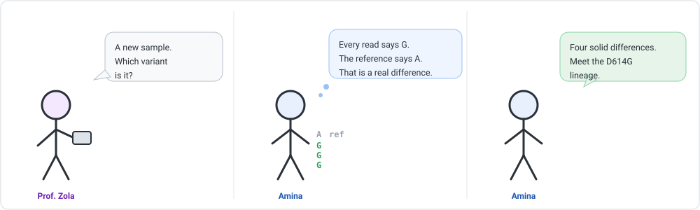
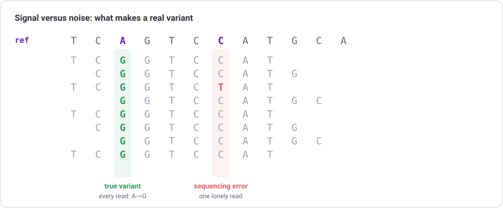
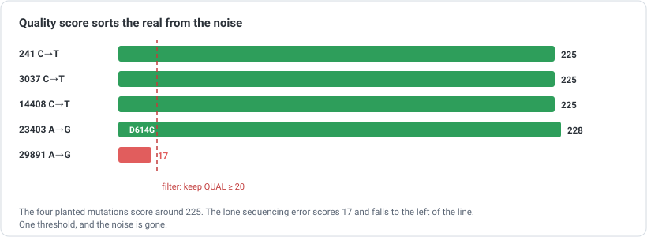

```{=html}
<div class="cba-comic">
```
{fig-alt="Three-panel comic: Prof. Zola asks Amina which variant a new sample is; Amina notices a column where every read says G while the reference says A; she concludes it carries four solid differences, the D614G lineage."}
```{=html}
</div>
```

## 🧩 The mystery

A new sample lands on the bench. You already know how to clean its reads
([Module 05](../05-reads-and-quality-control/index.qmd)) and map them to the reference
([Module 06](../06-read-alignment/index.qmd)). So you do, and Prof. Zola asks the question
the whole week has been building toward:

> "Good. Now tell me what makes *this* sample different. Which variant is it?"

Amina (that is you) looks at the aligned reads. Almost every letter matches the reference
genome perfectly. But not quite everywhere.

::: {.think}
At most positions, all your reads agree with the reference. That is boring, and boring is
good.

But imagine a single position where *every* read says **G** and the reference says **A**.
Is that a mistake, or is it real? And how would you tell the difference from a position
where just *one* read disagrees? Hold that thought.
:::

## What a "variant" actually is

A **variant** is simply a position where your sample consistently differs from the
reference genome. That is the whole idea. Alignment lined your reads up against the
reference; now you read *down* each column and look for disagreement.

::: {.story}
Picture a hundred people who each photocopied one page of the same book. Most copies are
identical to the original. If you stack them and one copy has a smudge in a random spot,
you ignore it: one smudge, one copy, clearly an accident.

But if *every single copy* has the same word changed in the same place, that is not an
accident. Someone changed the original. That is a variant.
:::

{width=820 fig-alt="Reads aligned under a reference sequence. In one column every read reads G where the reference reads A, a true variant. In another column one lone read disagrees, a sequencing error."}

That picture *is* the job. The tool you are about to run does exactly this counting, at
every position, and weighs the evidence.

## 🛠 Let's do it: call the variants

You need one new tool, **bcftools**, from the same family as samtools. Add it to the `align`
environment from [Module 06](../06-read-alignment/index.qmd):

```bash
conda activate align
conda install -c conda-forge -c bioconda bcftools
```

Calling variants is two steps piped together. First `mpileup` walks the genome and, at every
position, tallies what the stacked reads say. Then `call` decides which of those positions
are real variants:

```bash
bcftools mpileup -f sars2.fasta aln.sorted.bam \
  | bcftools call -mv -Oz -o calls.vcf.gz
bcftools index calls.vcf.gz
```

In plain words: `-f` gives it the reference to compare against, `-m` uses the modern calling
model, `-v` says "only write out the positions that are actually variant", and `-Oz` writes
a compressed, indexable file. Done. You just called variants.

## 🎉 Meet the output: the VCF file

The answer comes back as a **VCF** (Variant Call Format) file. Like SAM, it has a header of
`##` lines describing the run, then one line per variant. Peek at what was found:

```bash
bcftools query -f '%POS\t%REF\t%ALT\t%QUAL\n' calls.vcf.gz
```

The **real output**:

```text
241	C	T	225.421
3037	C	T	225.421
14408	C	T	225.417
23403	A	G	228.379
29891	A	G	17.4502
```

Look at one full variant record to see everything the caller recorded. Here is position
23403:

```text
NC_045512.2  23403  .  A  G  228.379  .  DP=107;...;DP4=0,1,51,55;MQ=60  GT:PL:AD  1/1:255,255,0:1,106
```

Reading the important columns left to right:

| Column | Value | Meaning |
|---|---|---|
| CHROM | `NC_045512.2` | which reference sequence |
| POS | `23403` | the position of the difference |
| REF | `A` | what the reference has here |
| ALT | `G` | what your sample has instead |
| QUAL | `228` | how confident the caller is (higher is better) |
| INFO → DP | `107` | depth: 107 reads covered this spot |
| INFO → DP4 | `0,1,51,55` | ref reads (fwd,rev), then alt reads (fwd,rev) |

That `DP4` is the evidence in numbers: **1** read still shows the old `A`, while **106** show
`G`, split evenly across both strands (51 + 55). A hundred independent reads, from both
directions, all agreeing. That is a variant you can trust.

## The payoff: you just identified a lineage

Four confident variants, and they are not random. `C241T`, `C3037T`, `C14408T`, and
`A23403G` are a real set that traveled together and defined the lineage which carried the
now-famous **Spike D614G** mutation to global dominance through 2020.

::: {.insight}
That last one, `A23403G`, *is* D614G. It changes a single amino acid in the spike protein.
The first one, `C241T`, sits in the 5' untranslated region, before any gene even starts, so
it changes no protein at all. Same kind of line in the same file, completely different
biological weight. The VCF tells you *where* the difference is. Deciding what it *means* is
the next chapter of the work.
:::

You did not just list some differences. You read a sample's identity straight off the
genome, which is exactly how the world tracked this virus in real time.

## 🧠 Think like a scientist, not a button

Now look again at that fifth line:

```text
29891	A	G	17.4502
```

You did not plant this one. It is a **sequencing error** that the caller flagged anyway.
Everything about it is weak: its quality is **17**, not 225, and it rests on a depth of just
**6** reads, a couple of which disagree. It is the single smudged photocopy from the story.

{width=820 fig-alt="Bar chart of quality scores: four variants near 225 and one error call at 17, below a threshold line at 20."}

::: {.mistake}
The beginner mistake is to treat every line in a VCF as a fact. It is not. Each line is a
*hypothesis*, and some are weak. A caller will happily hand you low-quality, low-depth calls
alongside the real ones. Your job is to filter.
:::

So you filter, keeping only calls with solid quality and depth:

```bash
bcftools view -i 'QUAL>=20 && INFO/DP>=10' calls.vcf.gz -Oz -o calls.filtered.vcf.gz
```

And the noise is gone. Exactly the four real variants remain:

```text
241	C	T	225.421
3037	C	T	225.421
14408	C	T	225.417
23403	A	G	228.379
```

Two habits separate a scientist from a button here:

- **A variant is always relative to a reference.** "Different from `NC_045512.2`" is not the
  same as "a mutation in the patient". Map to the wrong reference and every difference is
  suspect. Know your reference.
- **Quality and depth are your filters, not decoration.** A call at depth 6 is a rumour. A
  call at depth 100 across both strands is testimony.

::: {.reality}
Prof. Zola: "So the sample has five mutations?"<br>
Amina: "Four. The fifth is noise."<br>
Prof. Zola: "How do you know?"<br>
Amina: "Six reads and a bad quality score walk into a bar. Nobody believes them."
:::

## 🧩 Mini challenge

::: {.challenge}
A collaborator sends you a VCF and points at a single exciting row: a variant in a gene they
care about. Its `INFO` field shows `DP=4` and its `QUAL` is `12`.

Should you get excited yet? Why or why not?

**Answer:** not yet. Depth 4 and quality 12 is exactly the profile of a sequencing error,
the smudge on one photocopy. Before believing it, you would want more depth and a much higher
quality score, ideally with support on both strands. It might be real, but this evidence is
far too thin to build a claim on.
:::

## Three quick questions

Not graded. Just checking yourself.

1. In one sentence, what is a **variant**?
2. Why is a call with `DP=6` and `QUAL=17` less trustworthy than one with `DP=107` and
   `QUAL=228`?
3. True or false: every row in a VCF file is a confirmed mutation.

::: {.callout-note collapse="true"}
## Answers
A variant is a position where your sample consistently differs from the reference genome.
The low-depth, low-quality call rests on very few reads and weak evidence, so it is much more
likely to be a sequencing error than a real difference. False: each row is a hypothesis, and
weak ones should be filtered out.
:::

## 🎯 Key takeaway

::: {.takeaway}
Variant calling reads down the aligned reads and reports where your sample differs from the
reference, as a VCF file. The real variants stand on deep, high-quality, both-strand
evidence; the noise does not, and a simple filter separates them. Always remember a variant
is defined *against a reference*, and that a VCF row is a claim to be checked, not a fact to
be trusted.
:::

::: {.didyouknow}
This is not a toy exercise. During the pandemic, laboratories around the world ran almost
exactly this pipeline, clean reads to alignment to VCF, on millions of samples, and shared
the results openly. Reading variants off a genome is how names like Delta and Omicron were
spotted, tracked, and understood, sometimes within days of a new sample being sequenced. You
just did the core of it.
:::

::: {.callout-tip collapse="true"}
## ⚠️ Verify before you rely on exact numbers
The reads here were **simulated**, built by planting four real, documented mutations into the
SARS-CoV-2 reference so there is a known right answer to recover. The commands and outputs
used **bwa 0.7.19**, **samtools 1.24** and **bcftools 1.24**; your versions and the exact
quality numbers may differ. One honest detail: bcftools assumes a diploid genome by default,
so it writes the genotype as `1/1`. SARS-CoV-2 is a single-stranded virus, so for it `1/1`
just means "essentially every read carries this variant". The shapes (VCF columns, the
signal-versus-noise logic, filtering on QUAL and depth) are what to carry forward.
:::

```{=html}
<div class="cba-signoff">
```
You turned a pile of mismatches into a sample's identity, and you know which differences to believe. That is genomics doing real work.

<span class="coffee-line">Go and make a coffee. ☕</span>

Next time, Amina asks the harder question hiding inside that VCF: a variant is a difference, but does it change the protein, and does that change matter? Where a letter meets biology.
```{=html}
</div>
```
