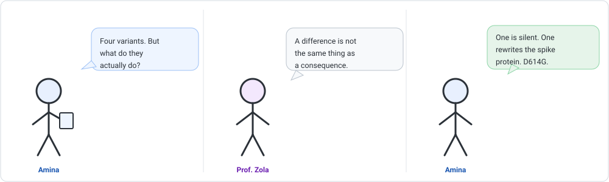
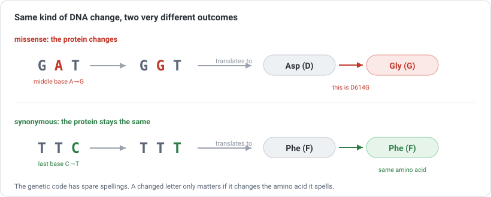
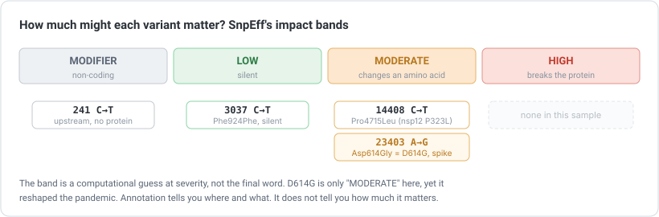

```{=html}
<div class="cba-comic">
```
{fig-alt="Three-panel comic: Amina holds a VCF of four variants and asks what they do; Prof. Zola says a difference is not the same as a consequence; Amina annotates them and finds one is silent and one is the famous D614G in the spike protein."}
```{=html}
</div>
```

## 🧩 The mystery

You did it: last time you turned a pile of reads into four confident variants in a VCF file.
You even named the lineage. Prof. Zola looks at your list of four positions and asks the
question that separates a technician from a scientist:

> "Fine. Four differences. But which of them actually *matters*?"

Amina (that is you) pauses. A variant is a change in the DNA. But DNA is a set of
instructions for building proteins. So the real question is not *where* the change is. It is
*what the change does to the instructions.*

::: {.think}
Here are two of your four variants. Both are a single letter swapped. One of them silently
does nothing to any protein. The other rewrites a protein that the whole world learned to
fear.

From the VCF alone, they look identical: one row each. So how could a computer possibly tell
them apart? Hold that thought.
:::

## From a letter to a consequence

To see what a variant *does*, you have to follow the DNA downstream. A gene is read three
letters at a time. Each triplet, called a **codon**, spells one amino acid, and amino acids
strung together make a protein.

Here is the trick that makes this whole lesson interesting: there are 64 possible codons but
only 20 amino acids, so the code has spare spellings. Several different codons can spell the
*same* amino acid. That means some DNA changes rewrite the protein, and some change nothing
at all.

::: {.story}
Think of the genetic code like a language full of synonyms. "Big" and "large" are different
words for the same thing. Swap one for the other and the sentence means exactly what it
meant before. But swap "big" for "bug" and the meaning changes completely.

DNA works the same way. Some letter changes swap one spelling of an amino acid for another
spelling of the *same* amino acid, and the protein reads identically. Others change the amino
acid itself, and the protein reads differently.
:::

{width=820 fig-alt="Two examples. GAT to GGT changes Asp to Gly, a missense change and the real D614G. TTC to TTT stays Phe, a synonymous silent change."}

So the job of this lesson is to take each variant, find the codon it lands in, and ask: did
the amino acid change? That process is called **annotation**.

## 🛠 Let's do it: annotate the variants

Calling variants only needed the reference sequence. Annotation needs one more thing: a map
of **where the genes are**, so the tool knows which codon each variant falls in. That map is
an annotation database.

The tool is **SnpEff**, and it ships databases for thousands of genomes, SARS-CoV-2 among
them. Add it to the `align` environment:

```bash
conda activate align
conda install -c conda-forge -c bioconda snpeff
```

Then point it at the filtered VCF from [Module 07](../07-variant-calling/index.qmd). The
first run downloads the gene map for our reference:

```bash
snpEff NC_045512.2 calls.filtered.vcf > annotated.vcf
```

That is it. SnpEff walked each variant into its gene, translated the codon before and after,
and wrote the verdict back into the file.

## 🎉 Meet the output: the ANN field

SnpEff does not make a new file format. It takes your VCF and adds its findings to the `INFO`
column under a tag called **`ANN`**. Here is the annotation it attached to position 23403
(trimmed to the key subfields):

```text
G | missense_variant | MODERATE | S | ... | c.1841A>G | p.Asp614Gly | 614/1273
```

Read the important pieces:

| Subfield | Value | Meaning |
|---|---|---|
| Effect | `missense_variant` | it changes an amino acid |
| Impact | `MODERATE` | SnpEff's guess at how serious that is |
| Gene | `S` | it lands in the spike gene |
| HGVS.c | `c.1841A>G` | the change in the gene's DNA |
| HGVS.p | `p.Asp614Gly` | Asp becomes Gly, at residue 614 |
| AA position | `614/1273` | residue 614 of the 1273 in spike |

Look at `p.Asp614Gly`. The tool just told you, on its own, that your variant is **D614G**:
the exact spike-protein change that defined the lineage which swept the globe in 2020.

::: {.insight}
Sit with what just happened. Starting from a raw sample and a reference genome, your pipeline
worked out that position 23403 changes residue 614 of the spike protein from Asp to Gly, and
handed you the name **D614G**. You did not recognise the mutation and look it up. The computer
derived it, letter by codon, from the genetic code itself.
:::

## The four variants, four different stories

Run the same reading across all four confident variants and they split into completely
different kinds of event:

| Position | Change | Effect | Impact | Protein result |
|---|---|---|---|---|
| 241 | C→T | upstream (non-coding) | MODIFIER | none, it is before the gene |
| 3037 | C→T | synonymous | LOW | `Phe924Phe`, silent |
| 14408 | C→T | missense | MODERATE | `Pro4715Leu`, in the polymerase |
| 23403 | A→G | missense | MODERATE | `Asp614Gly`, the famous D614G |

Same VCF, four rows that looked alike, and four genuinely different biological stories. One
sits outside any gene. One is completely silent. Two change an amino acid, and one of those
two is history.

{width=820 fig-alt="An impact scale from MODIFIER to LOW to MODERATE to HIGH with the four variants placed in their bands and the HIGH band empty."}

## 🧠 Think like a scientist, not a button

Now the trap, and it is a subtle one. SnpEff labelled D614G as **MODERATE**, the *same* band
as the polymerase change next to it. Yet D614G reshaped the pandemic and the other is a
footnote. The label did not know that.

::: {.mistake}
The impact band (`HIGH`, `MODERATE`, `LOW`, `MODIFIER`) is a *rule-of-thumb prediction from
the type of change*, not a measure of how much a variant matters in the real world. A
"MODERATE" missense can be world-changing or utterly harmless. A "LOW" synonymous change is
usually quiet but occasionally matters. Never read the impact column as biological
importance. It is a triage hint, not a verdict.
:::

Two habits keep you honest:

- **Annotation depends on the gene map.** SnpEff's answer is only as good as the database of
  gene positions it used. A different or outdated annotation can move a variant into a
  different gene, or miss it. Know which database you annotated against.
- **"Missense" is a starting point, not a conclusion.** It tells you an amino acid changed.
  Whether that change helps the virus, hurts it, or does nothing needs real evidence:
  experiments, structures, epidemiology. Annotation narrows millions of possibilities down
  to the few worth studying. It does not end the study.

::: {.reality}
Prof. Zola: "So D614G is MODERATE impact?"<br>
Amina: "That is what the label says."<br>
Prof. Zola: "And was it moderate?"<br>
Amina: "It changed the whole pandemic."<br>
Prof. Zola: "So what did the label really tell you?"<br>
Amina: "Where to look. Not what I would find."
:::

## 🧩 Mini challenge

::: {.challenge}
You annotate two variants. Variant A is `synonymous_variant`, `LOW` impact. Variant B is
`missense_variant`, `MODERATE` impact, in a gene central to your study.

Your labmate says: "Ignore A, chase B." Is that reasonable, and what is the risk?

**Answer:** it is a reasonable *first* prioritisation. Missense changes in a gene you care
about are exactly what annotation is meant to surface, and there are only so many hours in a
day. But the risk is treating the label as truth: variant B being "MODERATE" does not make
it real or important, and variant A being "silent" does not guarantee it is harmless (some
synonymous changes affect how a gene is read). Prioritise B, but verify it, and do not swear
A is nothing.
:::

## Three quick questions

Not graded. Just checking yourself.

1. Why can two single-letter DNA changes have completely different effects on a protein?
2. What extra information does annotation need that variant calling did not?
3. True or false: a `MODERATE` impact label means the variant is definitely important.

::: {.callout-note collapse="true"}
## Answers
Because the genetic code is redundant: one change may land on a codon that still spells the
same amino acid (silent), while another changes the amino acid (missense). Annotation needs a
gene map, the positions of genes and codons, which calling did not require. False: the impact
band predicts the *kind* of change, not its real-world importance.
:::

## 🎯 Key takeaway

::: {.takeaway}
Annotation follows each variant from a position into a gene and asks what it does to the
protein: nothing, a silent change, or a real amino-acid change. It turns a list of positions
into a list of consequences, and it can name a change like D614G straight from the data. But
the impact label is a triage hint, not a measure of importance. Annotation tells you where to
look, not what you will find.
:::

::: {.didyouknow}
D614G, the very change your pipeline just named from raw data, became one of the most studied
mutations of the pandemic. It arose early, was linked to greater transmissibility, and within
months had largely replaced the original form worldwide. Everything you did across the last
four lessons, clean, align, call, annotate, is the same path researchers walked to spot it.
:::

::: {.callout-tip collapse="true"}
## ⚠️ Verify before you rely on exact numbers
The variants here come from **simulated** data with four real mutations deliberately planted
(see [Module 07](../07-variant-calling/index.qmd)). Annotation used **SnpEff 5.4c** with its
`NC_045512.2` database; other tools (VEP, `bcftools csq`) or database versions can word
effects differently or place a variant in a differently named transcript. The concepts
(codon to amino acid, synonymous versus missense, impact as a prediction not a verdict) are
what to carry forward.
:::

```{=html}
<div class="cba-signoff">
```
You followed a single letter all the way to a protein, and you know why the label is only half the story. That is how variants become biology.

<span class="coffee-line">Go and make a coffee. ☕</span>

Next time, Amina zooms out from one sample. Line up thousands of them, let their shared differences fall into place, and a family tree of the virus starts to draw itself.
```{=html}
</div>
```
