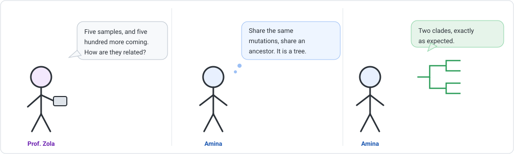
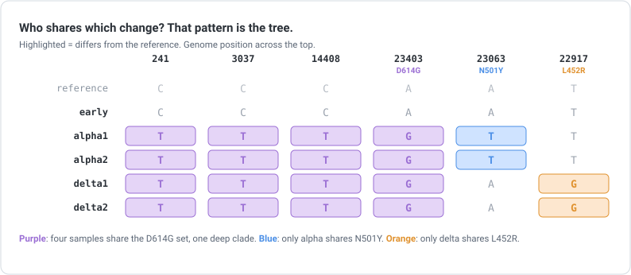
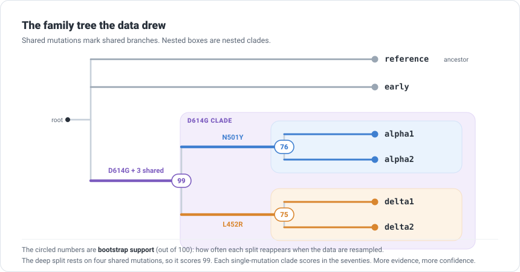

```{=html}
<div class="cba-comic">
```
{fig-alt="Three-panel comic: Prof. Zola asks how five samples, with five hundred more coming, are related; Amina realises samples that share mutations share an ancestor, so the pattern is a family tree; she aligns them and a tree with two clades draws itself."}
```{=html}
</div>
```

## 🧩 The mystery

You can now take one sample from raw reads all the way to named mutations. But a lab never
has just one sample. Prof. Zola drops a folder on the bench:

> "Five genomes today. Five hundred by Friday. How are they all related?"

Amina (that is you) looks at five samples, each with its own handful of variants. Some
variants show up in several samples. Some are unique to one. Is that a coincidence?

::: {.think}
Two samples carry the *exact same* mutation, at the exact same position. Did that identical
change happen twice by chance, in two separate samples? Or did both samples inherit it from a
shared ancestor that had it first?

Almost always, the answer is inheritance. Hold that thought, because it is the entire idea
behind a family tree of genomes.
:::

## Shared mutations mean shared ancestry

A mutation is a rare event. The same mutation appearing in two samples is far more likely to
mean *they inherited it from a common ancestor* than that it happened twice independently. So
the pattern of who-shares-what is a record of descent.

::: {.story}
Think of surnames. If you meet several people all called "Okoro", the simplest explanation is
not that they invented the name separately. It is that they share an ancestor who carried it.
Add middle names and you can group cousins within the family.

Genomes work the same way. A shared mutation is a shared surname. The nested pattern of shared
mutations is a family tree.
:::

{width=820 fig-alt="A grid of six samples by six genome positions, highlighting which samples carry which mutations, showing a nested pattern of sharing."}

Read that grid and the tree is already visible: four samples share the D614G set (one big
group), and inside it, two share N501Y and two share L452R (two smaller groups). A computer
can find this pattern for thousands of samples in minutes.

## 🛠 Let's do it: build the tree

Two steps. First, line the genomes up so the same position sits in the same column, a
**multiple sequence alignment**, with `mafft`. Then hand the alignment to `iqtree`, which
weighs the shared differences and infers the tree. Add both tools to the `align` environment:

```bash
conda activate align
conda install -c conda-forge -c bioconda mafft iqtree
```

```bash
# 1) align the genomes to each other
mafft --auto samples.fasta > aligned.fasta

# 2) infer the tree (GTR+G model, 1000 quick bootstraps, rooted on the reference)
iqtree -s aligned.fasta -m GTR+G -B 1000 -o reference
```

IQ-TREE writes several files. The one you want is `aligned.fasta.treefile`.

## 🎉 Meet the output: a tree in text, then in pictures

A tree is stored as **Newick** format: nested parentheses, where things grouped inside the
same brackets are more closely related. Here is the **real** result (branch lengths trimmed
for readability):

```text
(reference, early, ((alpha1, alpha2)76, (delta1, delta2)75)99);
```

Read the brackets from the inside out: `alpha1` and `alpha2` are grouped, `delta1` and
`delta2` are grouped, and those two groups are wrapped together, with `reference` and `early`
left outside. The numbers just after a closing bracket are **confidence scores**, and we come
back to them in a moment.

The same tree, drawn by IQ-TREE straight into your terminal:

```text
             ___________ early
  __________|
 |          |            ___________ alpha1
 |          |            |
 |          |___________ (alpha1, alpha2)
 |                       |___________ alpha2
_|
 |                        ___________ delta1
 |           ___________ (delta1, delta2)
 |                       |___________ delta2
 |
 |__________ reference
```

And the same tree again, drawn properly:

{width=860 fig-alt="A rooted phylogenetic tree with nested clade boxes: a D614G clade containing an alpha clade and a delta clade, with reference and early near the root, and bootstrap support values on each split."}

::: {.insight}
Look at what happened. We never told the computer the family history. We only handed it six
genome sequences. From the pattern of shared mutations alone, it reconstructed exactly the
ancestry those samples were built with: the D614G group, split into an alpha branch and a
delta branch. The tree was hiding in the data. The tool simply revealed it.
:::

## 🧠 Think like a scientist, not a button

Now those numbers on the branches. They are **bootstrap support**: the computer repeatedly
resamples the data and asks how often each grouping still appears. A branch that shows up
almost every time is well supported. One that comes and goes is shaky.

Look how honest they are. The deep D614G split scores **99**: it rests on four shared
mutations, so the data insist on it. But each smaller clade rests on just *one* shared
mutation, and scores in the **mid-70s**: probably right, not certain.

::: {.mistake}
The beginner mistake is to read a tree as fact and trust every branch equally. A tree is a
*hypothesis*, and some parts of it are firmer than others. A split with strong support is
something to build on. A weakly supported split, like our single-mutation clades, is a lead
to check, not a conclusion. Always read the support values before you believe the shape.
:::

Two more habits worth keeping:

- **The tree is only as good as the samples in it.** Leave out an important genome and the
  shape can change. This is why surveillance projects share sequences openly: more samples,
  a truer tree.
- **It scales, and that is the point.** You did six genomes by hand to see the idea. The same
  two commands run on thousands. That is not a metaphor for genomic surveillance. It is
  genomic surveillance.

::: {.reality}
Prof. Zola: "Is the tree correct?"<br>
Amina: "The deep split, yes. Ninety-nine."<br>
Prof. Zola: "And the small branches?"<br>
Amina: "Seventy-six. I would call them likely, not proven."<br>
Prof. Zola: "Finally. Someone who reads the numbers."
:::

## 🧩 Mini challenge

::: {.challenge}
On a tree, one branch grouping two samples has a bootstrap support of **41**. A colleague
writes in the paper that these two samples "form a distinct lineage."

Is that claim safe? What would you say?

**Answer:** no, not on support of 41. That means the grouping appeared in fewer than half the
resamples, so the data barely favour it over alternatives. The two samples *might* form a
lineage, but the tree does not show it convincingly. You would ask for more data, or soften
the claim to "a possible grouping that needs stronger support", rather than state it as fact.
:::

## Three quick questions

Not graded. Just checking yourself.

1. Why does a mutation shared by several samples usually mean shared ancestry?
2. What does a bootstrap support value tell you about a branch?
3. True or false: every branch on a published tree is equally trustworthy.

::: {.callout-note collapse="true"}
## Answers
Because the same mutation arising independently in several samples is far less likely than all
of them inheriting it from one common ancestor. Bootstrap support estimates how often a
branch reappears when the data are resampled, so it measures confidence in that split. False:
branches vary in support, and weakly supported ones may be wrong.
:::

## 🎯 Key takeaway

::: {.takeaway}
Line many genomes up, and the nested pattern of shared mutations reconstructs their family
tree: an alignment feeds a tree-builder, and out comes the ancestry. Read the support values,
because a tree is a hypothesis whose branches differ in strength. The same two commands that
related six genomes relate thousands, which is exactly how the world watches a virus evolve.
:::

::: {.didyouknow}
During the pandemic this ran continuously and in the open. Projects like Nextstrain rebuilt
trees from millions of shared SARS-CoV-2 genomes, often within days of new samples arriving,
turning a flood of sequences into a live map of how the virus was spreading and changing. The
handful of genomes you just related is the same idea, at a smaller scale.
:::

::: {.callout-tip collapse="true"}
## ⚠️ Verify before you rely on exact numbers
The genomes here were **built on purpose** with a known ancestry (the reference plus planted
mutations, including the real D614G, N501Y and L452R landmarks) so there is a right answer to
recover. The pipeline used **MAFFT 7.526** and **IQ-TREE 3.1.3**; other tools (FastTree,
RAxML) and models can differ in detail, and support-value scales are interpreted differently
between methods. The ideas (shared mutations as shared ancestry, a tree as a hypothesis,
support as confidence) are what to carry forward.
:::

```{=html}
<div class="cba-signoff">
```
You turned six separate genomes into a single story of descent, and you know which parts of that story to trust. That is phylogenetics.

<span class="coffee-line">Go and make a coffee. ☕</span>

Next time, the reckoning: you have now run clean, align, call, annotate, and relate, all by hand. Prof. Zola wants it on five hundred samples by Friday. Nobody types that. Amina teaches the computer to run the whole pipeline itself.
```{=html}
</div>
```
