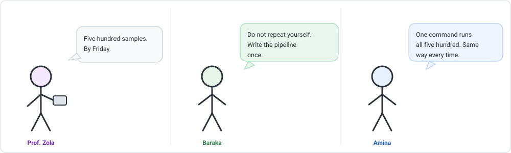
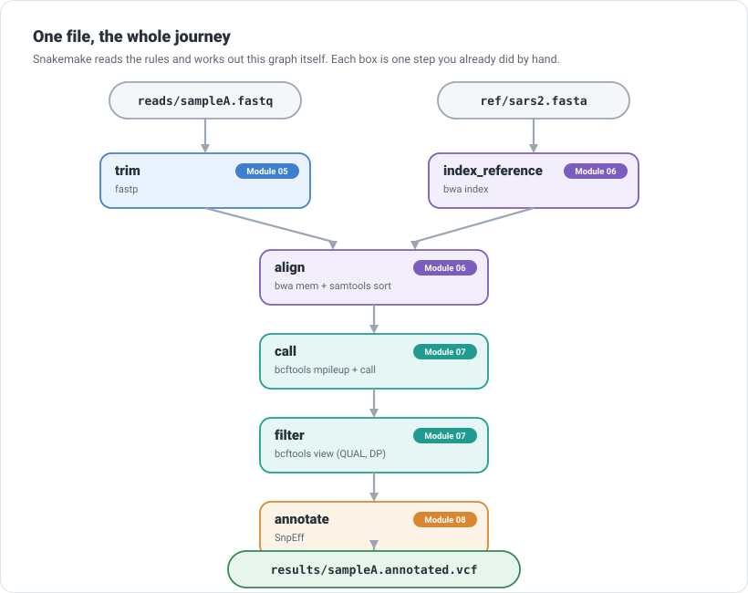
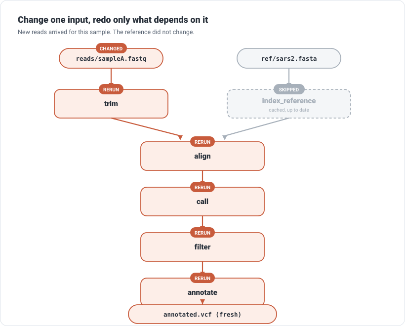

```{=html}
<div class="cba-comic">
```
{fig-alt="Three-panel comic: Prof. Zola demands five hundred samples by Friday; Baraka the programmer says do not repeat yourself, write the pipeline once; Amina realises one command can run all five hundred, the same way every time."}
```{=html}
</div>
```

## 🧩 The mystery

Look at what you can now do. Clean the reads, map them, call variants, annotate them. Five
lessons, and a real answer at the end. But you did it all **by hand**, one command at a time,
for **one** sample.

Prof. Zola appears with a folder and a deadline:

> "Five hundred samples. By Friday."

Amina (that is you) does the arithmetic. Roughly five commands per sample, five hundred
samples. That is thousands of commands typed by hand, in the right order, without a single
mistake. And if one tool changes, or one sample was bad, you redo it all.

::: {.think}
The problem is not that the work is hard. Each step, you already know. The problem is doing
it *by hand, five hundred times, perfectly*. Humans do not do that. We fat-finger a filename
on sample 347 and never notice.

What if you described the steps **once**, and let the computer do the repeating, the ordering,
and the remembering?
:::

## A pipeline is a recipe a machine follows

The tool that does this is called a **workflow manager**, and the one you will use is
**Snakemake**. The idea behind it is quietly brilliant, and it is worth slowing down for.

::: {.story}
You do not write a workflow as a to-do list ("first trim, then align, then call..."). You
write it as a set of **rules**, where each rule states only two things: what it *needs*
(inputs) and what it *makes* (outputs).

It is like leaving recipe cards in a kitchen. One card says "to make sauce, you need
tomatoes." Another says "to make pasta, you need sauce." You never write the order down. Anyone
reading the cards can work it out: sauce before pasta. The machine reads your rule cards and
figures out the order itself.
:::

## 🛠 Let's do it: write the rules

A Snakemake rule is short. Here is the one that trims a sample's reads (Module 05, now a rule):

```python
rule trim:
    input:  "reads/{sample}.fastq"
    output: "trimmed/{sample}.fastq"
    shell:  "fastp -i {input} -o {output} --cut_tail --cut_tail_mean_quality 20 --length_required 30"
```

Three parts: what it needs, what it makes, and the command to get from one to the other. The
`{sample}` is a **wildcard**: write the rule once and it works for `sampleA`, `sampleB`, or
five hundred others. `{input}` and `{output}` just stand in for the filenames so you never
retype them.

Now the crucial part. You never tell Snakemake the order. You only tell it your **goal**:

```python
rule all:
    input: "results/sampleA.annotated.vcf"
```

Snakemake works *backwards* from that final file. To make the annotated VCF it needs the
filtered VCF; to make that it needs the calls; and so on back to the raw reads. String the
rules together (trim, align, call, filter, annotate) and Snakemake reads the whole chain.

Ask it what it *would* do, without doing anything, with a dry run:

```bash
snakemake -n
```

The **real** plan it produced:

```text
Job stats:
job                count
---------------  -------
index_reference        1
trim                   1
align                  1
call                   1
filter                 1
annotate               1
all                    1
total                  7
```

Seven steps, worked out from your rules. You can even see the shape of it. Snakemake draws
the **dependency graph** for you (`snakemake --dag | dot -Tsvg`):

{width=820 fig-alt="A flowchart: reads feed a trim step and the reference feeds an index step, both feed align, then call, filter and annotate in sequence, producing the annotated VCF."}

That is your entire course, from Module 05 to Module 08, as one picture. You did not draw it.
Snakemake worked it out from the rules.

## 🎉 Run it: one command

```bash
snakemake --cores 1
```

Snakemake executes the steps in the right order, and reports as it goes. The **real** tail of
the run:

```text
5 of 7 steps (71%) done
6 of 7 steps (86%) done
7 of 7 steps (100%) done
Complete log(s): .snakemake/log/2026-09-04T122234.snakemake.log
```

And the final file carries exactly what you would have got by hand, the D614G lineage
variants, straight through five tools without you touching a single intermediate file:

```text
241     C  T
3037    C  T
14408   C  T
23403   A  G     <- D614G
```

One command did the work of the last four lessons. For five hundred samples, it is the *same*
command.

## 🧠 The part that makes it more than a script

Here is what separates a real pipeline from a shell script. Run it a second time:

```bash
snakemake --cores 1
```

```text
Nothing to be done (all requested files are present and up to date).
```

It did nothing, on purpose. Every output already exists and is newer than its inputs, so there
is nothing to redo. Now change *one* input, say new reads arrive for that sample, and ask
again what it would do:

{width=820 fig-alt="The pipeline with the reads input marked changed. Trim, align, call, filter and annotate are marked rerun; index_reference is marked cached and skipped."}

```text
job         count
--------  -------
trim            1
align           1
call            1
filter          1
annotate        1
all             1
total           6
```

Six steps, not seven. Snakemake reran everything downstream of the changed reads, but it
**skipped** `index_reference`, because the reference did not change. It redoes exactly what is
affected and nothing more. A hand-typed re-run cannot do that. This is the real payoff:
reproducible, and never repeating work it does not have to.

::: {.mistake}
The beginner instinct is to write one long shell script with the commands in order. It works
once, on your machine, today. But it reruns everything every time, breaks silently if a step
fails halfway, hides which tool versions you used, and quietly rots. A workflow manager gives
you order, restart-from-where-it-broke, a record of what ran, and reruns only what changed.
Same commands, but now they are trustworthy.
:::

## The wider world: you have choices

Snakemake is one of several workflow managers, and they share the same core idea: declare the
steps, let the tool handle order, scale, and reproducibility. Which you meet depends on where
you work.

| Tool | Flavour | You will see it... |
|---|---|---|
| **Snakemake** | Python-based rules (what you just used) | widely in academic labs, gentle if you know Python |
| **Nextflow** | dataflow pipelines (Groovy) | in production and cloud/HPC; home of **nf-core** |
| **WDL** | a portable workflow language | with GATK pipelines and platforms like Terra |
| **CWL** | an open, engine-neutral standard | where portability across systems matters |
| **Galaxy** | point-and-click, in the browser | when you would rather not write code at all |

::: {.insight}
**nf-core** is worth knowing by name. It is a large, community-curated collection of
ready-made Nextflow pipelines, tested and documented, for common jobs like RNA-seq and viral
genomics. The pipeline you just built by hand is, in spirit, exactly the kind of thing nf-core
packages and hardens for the whole field to reuse. Once you understand the idea, you can run
these giants, not just admire them.
:::

::: {.callout-note}
## From toy to real
The pipeline you just wrote is a teaching-sized version of the real thing. For a production
example in the very same tool, see [ngs-pipeline](https://github.com/Kishaz/ngs-pipeline), a
Snakemake workflow (by this course's author) that runs RNA-seq, WES and WGS data through QC,
alignment, recalibration, variant calling and quantification, with modular rule files, a
pinned Conda environment per tool, and ready-made cluster profiles. You now understand exactly
how a workflow like that is built. Go and read it.
:::

Two habits carry across all of them:

- **Pin your environment.** A pipeline that runs the right tools but the wrong *versions* is
  not reproducible. Snakemake, Nextflow and the rest all let you attach a Conda environment or
  a container to each step, so "works on my machine" becomes "works on everyone's".
- **A workflow is documentation.** Six months from now, the rules *are* the record of exactly
  what you did. That is worth as much as the results.

::: {.reality}
Prof. Zola: "Five hundred samples. Done?"<br>
Amina: "Running. Same command as one sample."<br>
Prof. Zola: "And when I add fifty more on Monday?"<br>
Amina: "It will do the fifty. Not the five hundred again."<br>
Prof. Zola: "...I have no follow-up question."
:::

## 🧩 Mini challenge

::: {.challenge}
You run your pipeline on 500 samples overnight. In the morning you notice the *annotation*
step used the wrong database, so you fix that one rule. Everything else, the trimming,
alignment and calling, was fine.

If your workflow is written as Snakemake rules, what will re-running do? What if it were one
long shell script instead?

**Answer:** Snakemake will rerun only the annotation step (and anything downstream of it),
because only that rule's command changed. The expensive trimming, alignment and calling for
all 500 samples are untouched. A plain shell script has no memory of what is up to date, so it
would redo everything from the first command, hours of work, to fix one step at the end.
:::

## Three quick questions

Not graded. Just checking yourself.

1. In a Snakemake rule, what two things do you actually declare?
2. You never tell Snakemake the order of steps. How does it know?
3. You change one input file. Why does a workflow manager beat re-running a shell script?

::: {.callout-note collapse="true"}
## Answers
Each rule declares its inputs (what it needs) and its outputs (what it makes). Snakemake works
backwards from your goal file, matching each needed input to the rule that produces it, so it
derives the order itself. Because it reruns only the steps affected by the change and skips
everything still up to date, while a shell script blindly redoes everything.
:::

## 🎯 Key takeaway

::: {.takeaway}
A workflow manager turns a pile of manual commands into one reproducible pipeline: you declare
each step's inputs and outputs, and the tool works out the order, runs it, and reruns only what
changed. Snakemake, Nextflow, WDL, CWL and Galaxy all share this idea. Pin your environments,
and remember the workflow itself is the clearest record of what you did.
:::

::: {.didyouknow}
Reproducibility is a real crisis in science: results that no one, sometimes not even the
original author, can reproduce. Workflow managers are one of the field's best answers. Shared
collections like nf-core mean an analysis run in Nairobi, Boston or São Paulo can follow the
exact same tested steps, and get the same answer. The small pipeline you just wrote is a
working example of that idea.
:::

::: {.callout-tip collapse="true"}
## ⚠️ Verify before you rely on the details
This pipeline is a teaching example built with **Snakemake 9.26.1** on the simulated sample
from the earlier modules; command flags and output wording shift between versions. Real
projects add per-rule environments (Conda or containers), logging, and error handling. The
core ideas (rules of inputs and outputs, a dependency graph, rerun only what changed, pin your
environment) are stable across tools and worth carrying anywhere.
:::

```{=html}
<div class="cba-signoff">
```
You turned a week of hand-typed commands into one reproducible pipeline that scales to five hundred samples, or five thousand. That is not a student exercise any more. That is how the work is really done.

<span class="coffee-line">Go and make a coffee. ☕</span>

You have taken a single biological question from an empty laptop all the way to an automated, reproducible answer. Next, Amina turns to a different kind of question entirely: not what a genome *is*, but what it is *doing*.
```{=html}
</div>
```
