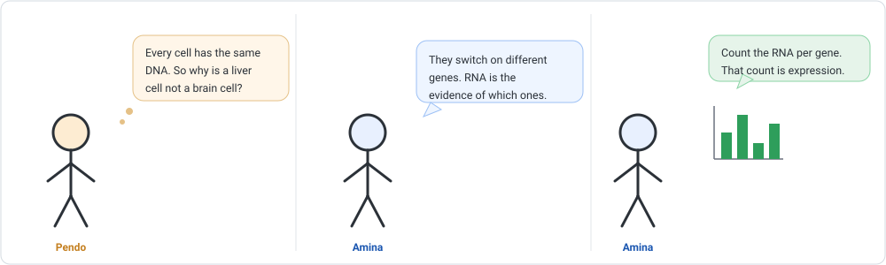
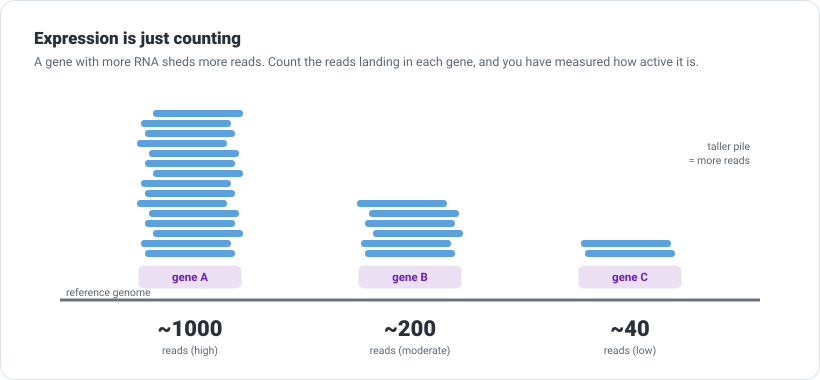
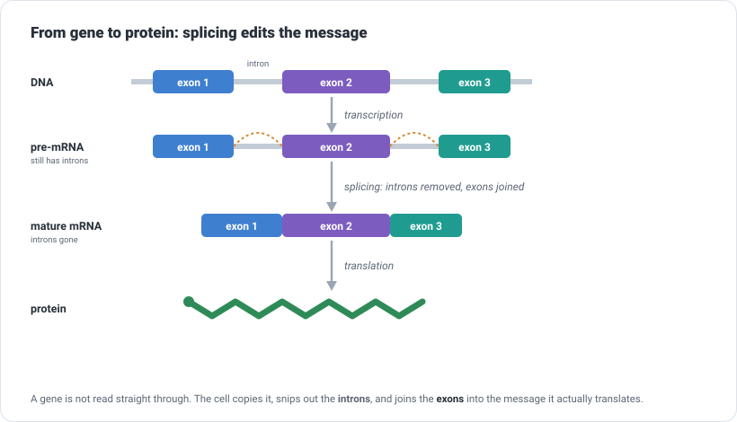
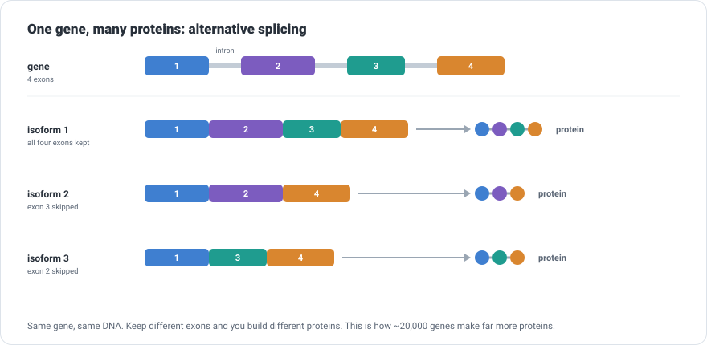
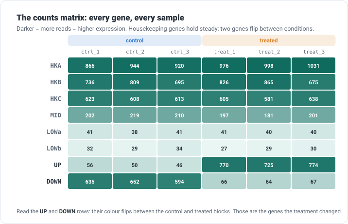

```{=html}
<div class="cba-comic">
```
{fig-alt="Three-panel comic: Pendo asks why a liver cell differs from a brain cell if every cell has the same DNA; Amina answers that they switch on different genes and RNA is the evidence; she holds a bar chart and says counting the RNA from each gene is expression."}
```{=html}
</div>
```

## 🧩 The mystery

For ten lessons you asked what a genome *is*: its letters, its differences, its family tree.
Now Prof. Zola sets a different kind of experiment on the bench. Cells grown two ways,
**control** and **treated**, three dishes each, all sequenced. Then the question:

> "The treatment did something. Which genes responded?"

Amina (that is you) reaches for the variant-calling toolkit, and stops. Every one of these
samples is the *same* cell line. The DNA is identical. Calling variants would find almost
nothing.

::: {.think}
The difference between a control cell and a treated cell is not in the *sequence* of their
genes. Both have the same genes. The difference is in **how much each gene is being used**.

So how do you measure "how much a gene is being used"? Not its spelling, its *activity*. Hold
that thought.
:::

## The photocopies, not the books

The answer runs straight through the central dogma. DNA is the master copy, the same in every
cell. To actually *use* a gene, the cell transcribes it into **RNA**. A gene the cell needs a
lot of, it transcribes a lot. A gene it is not using sits quiet.

::: {.story}
Think of a library whose master books never leave the shelf, that is your DNA, identical in
every branch. When a branch is busy on a topic, it runs off **photocopies** of that book for
everyone to use. A popular topic, a thick stack of copies. An ignored one, none.

**RNA-seq counts the photocopies.** It sequences the RNA a cell is actively making, so a gene
in heavy use shows up as many reads, and a quiet gene as few. That count is what we call
**gene expression**.
:::

{width=820 fig-alt="Three genes on a genome with read piles of different heights above them, labelled with read counts, showing expression as counting reads per gene."}

So the plan is exactly what that picture shows: align the RNA reads to the genome, then, for
each gene, **count how many reads landed in it**. Do that for every sample and you have a
table of activity.

## One gene, edited before it is read

There is a beautiful complication hiding inside "the cell transcribes a gene". A gene is not
one clean stretch of message. It is split into **exons**, the parts that end up in the final
message, separated by **introns**, filler that has to be removed first.

So the first copy a cell makes, the **pre-mRNA**, still contains the introns. Before it can be
used, the cell **splices** it: the introns are cut out and the exons are joined into the
finished **mature mRNA**. Only that is translated into protein.

{width=820 fig-alt="Vertical diagram: a DNA gene with exons and introns, transcribed into pre-mRNA, spliced into mature mRNA with the introns removed, then translated into protein."}

::: {.didyouknow}
Here is where it gets clever. A cell does not have to keep the *same* exons every time. By
including or skipping different exons, one gene can be spliced into **several different mature
mRNAs**, and so into **several different proteins**. This is **alternative splicing**, and it
is a big reason roughly 20,000 human genes can build a far larger number of proteins.
:::

{width=820 fig-alt="One gene with four exons spliced into three isoforms that keep different exons, each making a different protein drawn as a chain of coloured beads."}

Two things follow, and both matter for what we are about to do:

- **This is why RNA reads need a splice-aware aligner.** A read from a mature mRNA can begin at
  the end of one exon and continue at the start of the next, with the whole intron missing in
  between. Mapped back to the genome, that read has to *jump over* the intron. A plain DNA
  aligner cannot do that. **HISAT2** and STAR can.
- **Counting per gene adds up the isoforms.** The counting step ahead tallies all of a gene's
  reads together, whichever isoform they came from. That is the right place to begin. Telling
  the isoforms apart is a separate, harder job (tools like Salmon do it) for another day.

## 🛠 Let's do it: from reads to counts

You know the catch now, RNA reads span exon junctions, so the aligner must be **splice-aware**.
We use **HISAT2**, with **featureCounts** to do the counting:

```bash
conda activate align
conda install -c conda-forge -c bioconda hisat2 subread
```

Index the reference once, then align each sample's reads:

```bash
hisat2-build genome.fasta genome_index

for s in ctrl_1 ctrl_2 ctrl_3 treat_1 treat_2 treat_3; do
    hisat2 -x genome_index -U reads/$s.fastq | samtools sort -o aligned/$s.bam -
done
```

HISAT2 reports how it did. Here is a **real** line from the run:

```text
100.00% overall alignment rate
```

Now the new tool. Aligning tells you *where* each read landed; **featureCounts** (from the
`subread` package) tallies, for each gene in your annotation, how many reads fell inside it. It
needs the alignments and a **GTF** file that says where the genes are:

```bash
featureCounts -a genes.gtf -t exon -g gene_id -o counts.txt aligned/*.bam
```

The **real** summary it prints, per sample:

```text
Process BAM file ctrl_1.bam...
   Successfully assigned alignments : 3195 (100.0%)
```

Every read placed into its gene. That is quantification.

## 🎉 Meet the output: the counts matrix

Open `counts.txt` and you meet the single most important table in all of transcriptomics: the
**counts matrix**. One row per gene, one column per sample, and each cell is *how many reads
that gene got in that sample*. Here is the **real** result (gene name and the six sample
columns):

```text
Geneid   ctrl_1  ctrl_2  ctrl_3   treat_1  treat_2  treat_3
geneA      866     993    1082       873      841      961
geneB       46      51      45       841      726      822
geneC      839     877     791       765      751      819
geneD      612     652     580        64       69       65
geneE      578     680     595       545      531      657
geneF       36      34      42        44       41       38
geneG      190     214     198       185      193      200
geneH       28      32      30        31       26       33
```

Notice the row names: `geneA`, `geneB`, and so on. That is the honest shape of a counts matrix.
Real ones use gene identifiers (like `ENSG00000141510`, or a gene symbol), and **nothing in
the table tells you how a gene behaved**. The matrix hands you genes and numbers. Working out
*which genes changed* is the whole job still ahead.

Read as a picture, though, the story starts to surface:

{width=740 fig-alt="Heatmap of eight genes (neutral names) by six samples; two rows change colour between the control and treated blocks while the others stay constant."}

::: {.insight}
This experiment was **built with a known answer**: six genes were set to the same level in both
conditions, one gene was switched on by the treatment, and one switched off. Now find them in
the counts. `geneB` climbs from about 50 to about 800, and `geneD` drops from about 600 to
about 60, while the rest hold roughly steady. The pipeline recovered the truth, and notice that
you had to *read it out of the numbers*: nothing labelled those two genes for you. You did not
measure sequence. You measured **activity**.
:::

## 🧠 Think like a scientist, not a button

It is tempting to point at `geneB` and declare "the treatment increased this gene 15-fold,
done." Slow down. Raw counts are honest but not yet comparable.

::: {.mistake}
You cannot compare raw counts across samples directly. If `treat_1` was simply sequenced more
deeply than `ctrl_1`, *every* gene in it would look higher, treatment or not. Raw counts mix
together real biology and how much you happened to sequence each sample. Before you can trust a
difference, you must **normalise** for that, and then test whether the change is bigger than
the noise between replicates. That is a whole step of its own.
:::

Three habits to carry from here:

- **Counts are only as good as the gene map.** featureCounts assigns reads using your GTF. A
  wrong or incomplete annotation gives wrong counts, in the same way a bad reference misled
  variant calling. Know your annotation.
- **Longer genes catch more reads.** A long gene and a short gene at the *same* activity will
  not have the same raw count, which is another reason raw numbers need care before comparison.
- **There is more than one road.** We aligned then counted. Tools like **Salmon** and
  **kallisto** take a faster shortcut called pseudo-alignment, estimating per-transcript counts
  without a full alignment. Different route, same destination: a counts (or abundance) matrix.

::: {.reality}
Prof. Zola: "So geneB went up 15-fold?"<br>
Amina: "Its raw counts did."<br>
Prof. Zola: "Is that the real number?"<br>
Amina: "Ask me after I normalise. Then we can argue about it properly."<br>
Prof. Zola: "Good. Never trust a fold-change on a first date."
:::

## 🧩 Mini challenge

::: {.challenge}
You look at a single gene: 300 reads in your control sample, 600 in your treated sample. A
labmate says "it doubled, write it down."

Name two things you would check before believing that.

**Answer:** at least these. **One:** was the treated sample sequenced more deeply overall? If
it has more reads for *every* gene, this one did not really double. You need normalised values,
not raw counts. **Two:** is the change consistent across replicates, or is 300-versus-600 just
noise between two single samples? One pair of numbers is not evidence; you need the replicates
and a statistical test. (Both of these are exactly what the next lesson is for.)
:::

## Three quick questions

Not graded. Just checking yourself.

1. Two of your samples have identical DNA. What is different between a control and a treated
   cell that RNA-seq measures?
2. Why does RNA-seq need a *splice-aware* aligner when DNA alignment did not?
3. Why can you not simply compare raw counts between two samples?

::: {.callout-note collapse="true"}
## Answers
RNA-seq measures gene *expression*, how much RNA each gene is making, not its sequence; the
cells differ in which genes are active, not in their DNA. RNA reads can span exon-exon
junctions (introns are spliced out), so the aligner must place a read across a gap in the
genome. Raw counts depend on how deeply each sample was sequenced (and on gene length), so they
must be normalised before they can be compared.
:::

## 🎯 Key takeaway

::: {.takeaway}
Gene expression is how much RNA a gene makes, and RNA-seq measures it by counting reads: align
with a splice-aware aligner, then count reads per gene to build the counts matrix, one row per
gene, one column per sample. That matrix is the raw material of transcriptomics. But raw counts
are not yet comparable across samples, so the real question, *which genes truly changed*, waits
for normalisation and statistics.
:::

::: {.didyouknow}
The counts matrix you just built is the starting point for an enormous share of modern biology:
which genes a drug switches on, how a tumour differs from healthy tissue, what a stem cell does
as it becomes a neuron. All of it begins exactly here, by aligning RNA reads and counting how
many land in each gene. The scale changes, from your eight genes to twenty thousand, but the
idea does not.
:::

::: {.callout-tip collapse="true"}
## ⚠️ Verify before you rely on the details
This is a **simulated** experiment built with a known answer: a synthetic genome of 8
single-exon genes with designed expression levels, quantified with **HISAT2 2.2.3** and
**featureCounts (subread) 2.1.1**. Real transcriptomes have many exons and introns (which is
why splice-aware alignment matters), tens of thousands of genes, and far messier counts. Flags
and defaults shift between tool versions. The ideas (expression as counting reads per gene, the
counts matrix, the need to normalise) are what to carry forward.
:::

```{=html}
<div class="cba-signoff">
```
You stopped asking what the genome says and started asking what it is doing, and you built the table that every expression study begins from. That is a new kind of question, and you can now answer it.

<span class="coffee-line">Go and make a coffee. ☕</span>

Next time, Amina takes this counts matrix and asks the question it was built for: once you correct for how much each sample was sequenced, which genes *really* changed, and how sure are we?
```{=html}
</div>
```
