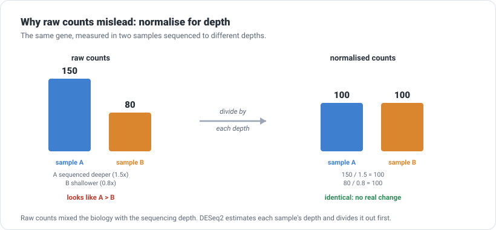
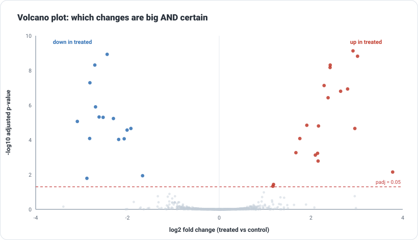

```{=html}
<div class="cba-comic">
```
{fig-alt="Three-panel comic: Prof. Zola says geneB doubled and asks if it is real; Amina answers not until she normalises for depth and tests against the replicates; she holds a volcano-plot shape and says a big change with a tiny p-value is a real hit."}
```{=html}
</div>
```

## 🧩 The mystery

Last time you built the counts matrix and a couple of genes clearly moved. But you ended on a
warning: raw counts are not comparable across samples, so you cannot yet call a change *real*.
Today you settle it.

The full experiment did not measure eight genes. It measured about **a thousand**, across three
control and three treated samples. Prof. Zola drops the complete counts matrix on the bench:

> "A thousand genes. Which ones actually responded to the treatment? And how sure are you?"

::: {.think}
Two things stand between you and the answer, and they are different problems.

**One:** your samples were not sequenced equally. If `treat_1` simply has more reads than
`ctrl_1`, every gene in it looks higher. **Two:** even after you fix that, you only have three
samples per group. Is a gene's change real, or just the wobble you would see between any three
dishes? Hold both thoughts.
:::

## First problem: raw counts are not comparable

Before comparing anything, you have to put the samples on the same footing. This is
**normalisation**, and the idea is simple.

::: {.story}
Imagine counting apples sold at two shops. Shop A had 1,500 customers today, shop B had 800.
Shop A sold more apples, of course it did, it had more customers. To ask which shop is *more
into apples*, you divide by customers, not compare raw totals.

Sequencing depth is the customers. A sample with more total reads shows higher counts for
almost everything. To compare fairly, you divide out the depth first.
:::

{width=820 fig-alt="Two bars: raw counts 150 vs 80 look different, but after dividing by each sample's depth both equal 100."}

You do not compute this by hand. The tool does it, and it is the same tool that does the whole
analysis: **DESeq2**, an R package (yes, the R you met back in
[Module 02](../02-r-for-biologists/index.qmd)).

## 🛠 Let's do it: run DESeq2

Load the counts and a small table saying which sample is which, then let DESeq2 work:

```r
library(DESeq2)

dds <- DESeqDataSetFromMatrix(countData = counts,
                              colData   = coldata,     # sample -> condition
                              design    = ~ condition)
dds <- DESeq(dds)
```

That one `DESeq()` call does three things: it estimates each sample's sequencing depth
(the **size factors**), models the natural noise between replicates, and tests every gene. Ask
it for the depth corrections it found:

```r
sizeFactors(dds)
```

```text
 ctrl_1  ctrl_2  ctrl_3  treat_1  treat_2  treat_3
  0.980   1.255   0.746    1.403    0.839    1.085
```

Read those numbers. `treat_1` was sequenced about **1.4 times** as deep as average, `ctrl_3`
only **0.75**. DESeq2 divides each sample by its own factor so the comparison is fair. The
first problem is solved, automatically.

## Second problem: is the change bigger than the noise?

Now the real question. For each gene, DESeq2 compares the (normalised) treated counts to the
control counts and asks: is this difference **bigger than the scatter between replicates**? It
answers with three numbers per gene.

```r
res <- results(dds, contrast = c("condition", "treated", "control"))
```

Here is the **real** top of that table, sorted by significance:

```text
gene       baseMean  log2FoldChange   pvalue      padj
gene0556     879.9        2.917       7.42e-13   7.4e-10
gene0008     736.6       -2.442       2.36e-12   1.18e-09
gene0134     118.7        3.015       4.53e-12   1.51e-09
gene0423     333.0       -2.711       1.97e-11   4.88e-09
gene0822     332.0        2.420       2.44e-11   4.88e-09
```

The three numbers that matter:

| Column | What it means |
|---|---|
| `log2FoldChange` | how big the change is. `+1` = doubled, `+2` = 4x, `-1` = halved. Sign gives direction. |
| `pvalue` | how surprising the change would be if the gene truly did nothing |
| `padj` | the p-value **corrected for testing thousands of genes** (this is the one you trust) |

`gene0556` has `log2FoldChange 2.9` (roughly an eight-fold increase) and a `padj` of `7e-10`.
Big change, and almost certainly real.

## 🧠 The trap that catches everyone: testing thousands of genes

Why two p-value columns? Because you did not test one gene. You tested a thousand. And that
changes everything.

::: {.mistake}
A p-value of 0.05 means "a 1-in-20 chance of seeing this if the gene did nothing". Test **one**
gene, fine. But test **1,000** genes that all truly do nothing, and about **50** of them will
sneak under 0.05 by pure chance. Trust raw p-values across a whole experiment and you will
"discover" dozens of genes that are noise.

Look at a real example from this run. `gene0091` has a raw `pvalue` of `0.034`, which looks
significant. But its `padj` is `0.522`. Corrected for the thousand tests, it is nowhere near
significant. It is one of the expected fifty.
:::

The `padj` column (an **adjusted p-value**, or false-discovery rate) does that correction for
you. The rule is simple and non-negotiable: **judge significance on `padj`, never on the raw
`pvalue`.** A common cutoff is `padj < 0.05`.

## 🎉 See it all at once: the volcano plot

A thousand genes is too many to read in a table. So you plot them. Every gene becomes a dot:
how *big* its change is (log2 fold-change) across the bottom, how *certain* that change is
(`-log10` of the adjusted p-value) up the side.

{width=820 fig-alt="Volcano plot of about a thousand genes; a grey central cloud of unchanged genes, with significant up genes in red at upper right and down genes in blue at upper left."}

It is called a volcano because the significant genes erupt up the two sides. The dull grey
cloud in the middle is the thousand genes that did nothing. The coloured dots up top, big change
*and* small `padj`, are your hits. Right for up, left for down.

::: {.insight}
This matrix was **built with a known answer**: 40 genes were set to truly change (20 up, 20
down), the other ~960 were left alone. DESeq2 flagged **34** as significant. Of those, **32
were real** and only **2 were false alarms**, and it **missed 8** real ones, mostly weak changes
in low-count genes. That is about **80%** of the truth recovered, with a small, controlled rate
of false positives. Powerful, honest, and, importantly, *not perfect*. Real analysis lives with
exactly this trade-off.
:::

## 🧠 Think like a scientist, not a button

- **Read both axes, not one.** A gene with a huge fold-change but a poor `padj` is not
  trustworthy (too noisy). A gene with a beautiful `padj` but a tiny fold-change is trustworthy
  but might be too small to matter biologically. Real hits are big *and* certain: top corners of
  the volcano.
- **Three replicates is not many.** DE with n=3 catches the strong, clear changes and misses
  subtle ones, as it did here. More replicates buy more power. This is an experimental design
  choice, not a software setting.
- **`padj`, always.** Say it in your sleep. The number of tests you ran is baked into it.
- **DESeq2 is not the only tool.** `edgeR` and `limma-voom` do the same job with different
  models and often agree. Knowing one teaches you all three.

::: {.reality}
Prof. Zola: "You found 34 genes."<br>
Amina: "Thirty-two are real. Two are probably false."<br>
Prof. Zola: "Which two?"<br>
Amina: "If I knew that, they would not be false positives, would they?"<br>
Prof. Zola: "...validate your top hits in the lab. Always."
:::

## 🧩 Mini challenge

::: {.challenge}
Two genes come back from DESeq2. `geneX`: `log2FoldChange = 4.0`, `padj = 0.30`. `geneY`:
`log2FoldChange = 0.3`, `padj = 0.001`.

Which one is a "real hit", and would you build a story around either?

**Answer:** `geneY` is the statistically real change, its `padj` says the difference is very
unlikely to be noise, while `geneX`'s `padj` of 0.30 means its dramatic-looking 16-fold change
is probably just scatter (common in low-count genes). But `geneY` only changed by about 23%
(`log2FC 0.3`), which may be too small to matter biologically. So: `geneY` is trustworthy but
perhaps unimportant; `geneX` is exciting but untrustworthy. Neither is a clean win, and that is
the honest answer. You would want more replicates before betting on either.
:::

## Three quick questions

Not graded. Just checking yourself.

1. Why must counts be normalised before you compare samples?
2. You test 1,000 genes. Why can you not trust a raw p-value of 0.04?
3. On a volcano plot, where do the strongest, most trustworthy hits sit?

::: {.callout-note collapse="true"}
## Answers
Because samples are sequenced to different depths, so a deeper sample shows higher counts for
almost every gene; dividing out the depth makes the comparison fair. Across 1,000 genes, about
50 will fall under p = 0.05 by chance alone, so a raw p-value of 0.04 may well be noise; the
adjusted p-value (`padj`) corrects for that. The strongest hits sit in the top corners: large
fold-change (far left or right) *and* high significance (high up).
:::

## 🎯 Key takeaway

::: {.takeaway}
Differential expression turns a counts matrix into a trustworthy list of changed genes. First
normalise, so sequencing depth stops masquerading as biology. Then test each gene against the
noise between replicates, and judge it on the **adjusted** p-value, never the raw one, because
you tested thousands. The volcano plot shows it at a glance: real hits are big *and* certain.
:::

::: {.didyouknow}
This exact analysis, counts to normalisation to a volcano plot, is one of the most-run
workflows in all of biology. It is how researchers find which genes a drug switches on, how a
cancer differs from healthy tissue, and how a cell responds to stress. DESeq2's method paper is
among the most-cited in the life sciences. You just ran the real thing.
:::

::: {.callout-tip collapse="true"}
## ⚠️ Verify before you rely on the details
This is a **simulated** dataset built with a known answer (1,000 genes, 40 truly changed) so
the method's successes and misses are visible. It was run with **DESeq2 1.50.2** on **R 4.5.3**.
Real experiments have tens of thousands of genes, more replicates give more power, and options
like fold-change shrinkage refine the estimates. The ideas (normalise first, test against
replicate noise, judge on the adjusted p-value, read both axes of the volcano) are what carry
across every tool and dataset.
:::

```{=html}
<div class="cba-signoff">
```
You turned a wall of raw numbers into a short, defensible list of genes that really responded, and you know exactly how much to trust it. That is differential expression, the heart of RNA-seq.

<span class="coffee-line">Go and make a coffee. ☕</span>

Next time, a twist that changes everything. Every count so far was the *average* of millions of cells mashed together. But a tissue is not one cell type. What if you could measure the genes of every single cell, one at a time?
```{=html}
</div>
```
