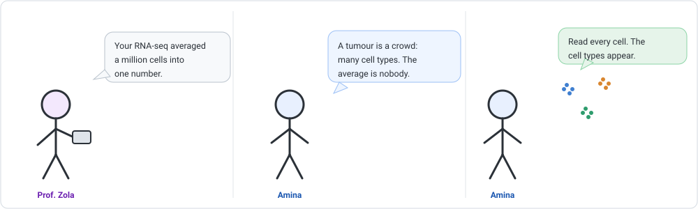
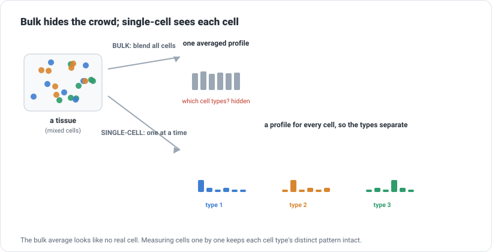
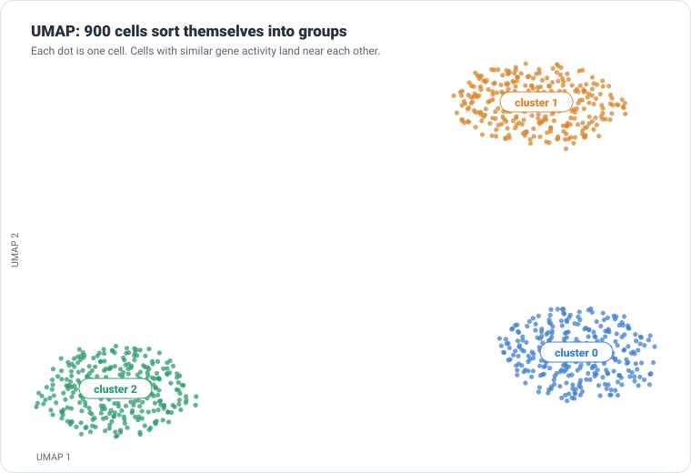
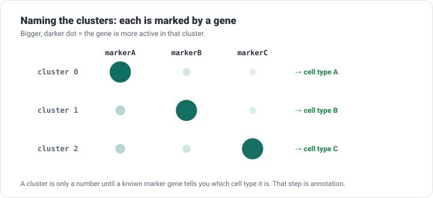

```{=html}
<div class="cba-comic">
```
{fig-alt="Three-panel comic: Prof. Zola says the RNA-seq averaged a million cells into one number; Amina says a tumour is a crowd of many cell types so the average is nobody; she points at three little clusters of dots and says read every cell and the cell types appear."}
```{=html}
</div>
```

## 🧩 The mystery

Everything you have measured so far, the counts, the differential expression, came from **bulk**
RNA-seq: you ground up a whole tissue and read all its RNA together. That gave you one number
per gene: the *average* across millions of cells.

But a tissue is not one kind of cell. A tumour is cancer cells *and* immune cells *and* blood
vessels, all mixed. Prof. Zola puts it sharply:

> "Your average says the tissue expresses this gene 'moderately'. Is that every cell at a
> medium level, or half the cells screaming and half silent? Those are completely different
> biology. Which is it?"

::: {.think}
Blend a fruit salad into a smoothie and measure its average sweetness. You cannot tell whether
it was all grapes, or apples and lemons cancelling out. The information about the *individual
fruits* is gone the moment you blend.

Bulk RNA-seq blends cells. So here is the question: what if you never blended? What if you
measured the RNA of **every single cell, separately**?
:::

## The crowd, not the average

That is exactly what **single-cell RNA-seq** does. Instead of one profile for the whole tissue,
it captures each cell on its own and measures the genes in that one cell. Thousands of cells,
thousands of tiny expression profiles.

::: {.story}
Bulk is a class photo blurred into one average face, useless for telling anyone apart.
Single-cell hands you a separate portrait of every student. Now you can sort them into groups:
the athletes, the musicians, the chess club, just by how alike their portraits are.
:::

{width=820 fig-alt="A mixed tissue of three cell types; bulk blends them into one grey average profile, while single-cell keeps three distinct coloured profiles."}

The data changes shape too. Bulk gave you genes by a handful of samples. Single-cell gives you
genes by **thousands of cells**, one column per cell, and it is very sparse (most genes are
zero in any given cell). The new question is not "which genes changed" but: **which cells are
alike, and how many kinds are there?**

## 🛠 Let's do it: cluster the cells

The standard Python toolkit is **Scanpy**. The workflow has a shape worth learning, because
every single-cell analysis follows it. Our example is 900 cells and 800 genes:

```python
import scanpy as sc

# adata: 900 cells x 800 genes
sc.pp.normalize_total(adata, target_sum=1e4)   # correct each cell's depth
sc.pp.log1p(adata)                             # tame the big numbers
sc.pp.highly_variable_genes(adata, n_top_genes=150)   # keep the informative genes
adata = adata[:, adata.var.highly_variable]
sc.pp.scale(adata, max_value=10)

sc.tl.pca(adata)          # compress to major axes of variation
sc.pp.neighbors(adata)    # build a "who is similar to whom" graph
sc.tl.leiden(adata)       # cluster: find groups of similar cells
sc.tl.umap(adata)         # lay the cells out in 2D for viewing
```

Two steps do the real work. `leiden` groups cells that have similar gene activity into
**clusters**. `umap` places every cell on a 2D map so that similar cells land near each other.
The **real** result:

```text
900 cells x 800 genes
Leiden found 3 clusters
```

## 🎉 Meet the output: the UMAP

You do not read 900 cells in a table. You look at the map.

{width=760 fig-alt="UMAP scatter of 900 cells forming three well-separated clusters coloured blue, orange and green, each labelled cluster 0, 1 and 2."}

Every dot is one cell. **UMAP** is just a way to squash each cell's expression down to two
coordinates so you can see the structure, cells that are alike end up close together. Three
clear islands means three groups of cells that use their genes differently: three **cell
types**, pulled out of the mixture with no labels given.

::: {.insight}
This tissue was **built with a known answer**: 900 cells drawn from exactly three types, 300
each. We handed Scanpy only the raw counts, never the labels. It found **3 clusters**, and each
one contains **exactly one** of the true types, a perfect match (an Adjusted Rand Index of
1.0). The cell types were never annotated in the data. The algorithm rediscovered them from
gene activity alone.
:::

## 🧠 A cluster is not yet a cell type

Here is the step beginners skip. Scanpy gave you `cluster 0`, `cluster 1`, `cluster 2`. Those
are just numbers. They do not tell you *what* those cells are. To name them, you look at which
**marker genes** each cluster switches on, genes known to belong to a particular cell type.

{width=720 fig-alt="Dot plot with clusters as rows and three marker genes as columns; a large dark dot on the diagonal shows each cluster is defined by one marker, naming it as a cell type."}

Each cluster lights up one marker. In real work that marker is a *known* gene: `CD3` for
T cells, `CD19` for B cells, and so on. Match the marker to the biology and the anonymous
`cluster 1` becomes "T cells". **That naming step is called annotation, and a computer cannot
do it for you**, it needs a human who knows the markers.

::: {.mistake}
The classic mistake is to treat a cluster as a cell type automatically. It is not. A cluster is
a *hypothesis*: "these cells are alike". Two more traps come with it. The **number** of clusters
depends on a resolution setting you choose, turn it up and one cluster splits into two, so ask
whether a split is real biology or a knob you turned. And real data hides **doublets** (two
cells captured as one) and **batch effects** (differences that are technical, not biological).
Clustering is the start of the interpretation, not the end.
:::

## 🧠 Think like a scientist, not a button

- **UMAP is for looking, not measuring.** Nearby cells are similar, yes. But do not read exact
  distances or the size of the gaps between clusters as meaningful; UMAP distorts them. It is a
  map to orient by, not a ruler.
- **Annotation needs biology.** The algorithm finds groups; *you* name them, using marker genes
  and what is known about the tissue. This is where a computational biologist earns their title.
- **Scale is the whole point.** This toy had 900 cells. Real atlases have *millions*, and the
  same workflow runs on them. That scale is why single-cell reshaped biology.
- **Scanpy or Seurat.** We used Scanpy (Python). `Seurat` (R) does the same job and is equally
  standard. Learn the *steps* and you can drive either.

::: {.reality}
Prof. Zola: "Three clusters. What are they?"<br>
Amina: "Cell types. Give me a day with the marker genes and I will name them."<br>
Prof. Zola: "The computer did not name them?"<br>
Amina: "The computer found them. Naming them is my job. That is the whole point of me."
:::

## 🧩 Mini challenge

::: {.challenge}
You run the same cells at a higher clustering resolution and now get **5** clusters instead of
3. A labmate says "great, we found two new cell types!"

Are they right? What would you check?

**Answer:** maybe, maybe not. Turning up the resolution *always* splits clusters, whether or not
the split is real. Before claiming two new cell types, check whether the new clusters are
defined by **distinct marker genes** (real biology) or just carve one type into arbitrary
halves with no clear markers (a knob you turned). A cluster earns the name "cell type" only when
a marker, and ideally prior biological knowledge, backs it up.
:::

## Three quick questions

Not graded. Just checking yourself.

1. What does single-cell RNA-seq measure that bulk RNA-seq cannot?
2. On a UMAP, what does it mean when two cells sit close together?
3. Scanpy gives you `cluster 2`. What must you still do to call it a cell type?

::: {.callout-note collapse="true"}
## Answers
The gene expression of each individual cell, so you can see the different cell types in a
mixture instead of only their blended average. Two nearby cells have similar overall gene
activity (but the exact distance is not meaningful, UMAP distorts it). You must annotate it:
look at its marker genes and match them to a known cell type, a step that needs human
biological knowledge.
:::

## 🎯 Key takeaway

::: {.takeaway}
Single-cell RNA-seq trades one blended average for thousands of individual cell profiles. The
standard workflow, normalise, reduce dimensions, build a similarity graph, cluster, and lay it
out with UMAP, groups the cells into their types with no labels given. But the clusters are only
numbers until *you* annotate them with marker genes. The algorithm finds the cell types;
naming them is the biologist's job.
:::

::: {.didyouknow}
Single-cell methods reshaped biology in barely a decade. Consortia like the **Human Cell Atlas**
are using exactly this approach, capture cells, cluster, annotate, to build a reference map of
every cell type in the human body, across *tens of millions* of cells. The 900-cell exercise you
just ran is, step for step, a miniature of that effort.
:::

::: {.callout-tip collapse="true"}
## ⚠️ Verify before you rely on the details
This is a **simulated** dataset built with a known answer (900 cells, 3 clean cell types) so the
clustering can be checked. It was run with **Scanpy 1.12.4**. Real single-cell data is far
messier: tens of thousands of genes, cells of uneven quality, doublets, batch effects, and cell
types that blend into one another rather than forming tidy islands. Clustering settings
(resolution, number of neighbours, PCA dimensions) all shift the result. The workflow and the
ideas (normalise, cluster, visualise with UMAP, annotate with markers) are what carry across.
:::

```{=html}
<div class="cba-signoff">
```
You went from the average of a crowd to a map of its individuals, and found the cell types hiding inside a tissue with no labels to guide you. That is the single-cell revolution in miniature.

<span class="coffee-line">Go and make a coffee. ☕</span>

Next time, one more dimension. You now know *which* cell types are in the tissue, but not *where* they sit. What if you could keep every cell in its place on the slide and read its genes without moving it?
```{=html}
</div>
```
