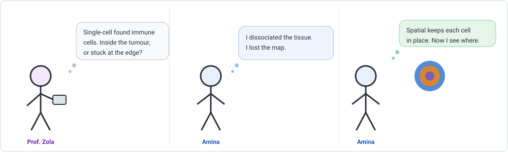
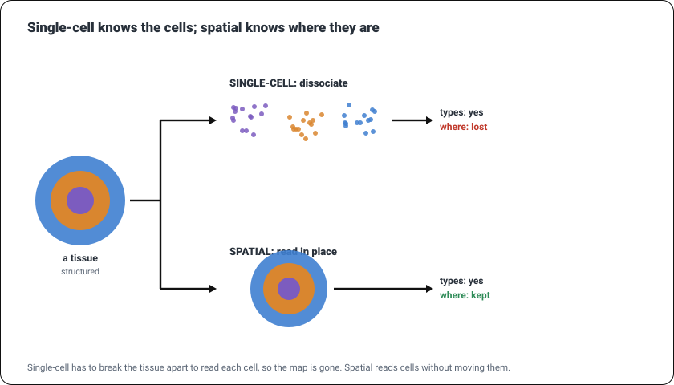
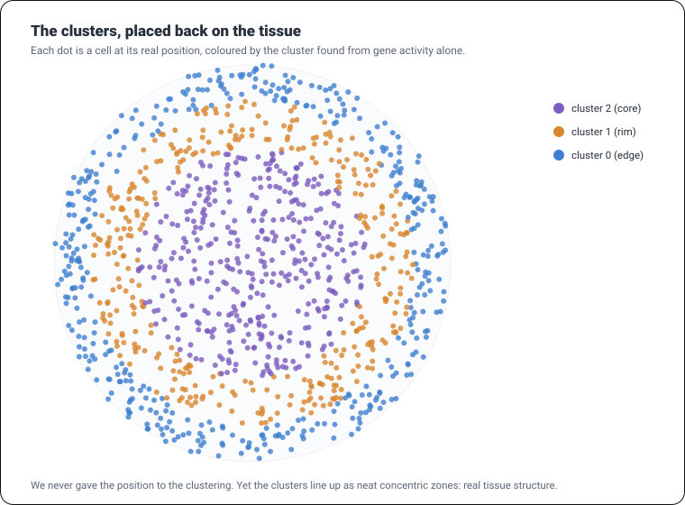
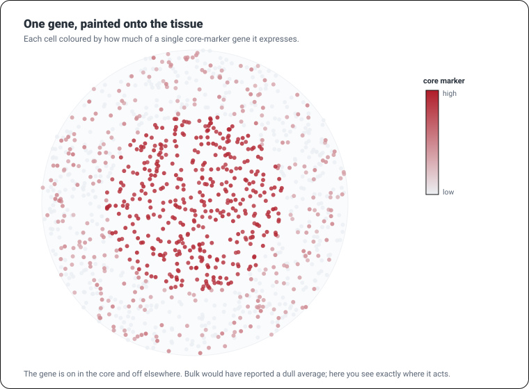

```{=html}
<div class="cba-comic">
```
{fig-alt="Three-panel comic: Prof. Zola says single-cell found the immune cells but asks whether they are inside the tumour or stuck at the edge; Amina says she dissociated the tissue so she lost the map; she points at a tissue of concentric rings and says spatial keeps every cell in place, so now she can see where."}
```{=html}
</div>
```

## 🧩 The mystery

Single-cell was a triumph: you found every cell type in the tissue. But to read each cell, the
protocol had to **dissociate** the tissue, break it into a soup of loose cells. The instant you
did that, you threw away something precious: *where each cell was*.

Prof. Zola points at the problem that costs patients their lives:

> "You found immune cells in this tumour. Good. Now: are they *inside* the tumour attacking it,
> or stuck at the **edge**, locked out? Same cells, completely different prognosis. Where are
> they?"

::: {.think}
Single-cell is like identifying everyone at a party from a DNA sample, but only after herding
them single-file through the door. You learn exactly *who* was there, and lose *who was
standing with whom*.

In a tissue, position *is* biology. An immune cell in the tumour core is fighting; the same cell
ringed outside is excluded. So here is the question: what if you could read each cell's genes
**without ever moving it**?
:::

## Reading cells in place

That is **spatial transcriptomics**. Instead of dissociating the tissue, it measures gene
expression right on the slide, and records the **x, y position** of every reading. You get the
same expression data as before, plus a map.

::: {.story}
Single-cell hands you a bag of labelled marbles: you know every colour, but they are jumbled in
a sack. Spatial hands you the marbles still glued to the board they came on. Same colours, but
now you can see the pattern they made.
:::

{width=820 fig-alt="A concentric tissue forks: single-cell gives three separated clusters with positions lost, while spatial keeps the tissue map intact with positions kept."}

The data gains one thing: **coordinates**. Alongside the familiar cells-by-genes matrix, every
cell now carries an `(x, y)`. That small addition unlocks a new power: you can take any result
and **put it back on the tissue**.

## 🛠 Let's do it: cluster, then map

Here is the elegant part. Finding the cell types is *exactly* what you did in single-cell:
cluster the cells by their gene activity. Position is not used for that. Our tissue is 1,200
cells and 800 genes:

```python
import scanpy as sc

# adata: 1200 cells x 800 genes, with adata.obsm["spatial"] = the x,y coordinates
sc.pp.normalize_total(adata, target_sum=1e4)
sc.pp.log1p(adata)
sc.pp.highly_variable_genes(adata, n_top_genes=150)
adata = adata[:, adata.var.highly_variable]
sc.pp.scale(adata, max_value=10)
sc.tl.pca(adata)
sc.pp.neighbors(adata)
sc.tl.leiden(adata)                              # cell types, from expression alone

# the new step: draw each cell at its real position
sc.pl.embedding(adata, basis="spatial", color="leiden")
```

The **real** result of the clustering:

```text
1200 cells x 800 genes
Leiden found 3 clusters (from expression alone)
```

Three clusters, found with no knowledge of where anything was. Now the new line, `basis="spatial"`,
plots those clusters where the cells actually sit.

## 🎉 Meet the output: the tissue, reassembled

{width=760 fig-alt="A disc of 1,200 cells coloured by cluster, forming three concentric rings: purple core, orange rim, blue edge."}

Look at what happened. We clustered purely on gene expression and **never told the algorithm a
single coordinate**. Yet when we drop the clusters back onto the slide, they fall into three neat
**concentric zones**: a core, a rim, an edge. That is real tissue **architecture**, invisible to
bulk and to single-cell, now plain to see.

::: {.insight}
This tissue was **built with a known answer**: three concentric zones, each its own cell type.
Clustering by expression alone recovered **3 clusters** that match the zones **perfectly** (an
Adjusted Rand Index of 1.0). And because every cell kept its coordinates, those clusters did not
just name the cell types, they redrew the map. Now you can answer Prof. Zola: the immune cells
are in the *rim*, not the core.
:::

## Painting a gene onto the slide

The same trick works for any single gene. Colour each cell by how much of one gene it expresses,
and you see exactly **where in the tissue that gene is active**:

{width=760 fig-alt="The tissue disc with cells coloured by a core-marker gene; deep red in the centre fading to pale at the edge."}

Bulk would have told you this gene is expressed "a little" on average. Single-cell would have
told you a *subset* of cells express it. Spatial tells you **which cells, and exactly where they
are**: the core, and nowhere else. That is the whole point.

## 🧠 Think like a scientist, not a button

- **A "spot" is not always a cell.** Some spatial technologies (like Visium) read small *spots*
  of tissue, each holding several cells mixed together, so you may need to computationally
  separate them. Newer imaging methods (Xenium, MERFISH) reach single cells or finer. Know which
  you have before you call a dot "a cell".
- **Clusters still need annotating.** Finding three domains is not the same as knowing what they
  are. As in single-cell, you name them with marker genes and tissue knowledge. The computer
  draws the map; you read it.
- **Position opens a new question.** Beyond "which cell types", spatial lets you ask *which types
  sit next to which*, is this immune cell touching a tumour cell? Dedicated tools like **Squidpy**
  compute exactly these neighbourhood statistics. That question simply did not exist before.

::: {.mistake}
The tempting mistake is to treat a pretty spatial plot as the finding. It is the *start*. A
cluster that forms a neat zone is a strong hint of real structure, but you still have to annotate
it, check it is not a tissue fold or a staining artefact, and ask what its *neighbours* are. The
map is the beginning of the biology, not the end of it.
:::

::: {.reality}
Prof. Zola: "So the immune cells are at the rim."<br>
Amina: "Ringed around the tumour, not inside it."<br>
Prof. Zola: "Meaning?"<br>
Amina: "The tumour is keeping them out. That is a finding. That is the paper."<br>
Prof. Zola: "*Now* you are thinking spatially."
:::

## 🧩 Mini challenge

::: {.challenge}
Two labs study the same tumour. Lab A does single-cell and reports "40% of the cells are
immune cells". Lab B does spatial and reports "the immune cells form a ring at the tumour
boundary and never enter the core".

Both are correct. Why might Lab B's result change how the patient is treated, when Lab A's does
not?

**Answer:** because *where* the immune cells are tells you whether they can do their job. Lab A's
40% sounds like a strong immune response, but if (as Lab B shows) those cells are locked out at
the boundary, the tumour is effectively hiding from them. That pattern, an "excluded" tumour,
points to a different treatment (one that helps immune cells get *in*) than a tumour the immune
cells have already infiltrated. Same cells, same count; the *position* changes the medicine.
:::

## Three quick questions

Not graded. Just checking yourself.

1. What does spatial transcriptomics keep that single-cell throws away?
2. In our example, was position used to *find* the clusters, or only to *display* them?
3. Why can you not always treat one spatial "spot" as a single cell?

::: {.callout-note collapse="true"}
## Answers
The location of every cell in the tissue (its x, y coordinates), so you can see tissue structure
and which cell types sit where. Position was used only to display the clusters; they were found
from gene expression alone, which is why it is striking that they line up as spatial zones. Some
spatial methods measure small spots that contain several cells mixed together, not individual
cells, so a spot can be a blend of types.
:::

## 🎯 Key takeaway

::: {.takeaway}
Spatial transcriptomics measures gene expression without dissociating the tissue, so every
reading keeps its position. You cluster on expression exactly as in single-cell, then drop the
result back onto the slide, and tissue architecture that was invisible to bulk and single-cell
appears. Mind the resolution (a spot may be many cells), annotate your domains, and remember the
new question spatial unlocks: not just which cells, but which cells sit next to which.
:::

::: {.didyouknow}
Spatial transcriptomics was named *Method of the Year* by **Nature Methods in 2020**, and the
field has exploded since. It is being used to map tumours cell by cell in their real
neighbourhoods, to chart how a brain is wired region by region, and to watch an embryo organise
itself in space. The 1,200-cell tissue you just reassembled is a miniature of that work.
:::

::: {.callout-tip collapse="true"}
## ⚠️ Verify before you rely on the details
This is a **simulated** tissue built with a known answer (1,200 cells, three concentric zones)
so the recovered structure can be checked. Clustering was run with **Scanpy 1.12.4**. Real
spatial data is far messier: different technologies trade resolution for gene coverage, spots may
mix cells, tissues fold and tear, and real domains are rarely tidy rings. Dedicated spatial tools
like **Squidpy** add neighbourhood statistics. The workflow and the ideas (cluster on expression,
map back onto the tissue, mind the resolution, ask who neighbours whom) are what carry across.
:::

```{=html}
<div class="cba-signoff">
```
You put the cells back where they belong and read a tissue's architecture straight off the slide. Bulk gave you the average, single-cell gave you the cast, and spatial gave you the stage. You can now see biology in all three.

<span class="coffee-line">Go and make a coffee. ☕</span>

You have now followed a biological question from raw reads all the way to a map of cells in a tissue. Next time, the final move every scientist must make: turning a result into something the world can read. A figure. A story. A claim you can defend.
```{=html}
</div>
```
